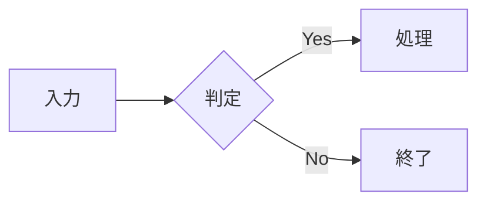

# 執筆ルール

原稿の書き方をここに集約します。ルールが増えたら追記してください。

## 文体

- 文体はドキュメント単位で統一する。混在は textlint が検出する
- 現在の既定は **である調**（`.textlintrc.json` の `no-mix-dearu-desumasu` で指定）。
  ですます調で書くトピックを増やす場合は、この設定を見直す
- 1文は200文字以内。読点は1文に8つまで（長文の読み物向けに緩めてある）
- 「〜と思います」のような弱い表現は避け、断定するか根拠を示す
- 数を数えられるものは、読み物としての調子を優先して漢数字（「三つの潮流」）で書く

## トピックとページの作り方

```bash
# 新しいトピック（1冊分）の入口を作る
npm run new:topic -- rust-cli "Rustで書くCLIツール"

# ページを足す（先頭の連番は自動で振られる）
npm run new:page -- rust-cli getting-started "はじめてのビルド"

# 部で束ねる場合は、トピックの下のディレクトリを指定する
npm run new:page -- ai-for-science/03-frontier agent-safety "エージェントの安全設計"
```

- slug は英小文字・数字・ハイフン。URLになるので、内容が分かる短い語にする
- frontmatter の `title` がページタイトル、`sidebar_label` がサイドバーの表示名になる。
  長いタイトルには短い `sidebar_label` を添える
- ディレクトリの `index.md` は、そのグループの扉ページ兼サイドバーの見出しになる

## トップページの索引

トップページは `docs/` を走査して作られる本の索引で、キーワードで本と章を絞り込める。
カードに出る情報はトピックの `index.md` の frontmatter で決まる（`description`、`status`、
`tags`）。章数・文字数・最終更新日は自動算出なので、書き足せばそのまま反映される。

タグは検索とタグ絞り込みの両方に使われるので、分野名（「材料科学」「金融」）や
技術名（「RAG」「MCP」）のように、読者が思いつく語を入れておく。

出典ページや用語集のように「章」として数えたくないページには、そのページの frontmatter に
`appendix: true` を書く。章数には数えず、一覧にだけ並ぶ。

## 目次ブロック

`index.md` の中の次のマーカーに挟まれた範囲は、`npm run toc` でファイル構成から再生成される。

```md
<!-- TOC:start -->
<!-- TOC:end -->
```

サイドバーは常に自動生成なので、この目次は「ページとして読める一覧」が欲しいときだけ使う。
章を追加したら `npm run toc` を実行する。

## 見出し

- ページ内の最上位見出しは `#` 1つだけ
- 本文の小見出しは `##` から。`###` より深くなるならページを分ける
- 外部から参照したい見出しにはアンカーを明示する: `## 設計の方針 {#design-policy}`

## 引用と注記

- 本文から引き出したい一文は引用記法（`> `）で置く。明朝体で少し大きく表示される
- 章のまとめは `::: tip この章のポイント` のコンテナに箇条書きで置く

## コード

- コードフェンスには必ず言語を指定する（`ts`、`bash` など）。ハイライトとコピーボタンが有効になる
- 長いコードは全文を載せず、注目してほしい行を `{3-5}` で強調する
- 検証したバージョン（言語・ライブラリ）を章の冒頭か扉ページに明記する

## 図版

- 画像は `docs/public/images/` に置き、`/images/foo.png` の形で参照する
- ファイル名は `01-architecture.png` のように章番号を頭に付ける
- 画像の直後に `*図1.1 システム構成*` と書くとキャプションとして表示される
- `alt` テキストは必ず書く

## 作図（Mermaid）

アーキテクチャ図・データフロー図・シーケンス図・状態遷移図は、画像ではなく Mermaid 記法で書く。
コードフェンスに `mermaid` を指定すると、ビルド時にブラウザー上で描画される
（`vitepress-plugin-mermaid` を導入済み。設定は `docs/.vitepress/config.mts`）。

````md

````

- ノードのラベルに `()` や `:` を含めるときは `A["ラベル（注記）"]` のようにダブルクォートで囲む
- 図は本文の主張を補うものに限る。手順の羅列を図にしても読みやすくならない
- 図が横に長くなる場合は `flowchart TB` を検討する（スマートフォンでの表示が崩れにくい）

## 校正（textlint）

```bash
npm run lint       # チェックのみ
npm run lint:fix   # 表記ゆれなど自動修正
```

- 用語の統一は `prh.yml` で管理する。ゆれが見つかったら辞書に追記する
- VitePressのコンテナ記法（`::: tip`）は本文ではないので、`allowlist` フィルタで
  校正対象から外している
- 長文の読み物では誤検知が多いため、次のルールは意図的に無効化している

  | ルール | 無効化した理由 |
  | --- | --- |
  | `arabic-kanji-numbers` | 「三つの潮流」のような漢数字を本文の調子として使うため |
  | `no-doubled-joshi` | 長い叙述文では同じ助詞の再出現が避けられないため |
  | `max-kanji-continuous-len` | 「機械学習原子間ポテンシャル」のような専門用語・固有名詞に反応するため |

- 個別に抑制したい箇所はコメントで囲む

```md
<!-- textlint-disable ja-technical-writing/sentence-length -->

（長い引用文など）

<!-- textlint-enable ja-technical-writing/sentence-length -->
```

## 事実確認

固有名詞・数値・年月・出典は、一次情報（原著論文、公式発表）で裏を取る。確認が済んでいない
記述は [REVIEW.md](./REVIEW.md) に残し、公開前に潰していく。

## 進捗の確認

```bash
npm run count
```

トピック・章ごとの文字数と400字詰め原稿用紙換算の枚数が出る。コードブロックと記号は除外して
数えているので、本文量の目安として使える。

## レビューの流れ

1. 章ごとにブランチを切る（例: `write/ai-for-science-31`）
2. 書けたら Pull Request を作る。CI で textlint とビルドが走る
3. 自分で読み返して直し、`main` にマージする
4. `main` にマージされると GitHub Pages に自動デプロイされる
