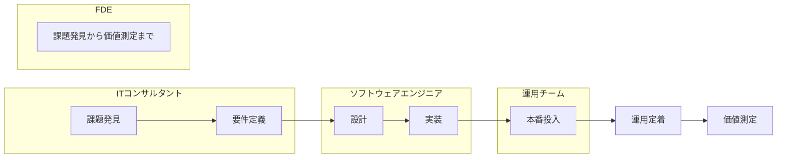
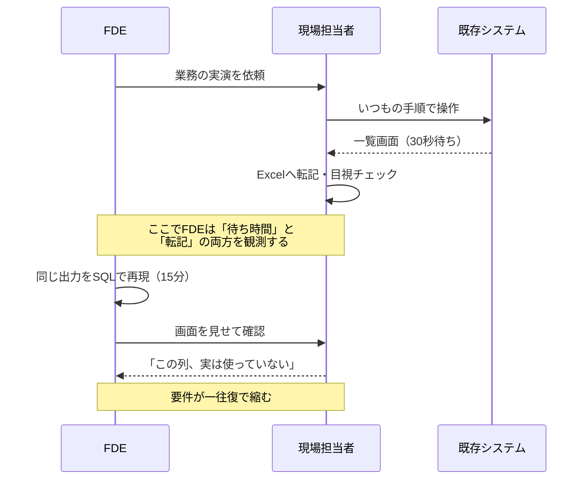
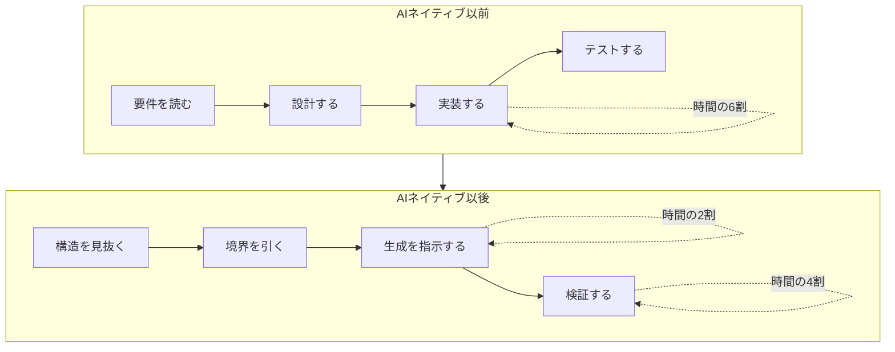

# 第1章 フォワードデプロイエンジニアリングの原点とパラダイム

ある製造業の生産管理部で、工程遅延の予測モデルを作ってほしいという相談を受けたとする。よくある依頼に見える。データを受け取り、特徴量を作り、勾配ブースティングで学習し、交差検証でAUC 0.87を出す。報告会でグラフを見せると拍手が起きる。そして半年後、そのモデルは誰にも使われていない。

この結末は、モデルの精度が足りなかったから起きたのではない。予測結果が届く先——現場の担当者が朝いちばんに開く画面——が存在しなかったから起きた。担当者は今日も生産管理システムの一覧を見て、経験で判断している。予測値は週次のレポートPDFの末尾に載っているが、意思決定のタイミングに間に合っていない。

フォワードデプロイエンジニアリングは、この「最後の数メートル」を最初から射程に入れる働き方である。本章では、この職種の輪郭を、既存の職種との違いという形で描く。

## 1.1 FDEの定義と既存職種との決定的違い {#definition}

FDEを一文で定義するなら、**顧客の業務プロセスの内側に入り込み、課題の発見から本番運用の定着までを一つの責任として引き受けるエンジニア**である。重要なのは「常駐しているかどうか」ではなく、責任の範囲がどこで切れるかにある。

### 1.1.1 責任範囲という切り口

同じプロジェクトに関わる四つの職種を、責任範囲の形で並べてみる。



ITコンサルタントは課題発見と要件定義に責任を持ち、実装は外部に渡す。ソフトウェアエンジニアは要件を受け取って設計と実装に責任を持ち、要件そのものの妥当性は問わない——問うたとしても、決定権は持たない。運用チームは動いているものを止めない責任を持つが、使われているかどうかは責任範囲の外にある。

FDEはこの全体を一本の線として引き受ける。結果として、次のような判断がFDEの手元で起きる。

- ヒアリングの最中に「その処理はSQLで十五分で終わる」と気づき、その場で書いて見せる
- 予測モデルの精度を0.87から0.91に上げる工数を、現場の画面に予測値を出す工数に振り替える
- 顧客が要求した機能を実装せず、要求の背後にある業務上の制約を解消する別の実装を提案する

三つ目が、FDEと受託開発の最も鋭い分岐点である。受託開発では、要求されていない実装をすることも、要求された実装をしないことも、契約上の逸脱になりうる。FDEは成果に対して責任を負うので、要求そのものを再設計する権限を持つ——正確には、その権限を持てる関係性を築くところまでが仕事に含まれる。

> FDEの成果物はソフトウェアではない。顧客の業務プロセスが変わったという事実である。ソフトウェアはその手段にすぎない。

### 1.1.2 ウォーターフォール、アジャイル、そしてFDEのアプローチ

開発方法論の対比で見ると、FDEの位置はもう少し明確になる。

| 観点 | ウォーターフォール | アジャイル（スクラム） | FDEのアプローチ |
| --- | --- | --- | --- |
| 要件の扱い | 最初に凍結する | スプリント単位で優先度を見直す | 現場観察から継続的に再発見する |
| 顧客との距離 | 定例会議とドキュメント | プロダクトオーナーを介する | 業務の現場に同席する |
| 最初の成果物 | 設計書 | 動くインクリメント | 顧客の実データで動く試作 |
| 失敗の検出 | 受入テスト | スプリントレビュー | 数日以内の現場での不採用 |
| 成功の定義 | 仕様どおりに納品された | ベロシティとバーンダウン | 業務指標が動いた |

アジャイルとの違いは微妙だが決定的である。スクラムのプロダクトオーナーは、顧客の要求を代表する役割を担う。FDEはその代表を介さず、要求が生まれる現場そのものを直接観察する。「代表者が要約した要求」と「現場で実際に起きていること」の間には、必ず情報の欠落がある。その欠落こそが、使われないシステムの主要な原因になる。

ここで注意したいのは、FDEのアプローチが常に優れているわけではない点である。要件が法令で厳密に定まっている領域、たとえば税制対応や規制報告のシステムでは、要件を凍結して検証可能性を確保するほうが合理的だ。FDEの手法が効くのは、**要件そのものが不確実で、かつ現場の暗黙知が成否を分ける領域**に限られる。この見極めができないFDEは、単に手続きを軽視するエンジニアになってしまう。

### 1.1.3 「顧客の最前線」で働くことの技術的な意味

現場に入ることは、心構えの問題としてよく語られる。だが実際には、技術的な帰結のほうが大きい。

**第一に、開発環境の制約が変わる。** 顧客のネットワーク内では、外部のパッケージレジストリに到達できないことがある。社内プロキシの証明書が必要で、Dockerイメージのプルが通らず、クラウドのマネージドサービスは稟議が通るまで使えない。FDEは、この制約下で初日から何かを動かす手段を持っていなければならない。具体的には、オフラインでも動く最小構成——SQLiteまたはDuckDB、ローカルのPythonランタイム、単一ファイルで完結するUI——を常に手札として持っておく。

**第二に、データの入手経路が変わる。** きれいなCSVは出てこない。出てくるのは、担当者が「これで足りますかね」と言いながら渡してくる、結合済みでフィルタ済みのExcelである。元のテーブルを見せてほしいと頼むところから交渉が始まる。詳しくは第3章で扱う。

**第三に、フィードバックの速度が桁違いになる。** 作ったものを隣の席の人に見せて五分で反応が返る環境では、一週間かけて磨いた機能より、三十分で作った粗い試作を四回見せるほうが早く正解に着く。この速度差が、後述するプロトタイピングの作法を決定づける。



この図が示しているのは、現場同席の本質が「共感」ではなく**観測**だという点である。担当者は自分の作業を正確に言語化できない。三十秒の待ち時間を不便だと感じていても、それを要件として口にすることはまずない。観測だけがその情報を拾える。

## 1.2 「現場の泥臭さ」を技術でスケールさせる設計思想 {#scaling}

現場に密着すると、一件一件の課題がすべて特殊に見えてくる。工場Aのラインと工場Bのラインでは、同じ帳票でも列の意味が違う。この特殊性に一つずつ手作業で対応していくと、FDEは顧客ごとに固定され、スケールしない便利屋になる。

この罠を避ける設計思想が、**差分を設定に追い出す**という原則である。

### 1.2.1 PoC貧乏からの脱却

PoC貧乏とは、検証は成功するのに本番に至らない状態が続く症状を指す。原因はたいてい技術ではなく、PoCの作り方そのものにある。

典型的な失敗は、PoCを「精度を確かめる実験」として設計してしまうことだ。実験としてのPoCは、次のような割り切りをする。

- データは手作業でクレンジングした固定のスナップショットを使う
- 認証は省略し、ローカルで動かす
- 結果はノートブックの出力とスライドで報告する

この三つの割り切りが、本番化の際にすべて作り直しを要求する。データの取得は自動化されておらず、認証は設計されておらず、UIは存在しない。つまりPoCで作った資産のうち、本番に持ち越せるのはモデルの学習コードだけであり、それはプロジェクト全体の一割にも満たない。

初日からプロダクションを見据えるとは、逆の割り切りをすることである。

| 要素 | 実験としてのPoC | プロダクションを見据えたPoC |
| --- | --- | --- |
| データ取得 | 手作業のスナップショット | 本番と同じ経路で、頻度だけ落とす |
| 処理ロジック | ノートブック | 関数として切り出し、テストを1本書く |
| 精度 | 極限まで追う | 業務が回る水準で止める |
| UI | なし（スライド） | 粗くてよいので現場が触れるものを置く |
| 認証 | なし | 本番の認証基盤に載る前提の設計だけ済ませる |
| 環境 | ローカル | 本番と同じコンテナで動かす |

ポイントは、**精度を落として、経路を通す**という配分である。予測精度は後から改善できるが、データの取得経路が存在しないことは後から発覚すると致命傷になる。社内の基幹システムからデータを日次で取り出す許可を得るのに三か月かかる、という事実は、PoCの初週に判明していなければならない。

::: warning よくある落とし穴
「まず精度を確かめてから、本番のデータ連携を設計しましょう」という進め方は、一見合理的に見えて、最も高くつく順序である。データ連携の実現可能性は、精度よりも先に検証すべき不確実性であることが多い。不確実性の高い順に潰す、が原則になる。
:::

### 1.2.2 差分を設定に追い出す

顧客ごとの特殊性をコードの分岐で吸収すると、コードは指数的に複雑化する。代わりに、特殊性を宣言的な設定として外に出し、コードは設定を解釈する一つの実装に保つ。

たとえば、顧客ごとに列名が違う帳票の取り込みを考える。分岐で書くとこうなる。

```python
# 悪い例: 顧客が増えるたびに分岐が増える
def load(df, customer):
    if customer == "A":
        return df.rename(columns={"品目CD": "item_code", "数量": "qty"})
    elif customer == "B":
        return df.rename(columns={"製品コード": "item_code", "出荷数": "qty"})
    # 顧客Cが来ると、ここにもう一本増える
```

設定に追い出すと、コードは一つで済む。

```python
from pydantic import BaseModel, Field

class ColumnMapping(BaseModel):
    """帳票1種類ぶんの列マッピング定義。顧客ごとにYAMLで持つ。"""
    source: str = Field(description="元ファイルの列名")
    target: str = Field(description="正規化後のカラム名")
    dtype: str = "string"
    required: bool = True

class SourceProfile(BaseModel):
    """顧客×帳票の組み合わせを一意に表すプロファイル"""
    profile_id: str
    encoding: str = "utf-8"
    header_row: int = 0
    columns: list[ColumnMapping]

def load(df, profile: SourceProfile):
    mapping = {c.source: c.target for c in profile.columns}
    missing = [c.source for c in profile.columns if c.required and c.source not in df.columns]
    if missing:
        raise ValueError(f"{profile.profile_id}: 必須列が見つからない {missing}")
    return df.rename(columns=mapping)[list(mapping.values())]
```

この書き換えで得られるものは三つある。第一に、新しい顧客の追加がYAMLの追記だけで済む。第二に、`missing` のチェックによって、列名が変わったときの失敗が**明示的で読めるエラー**になる。第三に、プロファイルは顧客自身が読める形式なので、内容の確認を顧客側に依頼できる。三つ目は、第14章で扱う引き継ぎの布石になる。

判断の基準はこうだ。**同じ形の処理が三つ目の顧客で必要になったら、設定に追い出す。** 二つ目までは分岐で構わない。抽象化を急ぐと、まだ見えていない次元で抽象化してしまい、かえって設定が複雑化する。

### 1.2.3 AIネイティブ時代のコアコンピタンス

生成AIがコードを書くようになって、FDEの技術的な価値の重心は動いた。以前は「短時間で正確に実装できること」が希少な能力だった。現在、定型的な実装の速度はAIによって平準化されつつある。

残る希少性は、次の三つに移っている。

**一つ目は、構造を見抜く力である。** 顧客の業務説明を聞いて、その裏にあるデータモデルを推定する。「この帳票とあの帳票は、実は同じエンティティの別の断面だ」と見抜く。この推定が正しければ、以降の実装はAIに任せても筋が通る。間違っていれば、AIは間違った構造の上に大量の正しいコードを積み上げてしまう。

**二つ目は、検証を設計する力である。** AIが生成したコードが正しいかどうかを判断するには、何をもって正しいとするかの基準が先になければならない。テスト、評価データセット、業務上の受入条件——これらを定義する仕事は、生成されるコード量が増えるほど価値が上がる。第12章で扱う評価は、この文脈で読むと位置づけがはっきりする。

**三つ目は、境界を引く力である。** どこまでを決定論的なシステムで処理し、どこからを確率的なモデルに任せるか。この線引きを誤ると、本来SQLで確実に出せる数字をLLMに計算させて、たまに間違える集計表を作ることになる。第2章で判定基準を扱う。



図が示すとおり、時間配分の重心は実装から検証へ移動する。これは「コードを書かなくなる」という意味ではない。**書く量は減るが、読む量は増える**というのが正確な表現である。AIが生成した五百行を五分で読み、設計上おかしい箇所を三つ指摘できる能力は、五百行を自分で書く能力よりも希少になった。第14章で、この読む技術を具体的に扱う。

## この章のまとめ

FDEという職種を、本章では責任範囲の設計として定義した。課題発見から価値測定までを一本の線として引き受け、そのために現場を観測し、初日から本番の経路を通す。顧客ごとの特殊性は設定に追い出し、コードは一つに保つ。そしてAIが実装を担うようになった時代には、構造を見抜き、境界を引き、検証を設計する力が価値の中心になる。

次章では、この責任範囲の最初の一歩——顧客が口にする要望を、解ける問いに変換する技術を扱う。

::: tip この章のポイント
- FDEは配置の話ではなく、課題発見から価値測定までを一つの責任として引き受ける設計思想である
- 現場同席の本質は共感ではなく観測であり、担当者が言語化できない制約を拾うためにある
- PoCは精度を追う実験ではなく、経路を通す試作として設計する。不確実性の高い順に潰す
- 顧客ごとの差分はコードの分岐ではなく宣言的な設定に追い出す。三つ目の顧客が抽象化の合図になる
- AIネイティブ時代の希少性は、構造を見抜く力、検証を設計する力、境界を引く力に移動した
:::
