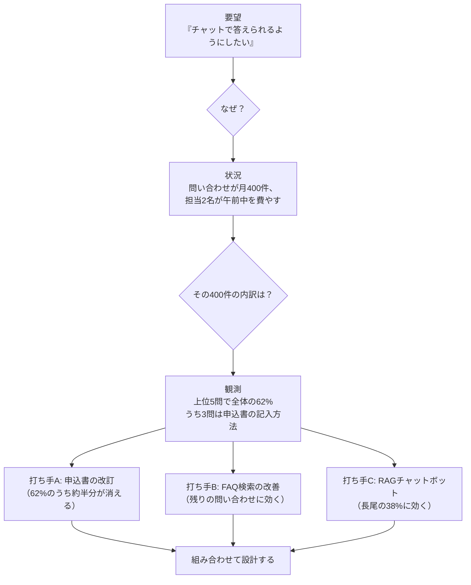
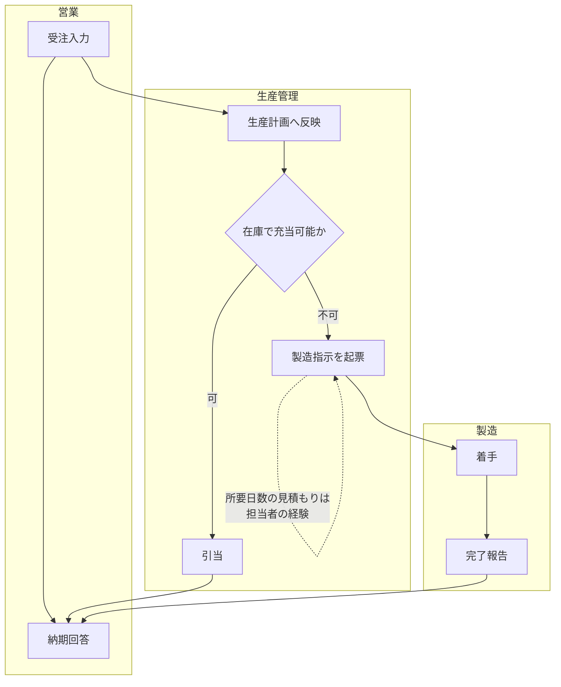
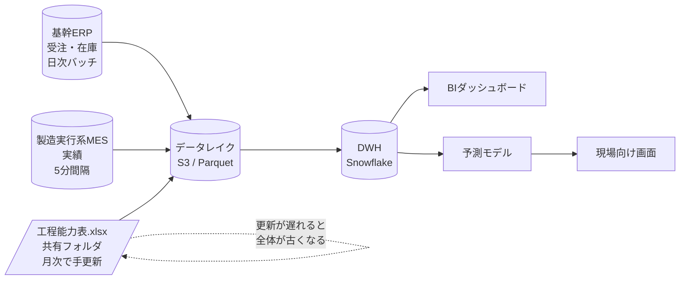
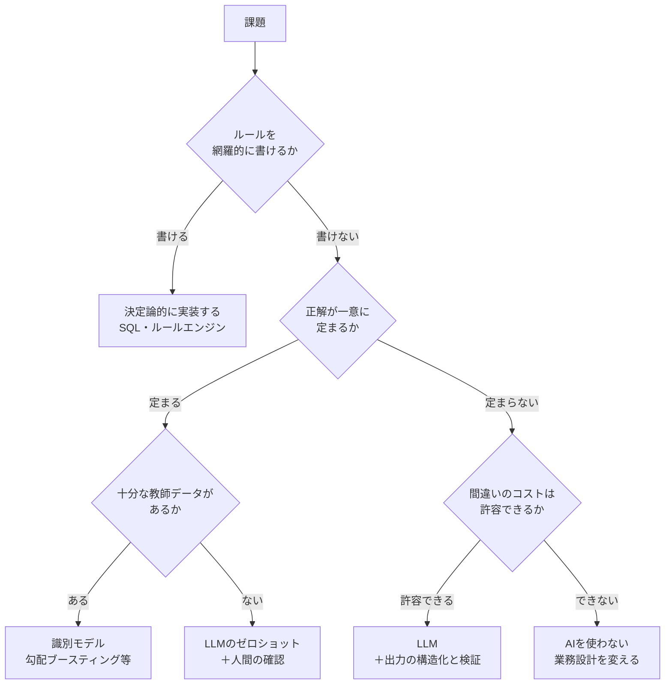

# 第2章 エンタープライズ領域における課題発見と「問い」の再定義

顧客は「AIで問い合わせ対応を自動化したい」と言う。この一文には、すでに三つの決定が埋め込まれている。解くべき課題は問い合わせ対応であること、解法はAIであること、目標は自動化であること。FDEの最初の仕事は、この三つをいったん分解して、それぞれが本当に正しいかを確かめることである。

分解の結果、「問い合わせ対応の工数が多いのではなく、同じ問い合わせが繰り返し来る原因が申込書のわかりにくさにある」と判明すれば、作るべきものはチャットボットではなく申込書の改訂案になる。それでもチャットボットを作るという判断もありうる。重要なのは、**判断をした自覚があるかどうか**である。

## 2.1 「欲しいもの」と「必要なもの」の乖離を解き明かす {#gap}

要望と必要の乖離は、悪意でも無能でもなく、構造的に生まれる。顧客は自分の業務については専門家だが、技術で何ができるかについては専門家ではない。したがって要望は、**自分が知っている解法の語彙**で表現される。表計算しか知らなければ「集計を速くしたい」となり、チャットボットを見たことがあれば「チャットで答えられるようにしたい」となる。

FDEがやるべきなのは、要望を否定することではなく、要望を生んだ状況まで遡ることである。



この遡行で重要なのは、**数を数える**という一点である。「問い合わせが多い」は要望だが、「月400件、上位5問で62%」は事実であり、打ち手の優先順位を決められる。FDEは現場に入って最初の一週間で、この種の数字を自分で数える。顧客に依頼して集計してもらうと二週間かかり、しかもその集計は既存の分類軸で行われるため、本当に見たい切り口が見えない。

### 2.1.1 ヒアリングと観察のフレームワーク

ヒアリングで有効な質問は、意見ではなく事実を引き出すものである。次の対比を頭に入れておく。

| 効きにくい質問 | 効く質問 |
| --- | --- |
| どんな機能がほしいですか | 昨日、この作業に何分かかりましたか |
| この画面は使いやすいですか | 直近でこの画面を使ったのはいつですか |
| 課題は何ですか | 先月、締め処理が遅れたのは何日でしたか。原因は |
| AIで何ができると嬉しいですか | 判断に迷ったとき、誰に何を聞いていますか |

右列の質問は、すべて過去の具体的な出来事を尋ねている。人は未来の要望については想像で答えるが、過去の出来事については記憶で答える。記憶のほうがはるかに信頼できる。

観察では、次の四つを重点的に見る。これらはいずれも、システム化の余地が高い割に、要望として言語化されにくい。

**シャドーIT**。 公式のシステムの外で回っている仕組みのことである。部門で共有されているExcelマクロ、個人のAccessデータベース、誰かが作った自動化スクリプト。これらは業務の実態を最も正確に反映しているため、要件定義の一次資料として極めて価値が高い。同時に、作成者しか保守できない爆弾でもある。

シャドーITを見つけたときの初動は、「なくすべきもの」として扱わないことだ。それは現場が自分たちで課題を解決した成果であり、否定から入ると情報が出てこなくなる。中身を見せてもらい、そこに埋め込まれた業務ルールを抽出する。

**転記**。 あるシステムの出力を人が別のシステムに入力している箇所。ここには必ず自動化の余地があり、同時に、転記の途中で人が行っている判断（例外の除外、単位の換算、名寄せ）が隠れている。その判断こそが、後でAIに任せるかどうかを検討する対象になる。

**待ち時間**。 バッチの完了待ち、承認待ち、他部門からの連絡待ち。待ち時間はリードタイムを支配するが、担当者は「そういうもの」として受け入れているため、課題として挙がらない。

**例外処理**。 「基本はこうなんですが、この条件のときだけは別で」という説明が出たら、必ず掘る。例外の頻度と種類が、システムの複雑性を決める最大の要因になる。例外が全体の1%なら手作業に残す設計が成り立つが、20%なら例外こそが本流である。

::: tip 観察メモの取り方
その場でメモするのは、所要時間・件数・登場する固有名詞（システム名、帳票名、部門名）の三つに絞る。解釈は後で書く。観察中に解釈を書き始めると、仮説に合う事実だけを拾うようになる。
:::

### 2.1.2 業務プロセスとデータフローを二枚の図にする

ヒアリングの成果は、二種類の図に落とすと検証可能になる。一枚目は業務プロセス（誰が、いつ、何をするか）、二枚目はデータフロー（データがどこからどこへ流れるか）である。両方が必要な理由は、**人の流れとデータの流れがずれている箇所にこそ課題がある**からだ。

まず業務プロセスを、BPMNの考え方にならって書く。レーン（担当者）とゲートウェイ（分岐）を明示するのがポイントである。



点線の自己ループとして描いた箇所が、この図の主役である。「担当者の経験」と書かれた部分は、システムに存在しないロジックであり、属人化のポイントであり、そして予測モデルの候補地でもある。業務プロセス図を書く目的は、手順を記録することではなく、**システム化されていない判断の所在を特定すること**にある。

次にデータフローを書く。ここでは、保管場所と更新頻度を必ず添える。



この図を書くと、ほぼ必ず一つ以上の「共有フォルダのExcel」が現れる。そしてそれが、パイプライン全体の鮮度を律速していることが判明する。第3章で扱うのは、この種のデータをどう扱うかという問題である。

二枚の図が揃ったら、顧客に見せて間違いを指摘してもらう。この確認作業には、正しい図を作ること以上の効果がある。**顧客の側に、自分たちの業務を構造として見る視点が生まれる**という効果である。これは第14章の内製化支援に直結する。

## 2.2 AI/データ活用におけるフィージビリティ判定 {#feasibility}

課題が特定できたら、次は解法の選択である。ここでFDEが最も価値を出せるのは、**AIを使わない判断**を自信を持ってできることだ。

### 2.2.1 決定論と確率論の境界線

境界を引くための実務的な問いは四つある。



それぞれの分岐で、現場で実際に効く判定材料を挙げる。

**ルールを網羅的に書けるか。** 書けるなら書くべきである。消費税の計算、締め日の判定、与信限度額のチェック。これらをLLMにやらせるのは、性能・コスト・監査可能性のすべてで劣る。判定の目安は、業務担当者に「例外なく、こうすれば必ず正しい、と言い切れますか」と尋ねて、言い切れるかどうかである。

ただし注意すべき罠がある。担当者が「ルール化できる」と言っても、実際に書き出すと三十を超える条件分岐が現れ、しかも相互に矛盾している、という事態は珍しくない。**ルールを実際に書き出してみる**ところまでが検証である。

**正解が一意に定まるか。** 過去のデータに対して、誰が見ても同じ答えになるか。不良品かどうかは一意に定まる。「この問い合わせの回答として適切か」は一意に定まらない。一意に定まらない課題では、精度という指標そのものが成立しないため、第12章で扱う別の評価軸が必要になる。

**十分な教師データがあるか。** ここで「十分」の水準は課題によるが、実務上の感触として、二値分類で少数クラスが数百件を下回ると、モデルの学習より人間のルール抽出のほうが速いことが多い。そして企業の現場では、ラベルが存在しないか、存在しても定義が途中で変わっていることが大半である。

**間違いのコストは許容できるか。** LLMの出力が一定の割合で誤ることを前提に、その誤りが業務に流れ込んだときの損害を見積もる。ここで効くのが、**誤りの検出可能性**という観点である。同じ5%の誤り率でも、誤りが後工程で必ず気づかれる場合（たとえば数値が明らかに桁違いになる）と、気づかれずに通過する場合とでは、リスクがまったく違う。

| 誤りの性質 | 検出可能性 | 設計方針 |
| --- | --- | --- |
| 形式が壊れる（JSONとして不正） | 高（機械的に検出可） | スキーマ検証＋再試行で吸収する |
| 値域を外れる（在庫数が負） | 高（バリデーションで検出可） | 事後検証ルールを必ず置く |
| もっともらしいが事実と違う | 低 | 出典を必ず併記し、人間の確認を挟む |
| 判断が業務慣習とずれる | 低 | 現場レビューを評価データに取り込む |

第7章で扱う構造化出力は、上二つを機械的に潰すための技術である。下二つは技術だけでは潰せないため、第8章の人間介入の設計と、第12章の評価が必要になる。

### 2.2.2 ROIを多面的に試算する

稟議を通すのはFDEの仕事ではない、と考えるのは早計である。FDEが試算しないと、試算は「工数削減時間×人件費単価」という単純な式で作られ、そして実績が出ないまま終わる。

現実的なROIの組み立ては、三つの層に分けると説明しやすい。

**第一層は、削減した作業時間である。** 最も計算しやすく、最も過大評価されやすい。過大評価を避ける係数は二つある。一つは**残存作業率**——自動化しても、確認や例外処理は残る。実務では三割前後残ると見ておくと外しにくい。もう一つは**再配置可能性**——浮いた時間が別の価値ある業務に回るのか、それとも単に余裕になるのか。後者なら会計上の効果はゼロである。

```python
def annual_labor_saving(
    minutes_per_case: float,     # 1件あたりの現行作業時間
    cases_per_month: int,        # 月間件数
    residual_ratio: float = 0.3, # 自動化後も残る作業の割合
    reallocation: float = 0.6,   # 浮いた時間が価値業務に回る割合
    hourly_cost: int = 5000,     # 時間あたり人件費
) -> int:
    """年間の労務削減効果。係数を明示的に置き、後で顧客と議論できるようにする。"""
    saved_h = minutes_per_case * cases_per_month * 12 / 60
    return int(saved_h * (1 - residual_ratio) * reallocation * hourly_cost)
```

このコードの要点は計算式ではなく、**係数を引数として表に出していること**にある。`residual_ratio` と `reallocation` は推定値であり、顧客と合意すべき数字である。式の中に埋め込んでしまうと議論の対象にならず、後から「前提が違った」という話になる。

**第二層は、リードタイムの短縮である。** 見積回答が三日から半日になれば、受注率が上がる可能性がある。ここは因果の証明が難しいため、効果額を主張するより、**先行指標として測る**という約束にしておくほうが健全だ。「受注率が上がる」と言い切らず、「回答リードタイムを測定し、受注率との相関を四半期ごとに確認する」と定義する。

**第三層は、意思決定の精度である。** 最も効果が大きく、最も測りにくい。在庫の欠品率、不良の流出率、与信の貸倒率といった既存のKPIに接続できるかどうかがすべてである。接続できないなら、この層は主張しない。

::: warning ROI試算で避けるべきこと
削減時間を人数換算して「2.5人分の削減」と書くと、現場は協力しなくなる。数字は同じでも、「担当者が本来やるべき例外対応に時間を回せる」という設計にしておかないと、データ提供もヒアリングも止まる。FDEは現場の協力の上に成立する職種であり、試算の表現はその協力を壊さない範囲で選ぶ。
:::

最後に、投資側のコストも同じ粒度で置く。LLMを使うシステムでは、開発費だけでなく**推論コストが運用費として毎月かかる**点が従来システムと大きく違う。第13章で扱うコスト最適化は、この運用費を設計変数として扱う技術である。初期の試算では、月間リクエスト数×平均トークン数×単価に、評価とリトライぶんの係数を1.5倍ほど掛けておくと、実績と大きくずれない。

## この章のまとめ

課題発見とは、要望を事実まで遡り、数を数え、打ち手を並べる作業である。ヒアリングでは意見ではなく過去の出来事を尋ね、観察ではシャドーIT・転記・待ち時間・例外処理という四点を重点的に見る。成果は業務プロセス図とデータフロー図の二枚に落とし、システム化されていない判断の所在を特定する。

解法の選択では、決定論で書けるものは決定論で書く。AIを使うと決めたら、誤りの検出可能性という観点で設計方針を分ける。ROIは削減時間・リードタイム・意思決定精度の三層に分け、推定係数を表に出して顧客と合意する。

次章から技術編に入る。最初に立ちはだかるのは、この章で図に描いた「共有フォルダのExcel」である。

::: tip この章のポイント
- 要望は顧客が知っている解法の語彙で表現される。要望を生んだ状況まで遡り、自分で数を数える
- ヒアリングは意見ではなく過去の具体的な出来事を尋ねる。観察はシャドーIT・転記・待ち時間・例外処理を狙う
- 業務プロセス図とデータフロー図の二枚を書き、システム化されていない判断と、鮮度の律速点を特定する
- ルールを網羅的に書けるなら決定論で実装する。AIの採用は、誤りの検出可能性とセットで判断する
- ROIは三層に分け、残存作業率と再配置可能性という推定係数を明示して顧客と合意する
:::
