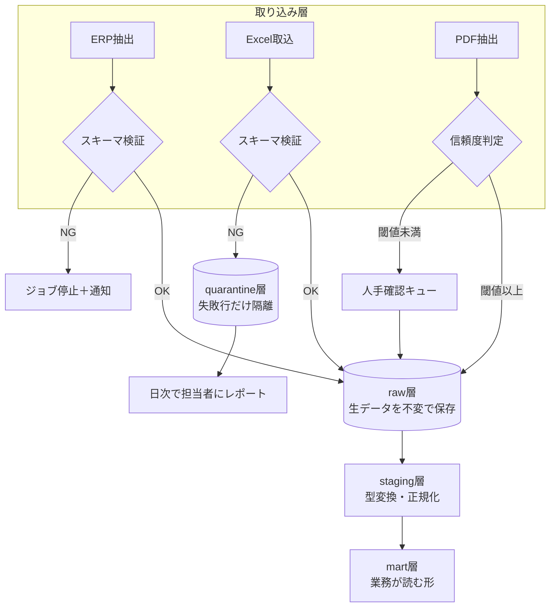
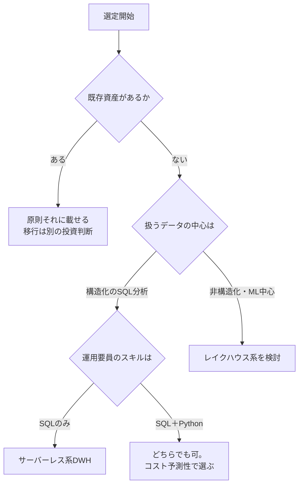
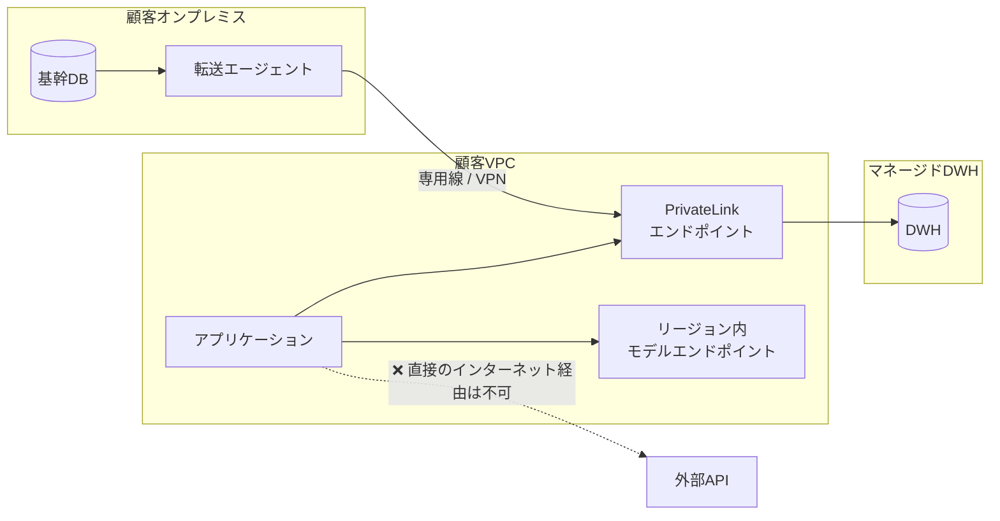

# 第3章 エンタープライズ・データの泥臭い現実に立ち向かう

前章の最後に描いたデータフロー図には、共有フォルダに置かれた `工程能力表.xlsx` が登場した。この一つのファイルが、月次で手更新され、セル結合があり、担当者が独自に追加した列があり、そして三年前から同じ人しか触っていない。エンタープライズのデータ基盤とは、この種のファイルと基幹システムを、同じパイプラインの上で扱えるようにする営みである。

本章では、現場で必ず出会う三つの現実——サイロ化、非構造化、スキーマ崩壊——への処方箋を書く。理想的なアーキテクチャの話ではなく、**壊れたときに誰がどう気づくか**を軸に設計する。

## 3.1 サイロ化・非構造化・スキーマ崩壊への処方箋 {#dirty-data}

### 3.1.1 三つの入力経路と、それぞれの壊れ方

入力を三種類に分けると、必要な防御が整理できる。

| 経路 | 典型 | 主な壊れ方 | 防御の中心 |
| --- | --- | --- | --- |
| 基幹系（ERP/CRM） | 受注、在庫、取引先マスタ | 論理削除の見落とし、コード体系の世代混在、締め後の遡及更新 | 抽出条件とスナップショット設計 |
| 人が作る表（Excel/CSV） | 工程能力表、料金表、配賦基準 | 列の増減、セル結合、型の混在、手入力の表記ゆれ | スキーマ検証と隔離（quarantine） |
| 文書（PDF/メール/画像） | 帳票、契約書、仕様書 | レイアウト変動、スキャン品質、版管理の欠如 | 抽出結果の信頼度と人手確認の導線 |

この三つを同じ一本のパイプラインで扱おうとすると破綻する。分けるべきは処理ではなく、**失敗したときの扱い**である。基幹系の抽出が失敗したらジョブを止めるべきだが、一つのExcelが壊れているだけで全体を止めると、現場は「またシステムが止まった」と言い出す。



この図の設計上の主張は三つある。

第一に、**raw層は不変（immutable）にする**。取り込んだ生データは加工せず、取得日時つきで保存する。後になって「先月の数字が変わっているのはなぜか」と問われたとき、raw層がなければ答えられない。ストレージの費用は、この保険料としては安い。

第二に、**quarantineは捨て場ではなく差し戻しの導線である**。失敗した行を隔離するだけでは、誰も直さない。隔離した行を日次で担当者にレポートし、直す責任者を決めるところまでが設計に含まれる。

第三に、**人手確認キューをパイプラインの一部として持つ**。PDFからの抽出で信頼度が低いものを人が確認する経路を、例外処理ではなく正規の経路として設計する。第8章の人間介入と同じ思想である。

### 3.1.2 スキーマ検証を「最初の門」に置く

Excelを扱うときに最も効くのは、読み込み直後にスキーマを検証し、期待と違えば早く止めることである。pandasで読んで、そのまま加工を続けると、エラーは十行先の集計処理で「なぜか合計が合わない」という形で表面化し、原因究明に半日かかる。

```python
from datetime import date
from typing import Annotated
from pydantic import BaseModel, Field, field_validator, ValidationError

class ProcessCapacityRow(BaseModel):
    """工程能力表の1行。Excelの1行がこの型に入らなければ、そこで止める。"""
    model_config = {"str_strip_whitespace": True, "extra": "forbid"}

    line_code: Annotated[str, Field(pattern=r"^L\d{3}$")]        # 例: L012
    item_code: Annotated[str, Field(min_length=1, max_length=20)]
    capacity_per_hour: Annotated[float, Field(gt=0, le=10_000)]
    effective_from: date
    effective_to: date | None = None

    @field_validator("item_code", mode="before")
    @classmethod
    def normalize_item_code(cls, v: object) -> object:
        # 全角英数・前後空白・区切り記号のゆれを吸収する
        if isinstance(v, str):
            return v.translate(str.maketrans(
                "ＡＢＣＤＥＦＧＨＩＪＫＬＭＮＯＰＱＲＳＴＵＶＷＸＹＺ０１２３４５６７８９－",
                "ABCDEFGHIJKLMNOPQRSTUVWXYZ0123456789-",
            )).strip().upper()
        return v

    @field_validator("effective_to")
    @classmethod
    def check_period(cls, v: date | None, info) -> date | None:
        start = info.data.get("effective_from")
        if v and start and v < start:
            raise ValueError("effective_to が effective_from より前になっている")
        return v
```

`extra: "forbid"` は重要な設定である。Excelに列が追加されたとき、黙って無視するのではなく失敗させる。追加された列は、担当者が業務上の必要があって足したものであり、パイプラインがそれを知らないまま動き続けるほうが危険だ。

検証の結果は、行単位で成功と失敗に分ける。

```python
def validate_rows(records: list[dict]) -> tuple[list[ProcessCapacityRow], list[dict]]:
    ok, ng = [], []
    for i, rec in enumerate(records, start=2):  # ヘッダ行ぶんずらす＝Excelの行番号に一致させる
        try:
            ok.append(ProcessCapacityRow(**rec))
        except ValidationError as e:
            ng.append({
                "excel_row": i,
                "errors": [
                    {"field": ".".join(str(x) for x in err["loc"]), "message": err["msg"]}
                    for err in e.errors()
                ],
                "raw": rec,
            })
    return ok, ng
```

`excel_row` をExcelの行番号に合わせるという細部が、現場では大きな差になる。「3行目の数量が不正です」と言えば担当者は直せるが、「インデックス1でバリデーションエラー」と言われても直せない。**エラーメッセージは、受け取る人の語彙で書く。**

> データ品質の仕組みは、検出する能力ではなく、直す人に届く導線で評価される。

### 3.1.3 クレンジングの定番パターン

現場で繰り返し必要になる処理を、パターンとして持っておく。

**文字コードと改行。** 日本のエンタープライズではShift_JIS（正確にはCP932）が現役である。UTF-8で読んで失敗したらCP932で読み直す、という二段構えを標準にしておく。さらに、CP932にしか存在しない機種依存文字（丸数字、ローマ数字）が混じると、下流のDBで落ちる。取り込み時に正規化するか、少なくとも検出する。

```python
def read_text(path: str) -> str:
    for enc in ("utf-8-sig", "cp932", "utf-8"):
        try:
            with open(path, encoding=enc) as f:
                return f.read()
        except UnicodeDecodeError:
            continue
    raise ValueError(f"文字コードを判定できない: {path}")
```

**欠損値の意味を分ける。** 欠損には三種類ある。値が存在しない（未入力）、値がゼロである、値が「該当なし」である。Excelでは三つとも空セルで表現されることがあるが、意味はまったく違う。在庫数の空欄をゼロで埋めると、欠品として集計され、発注が走る。**欠損を機械的に埋める処理は、業務上の意味を確認してからでないと書かない。**

**名寄せと表記ゆれ。** 取引先名の「株式会社」「(株)」「㈱」、住所の「1-2-3」「一丁目二番三号」。完全な自動化は不可能なので、次の三段構成にする。

1. 正規化ルール（法人格の統一、全角半角、空白除去）で機械的に寄せる
2. 残った候補を編集距離や部分一致でグルーピングし、**候補として提示する**
3. 人が確定した対応表を保存し、次回以降は対応表を優先する

三段目が肝心である。人の判断を対応表として蓄積すれば、名寄せの精度は運用のたびに上がる。LLMを使う場合も同じで、LLMの出力を直接採用せず、対応表への候補提示として使う。LLMは「株式会社山田製作所」と「ヤマダ製作所」が同じかどうかを判断できないが、候補を絞ることはできる。

**日付と締め。** 会計期間、締め日、営業日カレンダー。ここを業務ルールとして明示しないと、月次集計が一日ずれる。締め日の扱いは顧客ごとに違うため、第1章で述べた「設定に追い出す」対象の典型である。

### 3.1.4 PDF帳票をパイプラインに載せる

非構造化文書の取り込みは、2020年代半ばに選択肢が大きく増えた領域である。判断軸は精度ではなく、**運用の形**にある。

| 方式 | 向く場面 | 弱点 |
| --- | --- | --- |
| レイアウト固定のルール抽出 | 自社発行の定型帳票、罫線が安定 | レイアウト変更で全滅する |
| OCR＋座標ベース抽出 | スキャン紙、レイアウトが概ね一定 | 傾き・かすれに弱い |
| 文書AI（レイアウト解析モデル） | 取引先ごとに様式が違う請求書など | 費用、項目定義の事前設計が必要 |
| LLMへの画像/テキスト投入 | 様式が多様、量が中程度 | 数値の読み取り誤りが静かに混ざる |

LLMで請求書を読ませる構成は手軽だが、**金額を読み違えても、もっともらしい結果が返る**という性質を忘れてはならない。第2章の表で言えば「もっともらしいが事実と違う」に該当し、検出可能性が低い。したがって次の二つを必ず併設する。

- **算術的な整合チェック**。明細の合計と小計、小計と消費税と総額の関係を機械的に検算する。ここが合わないものは人手確認に回す
- **信頼度と原文の併記**。抽出した各項目に、原文のどの位置から取ったかを添える。確認する人が原本と突き合わせられるようにする

```json
{
  "invoice_no": {"value": "INV-2026-0412", "confidence": 0.98, "source_page": 1},
  "total_amount": {"value": 1284000, "confidence": 0.91, "source_page": 1},
  "lines": [
    {"item": "部品A", "qty": 200, "unit_price": 4200, "amount": 840000},
    {"item": "部品B", "qty": 120, "unit_price": 3700, "amount": 444000}
  ],
  "checks": {"lines_sum_matches_total": true, "tax_consistent": true}
}
```

この `checks` ブロックが、AI出力を業務に流す際の最低限の安全装置になる。詳細は第7章の構造化出力と第12章の評価で扱う。

## 3.2 マルチクラウド・ハイブリッド環境でのデータ連携 {#platform}

### 3.2.1 DWH/レイクハウスの選定基準

顧客の環境にすでに何かがある場合、FDEが選定を主導する機会は多くない。それでも判断が必要になる場面はあるので、軸を整理しておく。重要なのは製品の優劣ではなく、**顧客の組織がどの運用を引き受けられるか**である。

| 観点 | Snowflake | BigQuery | Databricks |
| --- | --- | --- | --- |
| 運用の重さ | 軽い。計算資源はウェアハウス単位で明示的 | 最も軽い。サーバーレス | 重い。クラスタとランタイムの管理が要る |
| 課金の見え方 | 稼働時間ベースで予測しやすい | スキャン量ベース。クエリ次第で変動 | コンピュート時間ベース |
| 得意分野 | 構造化データのSQL分析、データ共有 | 大規模スキャン、GAデータ連携 | 非構造化・ML・ストリーミング |
| AI/ML統合 | SQLからのモデル呼び出しが整備 | BigQuery MLとVertex AI連携 | MLflow含め最も一体化 |
| 引き継ぎやすさ | SQLだけで完結しやすい | SQLだけで完結しやすい | Python/Sparkの素養が要る |

最後の行が、FDEにとっては最も重い。第14章で扱うように、FDEの成果物は引き継がれなければ価値を失う。顧客の情報システム部門にPythonを書ける人が一人もいない環境でDatabricksを選ぶと、半年後に誰もパイプラインを直せなくなる。**技術的な最適解より、組織が保守できる解を選ぶ**という判断は、日和見ではなく設計判断である。

判断の順序は次のようにするとぶれない。



### 3.2.2 閉域網の要件を満たすデータ転送設計

金融、医療、製造の基幹領域では、「インターネットを経由しない」ことが要件になる。この制約は後から足せないため、設計の最初期に確認する。

確認すべき項目は具体的には次のとおりである。

- データがVPC/VNetの外に出ることが許されるか。許されない場合、マネージドサービスへの接続はプライベート接続（PrivateLink、Private Service Connect、Private Endpoint）が必須になる
- LLMのAPIを外部に呼べるか。呼べない場合、クラウド事業者が自社リージョン内で提供するモデルエンドポイント、あるいはオンプレミスのモデルに限定される
- ログやトレースを外部SaaSに送れるか。第13章のオブザーバビリティの選択肢がここで決まる
- 個人情報がどの区分に該当し、どこまで保存してよいか



FDEとして重要なのは、この構成を**PoCの段階で一度は通しておく**ことである。第1章で述べた「精度を落として経路を通す」の具体例がこれにあたる。専用線の帯域、プロキシの認証、証明書の配布——どれも技術的には難しくないが、社内手続きに数週間かかる。その待ち時間を、モデルの精度改善と並行して消化する計画にしておく。

::: warning 閉域網でよく詰まる三点
プロキシのTLS終端によって、自己署名証明書をランタイムに信頼させる必要が出る。パッケージレジストリへの到達が制限され、依存ライブラリの取得ができない。そしてDNSの解決がプライベートゾーンに向いておらず、エンドポイント名が引けない。この三つは、初日に確認しておけば数時間で片づく。後から見つかると、そのたびに承認手続きが要る。
:::

## この章のまとめ

エンタープライズのデータは、基幹系・人が作る表・文書という三つの経路から入り、それぞれ違う壊れ方をする。設計の中心は処理の共通化ではなく、失敗の扱いを分けることにある。raw層は不変で保持し、検証は入口に置き、隔離した行は直す人に届ける。

クレンジングでは、文字コード、欠損の意味、名寄せ、締めという四つの定番に、顧客ごとの設定として対応する。非構造化文書は、抽出精度ではなく検算と人手確認の導線で安全性を確保する。

基盤の選定は、技術的な最適解ではなく、顧客組織が保守できる解を選ぶ。閉域網の要件は初日に確認し、PoCの段階で経路を通しておく。

次章では、こうして取り込んだデータを、分析とAIの両方が使える形にモデリングする技術を扱う。

::: tip この章のポイント
- 入力経路を三つに分け、失敗したときの扱い（停止・隔離・人手確認）を経路ごとに設計する
- raw層は不変で保持する。過去の数字が変わった理由を説明できることが、信頼の前提になる
- スキーマ検証は入口に置き、未知の列は黙って無視せず失敗させる。エラーは受け取る人の語彙で書く
- 名寄せは機械的な正規化・候補提示・人が確定した対応表の三段構成にし、判断を資産として蓄積する
- 文書AIやLLMによる抽出は、算術的な検算と原文併記をセットにしないと、誤りが静かに業務へ流れる
- 基盤の選定は、顧客組織が保守できるかを最上位の軸に置く。閉域網の要件は初日に確認する
:::
