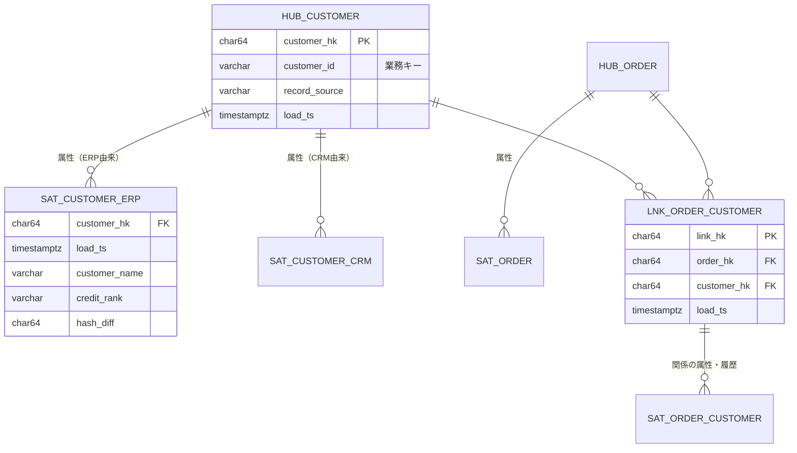
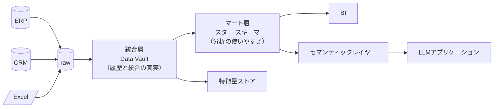
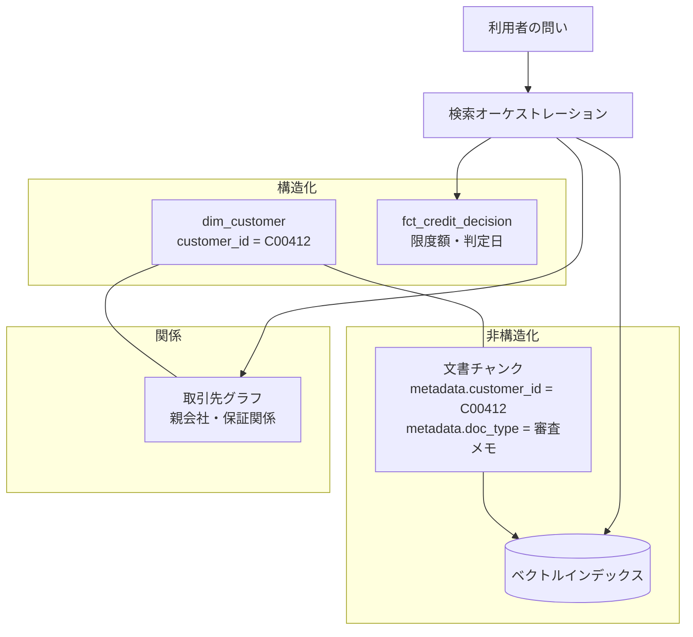

# 第4章 分析とAI活用のためのデータモデリング技術

データモデリングは、FDEの仕事の中で最も「後から効く」領域である。モデリングが適切なら、その後に来る要望の大半は数行のSQLで答えられる。不適切なら、一つ一つの要望に対して個別のパイプラインを増築することになり、半年後には誰も全体を把握できなくなる。

本章では、ディメンショナルモデリングとData Vault 2.0という二つの手法を、**どちらを選ぶかの判断**を中心に扱う。そのうえで、LLMアプリケーションがデータを参照するときに必要になるセマンティックレイヤーの設計に接続する。

## 4.1 ディメンショナルモデリング実践 {#dimensional}

### 4.1.1 ファクトとディメンションという分け方

ディメンショナルモデリング（Kimball手法）の中核は、業務データを二種類に分けることである。

- **ファクト（fact）**: 起きた出来事と、その量。受注、出荷、入金、クリック。行が増え続ける
- **ディメンション（dimension）**: 出来事を説明する属性。顧客、商品、日付、拠点。行はあまり増えない

この分け方の実用的な価値は、**分析の問いがすべて「ファクトの量を、ディメンションで切る」という形に統一される**点にある。「今月の関東地区における商品カテゴリ別の受注金額」は、受注ファクトを地区ディメンションと商品ディメンションで切っているだけだ。問いの形が揃えば、BIツールもLLMも同じ構造の上で動ける。

設計の出発点は、**グレイン（粒度）の宣言**である。「このファクトテーブルの1行は何を表すか」を一文で書けるまで、設計を進めてはならない。

```sql
-- グレイン: 受注明細1行（受注番号 × 明細行番号）につき1レコード
create table fct_order_line (
    order_line_key   bigint      primary key,       -- サロゲートキー
    order_no         varchar(20) not null,          -- 業務キー（自然キー）
    line_no          int         not null,
    -- ディメンションへの外部キー
    order_date_key   int         not null,          -- dim_date
    customer_key     bigint      not null,          -- dim_customer（SCD2）
    item_key         bigint      not null,          -- dim_item（SCD2）
    site_key         bigint      not null,          -- dim_site
    -- 測定値（加法的な指標を優先する）
    quantity         numeric(18,3) not null,
    unit_price       numeric(18,4) not null,
    amount           numeric(18,2) not null,
    discount_amount  numeric(18,2) not null default 0,
    -- 監査列
    source_system    varchar(20)  not null,
    loaded_at        timestamptz  not null,
    unique (order_no, line_no)
);
```

この定義で意図している設計判断を三つ挙げる。

**測定値は加法的にする。** `amount` は足し算できるが、`unit_price` は足せない。単価の平均が必要なら、金額の合計を数量の合計で割って算出する。比率や単価を測定値として持つと、集計の階層が変わったときに誤った数字が出る。「部分の平均の平均は全体の平均ではない」という古典的な罠は、ファクトテーブルの設計段階で防ぐ。

**業務キーを残す。** サロゲートキーで結合しつつ、`order_no` を保持する。障害調査で現場と会話するとき、必要なのは業務キーのほうである。

**監査列を必ず置く。** `source_system` と `loaded_at` がないと、数字が合わないときに「どの取り込みで入った行か」を追えない。第3章のraw層と対になる仕組みである。

### 4.1.2 SCDで履歴を持つ

ディメンションの属性は変化する。顧客の担当営業が変わり、商品がカテゴリを移り、拠点が統廃合される。この変化をどう扱うかが、SCD（Slowly Changing Dimension）の設計である。

| 型 | 挙動 | 使いどころ | 落とし穴 |
| --- | --- | --- | --- |
| Type 1 | 上書きする。履歴は残らない | 誤記の訂正、表示名の変更 | 過去の集計値が遡って変わる |
| Type 2 | 新しい行を追加し、有効期間で管理 | 組織変更、区分変更など分析に効く属性 | 行数が増え、結合条件が複雑になる |
| Type 3 | 前の値を別列に持つ | 「変更前後」の二値比較だけが必要なとき | 三回以上の変更に対応できない |

実務ではType 2が主役になる。実装はこうなる。

```sql
create table dim_customer (
    customer_key      bigint      primary key,      -- サロゲートキー（版ごとに発番）
    customer_id       varchar(20) not null,         -- 業務キー（版をまたいで不変）
    customer_name     varchar(200) not null,
    industry_code     varchar(10),
    sales_rep_code    varchar(10),
    credit_rank       varchar(2),
    valid_from        timestamptz not null,
    valid_to          timestamptz not null default '9999-12-31'::timestamptz,
    is_current        boolean     not null default true,
    row_hash          char(64)    not null          -- 変更検知用（属性の連結値のSHA-256）
);
create index on dim_customer (customer_id, valid_from);
```

`row_hash` は、変更検知を単純化するための実務的な工夫である。監視対象の属性を連結してハッシュ化し、前回と違えば新しい版を作る。属性が二十個あっても比較は一回で済み、比較漏れがなくなる。

そして、ファクトからの結合は**イベント発生時点の版**を指す。

```sql
-- 受注時点の顧客属性で集計する（現在の属性ではない）
select d.industry_code,
       sum(f.amount) as amount
from fct_order_line f
join dim_customer d
  on d.customer_id = f.customer_id
 and f.order_ts >= d.valid_from
 and f.order_ts <  d.valid_to
group by 1;
```

ここが業務と最も衝突する箇所である。現場は「今の担当営業別に、過去の実績を見たい」と言うこともあれば、「当時の担当営業の実績として見たい」と言うこともある。**両方が必要**というのが正しい答えで、その場合はディメンションを二通りの結合で使えるようにする。前者は `is_current = true` の行に業務キーで結合し、後者は有効期間で結合する。この二つを別々のビューとして用意し、名前で区別する（`dim_customer_current` と `dim_customer_historical`）。名前で区別しないと、必ず誤用される。

::: warning 遡及更新という厄介事
基幹システムでは、締め後に過去の伝票が修正されることがある。このとき、ファクトを上書きするか、打ち消し行を追加するかで運用が分かれる。監査が必要な領域では、打ち消し行（元の行と符号を反転した行）を追加する方式を選ぶ。上書きすると、昨日出したレポートが再現できなくなる。
:::

## 4.2 Data Vault 2.0 と現代的アーキテクチャ {#data-vault}

### 4.2.1 Hub・Link・Satellite

Data Vault 2.0は、統合と履歴保持を最優先した手法である。三つの構成要素を持つ。



- **Hub**: 業務キーだけを持つ。顧客という概念が存在することだけを表現する
- **Link**: Hub同士の関係を表す。受注と顧客の関係、受注と商品の関係
- **Satellite**: 属性と履歴を持つ。**ソースシステムごとに分ける**のが要点

Satelliteをソースごとに分けるという設計が、この手法の実用的な価値の中心にある。ERPの顧客名とCRMの顧客名が食い違っているとき、ディメンショナルモデリングでは取り込み時にどちらかを選ぶ必要がある。Data Vaultでは両方を保持し、統合の判断を下流に遅らせられる。**統合ルールが確定していない段階でも、データを溜め始められる**という利点は、FDEの初期フェーズと相性がよい。

さらに、ハッシュキー（`customer_hk` は業務キーのハッシュ）を使うことで、各テーブルのロードが独立する。Hubのロードが終わるのを待たずにSatelliteをロードできるため、並列化しやすい。

### 4.2.2 どちらを選ぶか

二つの手法は排他ではない。実務では、Data Vaultを統合層に置き、その上にディメンショナルモデルをマートとして構築する構成がよく使われる。



ただし、この二層構成はコストが高い。FDEが単独で三か月のプロジェクトに入る場合、Data Vaultまで作る余裕はないことが多い。判断の基準を明示しておく。

| 条件 | 推奨 |
| --- | --- |
| ソースが1〜2系統、分析要件が明確 | ディメンショナルモデルのみ |
| ソースが多数、統合ルールが未確定、監査要件が強い | Data Vault＋マート |
| 短期の価値実証が最優先 | マートを直接作り、統合層は後から挿入できる形にしておく |

三行目の「後から挿入できる形にしておく」が実務的に重要である。具体的には、マートを作るSQLの中でソース固有の整形と業務ロジックを混ぜないこと。第5章で扱うdbtのstagingレイヤーが、この分離の実装になる。

## 4.3 AIアプリケーションを見据えたセマンティックレイヤー {#semantic}

### 4.3.1 LLMにテーブルを直接見せてはいけない理由

LLMに自然言語で質問させ、SQLを生成させる構成（Text-to-SQL）は魅力的だが、生のテーブル定義をそのまま渡すと精度が出ない。理由は三つある。

第一に、**列名が業務の語彙と一致しない**。`amount` が税込なのか税抜なのか、`status = 3` が何を意味するのか、スキーマからは読み取れない。

第二に、**指標の定義が一つに定まらない**。「売上」は、受注ベースか、出荷ベースか、入金ベースか。キャンセル分を含むか。この定義が会話のたびに揺れると、出てくる数字も揺れる。

第三に、**結合の正しさを保証できない**。ファクト同士を直接結合するとファンアウト（行の重複）が起き、金額が数倍になる。LLMはもっともらしいJOINを書くが、それが正しいかどうかを検証する術がない。

セマンティックレイヤーは、この三つを宣言的な定義で解決する層である。

```yaml
# semantic/sales.yml — 指標とディメンションの定義をコードとして持つ
semantic_model:
  name: sales
  description: 受注ベースの売上。出荷・入金ベースは別モデルとして定義する。
  base_table: analytics.fct_order_line
  grain: 受注明細1行
  entities:
    - name: customer
      type: foreign
      join: analytics.dim_customer
      on: customer_key
    - name: item
      type: foreign
      join: analytics.dim_item
      on: item_key
  dimensions:
    - name: order_date
      type: time
      granularity: [day, week, month, quarter, fiscal_year]
      expr: dim_date.date_value
    - name: industry
      expr: dim_customer.industry_name
      description: 受注時点の業種区分（現在の業種ではない）
    - name: category
      expr: dim_item.category_name
  measures:
    - name: net_sales
      label: 売上高（税抜・値引後）
      expr: sum(amount - discount_amount)
      format: "#,##0"
      description: キャンセル済みの受注は除外される
      filters: ["fct_order_line.is_cancelled = false"]
    - name: order_count
      label: 受注件数
      expr: count(distinct order_no)
    - name: average_unit_price
      label: 平均単価
      expr: sum(amount) / nullif(sum(quantity), 0)
      description: 明細単価の単純平均ではない
```

この定義がLLMアプリケーションにもたらす効果は大きい。LLMが生成するのはSQLではなく、**セマンティックレイヤーへのクエリ指示**になる。

```json
{
  "model": "sales",
  "measures": ["net_sales", "order_count"],
  "dimensions": ["order_date:month", "industry"],
  "filters": [{"field": "order_date", "op": "between", "value": ["2026-01-01", "2026-06-30"]}],
  "order_by": [{"field": "net_sales", "direction": "desc"}],
  "limit": 20
}
```

出力空間が狭いJSONに限定されるため、第7章で扱うスキーマ検証がそのまま効く。存在しない指標名を書けば検証で弾かれ、結合はセマンティックレイヤーが正しく生成する。**LLMの自由度を意図的に下げることが、精度を上げる最も確実な方法である。**

> Text-to-SQLの精度問題の多くは、モデルの能力ではなく、モデルに渡している構造の貧しさに由来する。

### 4.3.2 ベクトル検索とグラフを同じ設計の中に置く

第6章で扱うRAGは、非構造化文書を対象にする。一方、ここまで作ってきたのは構造化データである。実務の問いは、この二つをまたぐことが多い。

「A社向けの与信判断の根拠を教えて」という問いは、与信額（構造化）と、審査メモ（非構造化）の両方を必要とする。両者をつなぐのは、**共通のエンティティキー**である。



設計上の原則は単純である。**非構造化データのメタデータに、構造化側の業務キーを必ず持たせる。** これを怠ると、ベクトル検索は文書全体を対象にした曖昧な類似検索になり、「A社の」という絞り込みができない。第6章で扱うメタデータフィルタつきハイブリッド検索は、この設計があって初めて機能する。

グラフDBを導入するかどうかは、**多段の関係をたどる問いが業務に存在するか**で決める。「この取引先の親会社が保証している別の取引先の、直近の延滞状況」のような問いが日常的にあるなら、グラフの導入が効く。そうでなければ、再帰CTEで十分に間に合う。

```sql
-- 親子関係を3段までたどる。グラフDB導入前に、まずこれで足りるかを確かめる
with recursive tree as (
    select customer_id, parent_customer_id, 1 as depth
    from dim_customer_current
    where customer_id = 'C00412'
    union all
    select c.customer_id, c.parent_customer_id, t.depth + 1
    from dim_customer_current c
    join tree t on c.parent_customer_id = t.customer_id
    where t.depth < 3
)
select * from tree;
```

新しいミドルウェアを一つ増やすことは、顧客にとって運用対象が一つ増えることを意味する。第3章で述べた「組織が保守できる解」の原則は、ここでも同じように効く。

## この章のまとめ

ディメンショナルモデリングは、グレインの宣言から始め、測定値を加法的に保ち、SCD Type 2で履歴を持つ。現在の属性で見るか当時の属性で見るかは、名前で区別したビューとして両方を用意する。

Data Vault 2.0は、統合ルールが未確定な段階でもデータを溜め始められる手法であり、ソースごとにSatelliteを分けることで食い違いを保持する。短期のプロジェクトではマートを直接作り、統合層を後から挿入できる分離だけ確保しておく。

LLMにテーブルを直接見せず、セマンティックレイヤーで指標と結合を宣言する。LLMの出力を狭いJSONに限定することが、精度を上げる最も確実な方法になる。そして非構造化データには、構造化側の業務キーをメタデータとして必ず持たせる。

次章では、これらのモデルをdbtで実装し、オーケストレーションとCI/CDに載せる。

::: tip この章のポイント
- ファクトのグレインを一文で宣言できるまで設計を進めない。測定値は加法的なものに限る
- SCD Type 2では、現在の属性による集計と当時の属性による集計を、名前で区別して両方提供する
- Data Vaultはソースごとにサテライトを分け、統合の判断を下流に遅らせられる。短期案件では層を足せる分離だけ残す
- LLMにはテーブルではなくセマンティックレイヤーを見せ、出力を狭いJSONに限定して検証可能にする
- 非構造化データのメタデータに構造化側の業務キーを持たせておくと、構造化と非構造化をまたぐ問いに答えられる
:::
