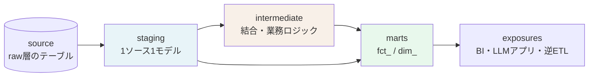
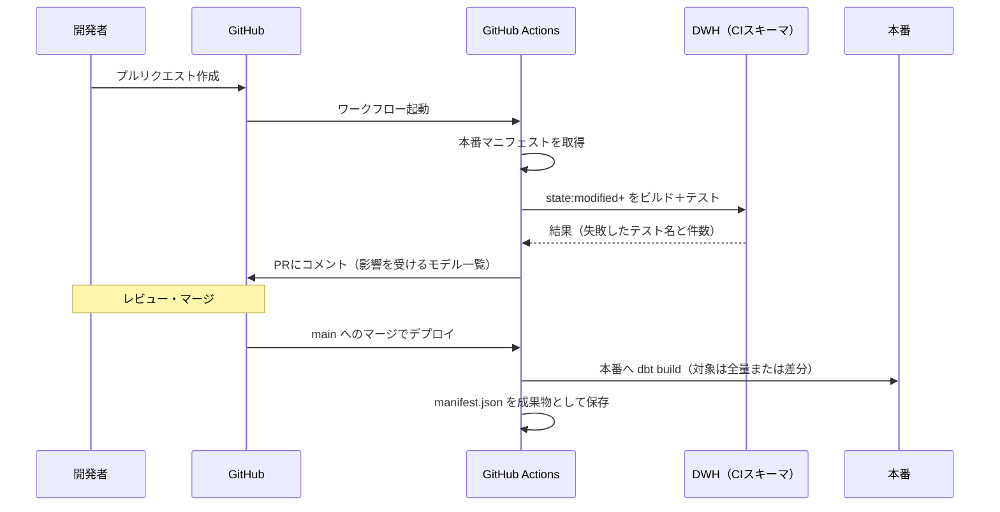

# 第5章 モダン・パイプライン構築：dbt とオーケストレーション

前章で設計したモデルを、実際に動くパイプラインにする。ここでFDEが直面する現実的な問題は、技術選定ではなく**引き継ぎ可能性**である。自分が書いたパイプラインを、三か月後に顧客のエンジニアが直せるか。直せないなら、それは技術的負債を納品したことになる。

dbtが広く使われるようになった理由は、SQLという既存の語彙のまま、ソフトウェアエンジニアリングの作法——モジュール化、テスト、バージョン管理、ドキュメント——を持ち込めた点にある。顧客の情報システム部門にSQLが書ける人がいれば、引き継ぎのハードルは大きく下がる。

## 5.1 dbtによる変換のコード化 {#dbt}

### 5.1.1 三層のレイヤー設計

dbtプロジェクトの構成は、staging・intermediate・martsという三層に分けるのが定石である。この分け方の価値は、**各層で許される操作を限定すること**にある。



| 層 | 許される操作 | 禁止する操作 | 命名 |
| --- | --- | --- | --- |
| staging | 列名の正規化、型変換、単純なフィルタ、1対1の値変換 | 結合、集計、業務ロジック | `stg_<source>__<entity>` |
| intermediate | 結合、業務ロジック、中間集計 | 最終的な命名の確定 | `int_<entity>_<verb>` |
| marts | 最終的な整形、ファクトとディメンションの構築 | ソース固有の整形 | `fct_` / `dim_` |

stagingで結合を禁止する理由は明快である。結合を許すと、同じソースに対する整形が複数のモデルに散らばり、「取引先コードの前ゼロ除去」のようなルールが三か所で微妙に違う実装になる。**ソースごとの整形は一か所に集約する**という制約が、この規約の本質だ。

stagingモデルの実装は、驚くほど単純になる。

```sql
-- models/staging/erp/stg_erp__order_lines.sql
{{ config(materialized='view') }}

with source as (
    select * from {{ source('erp', 'T_ORDER_DETAIL') }}
),

renamed as (
    select
        -- キー
        trim(order_no)                                as order_no,
        cast(line_no as integer)                      as line_no,
        -- 業務属性
        upper(trim(item_cd))                          as item_code,
        lpad(trim(cust_cd), 8, '0')                   as customer_code,
        -- 数値（ERPは数量を1000倍で保持しているという固有の事情）
        cast(qty as numeric(18,3)) / 1000             as quantity,
        cast(unit_price as numeric(18,4))             as unit_price,
        -- 日付（YYYYMMDD の文字列で入っている）
        to_date(nullif(order_ymd, '00000000'), 'YYYYMMDD') as order_date,
        -- フラグ（'1' が論理削除）
        (del_flg = '1')                               as is_deleted,
        -- 監査
        _loaded_at                                    as loaded_at
    from source
)

select * from renamed
where not is_deleted
```

コメントで「ERPは数量を1000倍で保持している」と書いてある一行が、このモデルの最大の価値である。この種のソース固有の事情は、必ずstagingに閉じ込め、コメントで理由を残す。第14章で扱う引き継ぎにおいて、こうしたコメントの有無が保守可能性を分ける。

intermediate層には、業務ロジックを置く。

```sql
-- models/intermediate/int_order_lines_with_cancellation.sql
{{ config(materialized='ephemeral') }}

with lines as (
    select * from {{ ref('stg_erp__order_lines') }}
),
cancellations as (
    select order_no, line_no, cancelled_at
    from {{ ref('stg_erp__cancellations') }}
)

select
    l.*,
    c.cancelled_at,
    (c.cancelled_at is not null) as is_cancelled,
    -- 業務定義: 取消日が当月内なら当月の売上から除外する
    case when c.cancelled_at is null then l.quantity * l.unit_price else 0 end as net_amount
from lines l
left join cancellations c
  on l.order_no = c.order_no and l.line_no = c.line_no
```

`ephemeral` を指定すると、このモデルはCTEとして下流に展開され、テーブルとして実体化されない。中間処理が増えてもオブジェクトが散らからない。ただしデバッグはしづらくなるため、開発中は `view` にしておき、安定したら `ephemeral` に切り替えるとよい。

### 5.1.2 増分モデルと冪等性

ファクトテーブルは行数が大きいため、毎回フルリフレッシュすると時間もコストもかかる。増分（incremental）モデルを使う。

```sql
-- models/marts/sales/fct_order_line.sql
{{ config(
    materialized='incremental',
    unique_key='order_line_key',
    incremental_strategy='merge',
    on_schema_change='sync_all_columns'
) }}

with base as (
    select * from {{ ref('int_order_lines_with_cancellation') }}
    
    -- 遡及更新に備え、単純な「前回以降」ではなく重複期間を持たせる
    where loaded_at >= (select coalesce(max(loaded_at), '1900-01-01') from {{ this }}) - interval '3 days'
    
)

select
    {{ dbt_utils.generate_surrogate_key(['order_no', 'line_no']) }} as order_line_key,
    b.order_no,
    b.line_no,
    d.date_key   as order_date_key,
    c.customer_key,
    i.item_key,
    b.quantity,
    b.unit_price,
    b.net_amount as amount,
    b.is_cancelled,
    'ERP'        as source_system,
    b.loaded_at
from base b
join {{ ref('dim_date') }} d on d.date_value = b.order_date
join {{ ref('dim_customer') }} c
  on c.customer_id = b.customer_code
 and b.order_date >= c.valid_from and b.order_date < c.valid_to
join {{ ref('dim_item') }} i
  on i.item_id = b.item_code
 and b.order_date >= i.valid_from and b.order_date < i.valid_to
```

このモデルで意識している論点を挙げる。

**重複期間（ルックバック）を持たせる。** 第4章で触れた遡及更新に対応するため、前回の最大 `loaded_at` から三日戻した範囲を再処理する。`merge` 戦略と `unique_key` の組み合わせにより、再処理された行は上書きされる。ルックバックの日数は、顧客の締め運用に合わせて決める設定値である。

**冪等性を保つ。** 同じジョブを二回流しても結果が変わらないことが、パイプラインの最重要要件である。`insert` 戦略では重複が生まれるため、`merge` またはパーティション単位の洗い替えを選ぶ。冪等でないパイプラインは、障害復旧のたびに手作業の後始末が発生し、その手作業はいずれ間違える。

**`on_schema_change` を明示する。** 既定では新しい列が無視される。無視されたまま数週間が経ち、「あの列が入っていない」と気づくのは最悪の発見のされ方である。

::: warning 内部結合が静かにデータを落とす
上の例は `join`（内部結合）でディメンションに結合している。マスタ未登録の商品コードが受注に現れると、その行は集計から消える。金額が合わない原因の上位がこれである。対策は二つ。ディメンションに「不明」を表す行（キーが -1 など）を用意して `left join` と `coalesce` で受ける方法と、後述のテストで結合欠落を検出する方法。両方やるのが安全である。
:::

### 5.1.3 テストとデータ品質アサーション

dbtのテストは、パイプラインに対する単体テストではなく、**データに対する表明（アサーション）**である。ここを取り違えると、テストの粒度を誤る。

```yaml
# models/marts/sales/_sales__models.yml
version: 2

models:
  - name: fct_order_line
    description: |
      受注明細のファクト。グレインは受注番号×明細行番号。
      キャンセル済み明細は amount = 0 で保持する（行自体は消さない）。
    columns:
      - name: order_line_key
        description: サロゲートキー
        tests: [unique, not_null]
      - name: customer_key
        tests:
          - not_null
          - relationships:
              to: ref('dim_customer')
              field: customer_key
      - name: amount
        tests:
          - not_null
          - dbt_utils.accepted_range:
              min_value: 0
              inclusive: true
    tests:
      # 行数が前日比で急減したら止める（取り込み漏れの検出）
      - dbt_utils.fewer_rows_than:
          compare_model: ref('fct_order_line_snapshot_yesterday')
          # 実務では elementary や dbt_expectations の volume テストを使う
```

テストを設計するときの観点は、**業務が壊れる形から逆算する**ことである。

| 業務が壊れる形 | 対応するテスト |
| --- | --- |
| 同じ伝票が二重計上される | `unique` （複合キー） |
| マスタ未登録により集計から消える | `relationships` と結合前後の件数比較 |
| 取り込みが途中で切れて件数が減る | 件数の対前日比・対前年同月比 |
| 単位の取り違えで桁が変わる | 金額の分布チェック（最大値・中央値の範囲） |
| 締め処理の前後で数字が動く | 確定済み期間のスナップショット比較 |

最後の「確定済み期間のスナップショット比較」は、地味だが効果が大きい。**すでに報告済みの月の数字が変わっていないこと**をテストする。変わっていたら、それは遡及更新か、パイプラインのバグである。どちらにせよ、気づかないまま報告書が食い違うより、はるかによい。

そして、テストが失敗したときの挙動を分けておく。

```yaml
  - name: amount
    tests:
      - not_null:
          config:
            severity: error      # パイプラインを止める
      - dbt_utils.accepted_range:
          min_value: 0
          config:
            severity: warn       # 通知するが止めない
            error_if: ">100"     # ただし100件を超えたら止める
```

すべてを `error` にすると、些細な逸脱で夜間バッチが止まり、朝にダッシュボードが更新されていないという事態になる。逆にすべてを `warn` にすると誰も見なくなる。第3章の「停止・隔離・人手確認」の切り分けと同じ判断が、ここでも必要になる。

### 5.1.4 ドキュメントを副産物にする

dbtの `description` は、`dbt docs generate` でリネージ図つきのドキュメントサイトになる。FDEにとっての価値は、**ドキュメントを別途書かなくてよくなること**ではなく、**コードレビューの対象になること**である。定義がYAMLにあれば、指標の定義変更がプルリクエストの差分として現れる。

書くべき内容は次の三つに絞ると、形骸化しにくい。

- グレイン（1行が何を表すか）
- 業務上の定義（何を含み、何を除外するか）
- 既知の制約（このソースは月次更新である、この列は2024年4月以降のみ有効、など）

## 5.2 オーケストレーションとCI/CD {#orchestration}

### 5.2.1 AirflowとDagsterの選択

オーケストレーターの役割は、ジョブを時刻で起動することではなく、**依存関係と失敗を管理すること**である。

| 観点 | Apache Airflow | Dagster |
| --- | --- | --- |
| 中心概念 | タスクの依存グラフ | データ資産（asset）の依存グラフ |
| 相性 | 既存のバッチ群の移行、運用実績重視 | dbtとの統合、データ品質の可視化 |
| 学習コスト | 情報が多く、採用しやすい | 概念の理解が先に必要 |
| ローカル開発 | 環境構築がやや重い | 軽量。単体実行がしやすい |
| 顧客への引き継ぎ | 運用者を採用しやすい | 人材市場が相対的に小さい |

選定は、やはり顧客の運用体制で決まる。すでにAirflowが動いている環境で、dbtのためにDagsterを追加導入するのは、運用対象を増やすだけのことが多い。

Airflowでdbtを動かす場合の最小構成を示す。

```python
from datetime import datetime, timedelta
from airflow.decorators import dag, task
from airflow.providers.cncf.kubernetes.operators.pod import KubernetesPodOperator

DBT_IMAGE = "registry.internal/dbt-runner:2026.03"

@dag(
    dag_id="sales_daily",
    start_date=datetime(2026, 1, 1),
    schedule="30 5 * * *",          # 基幹の日次バッチ完了の30分後
    catchup=False,
    max_active_runs=1,              # 多重起動を防ぐ（冪等でも同時実行は避ける）
    default_args={
        "retries": 2,
        "retry_delay": timedelta(minutes=10),
        "retry_exponential_backoff": True,
    },
    tags=["sales", "dbt"],
)
def sales_daily():

    @task.sensor(poke_interval=300, timeout=3600, mode="reschedule")
    def wait_for_erp_extract() -> bool:
        """基幹の抽出完了フラグを待つ。時刻ではなく事実で待つのが要点。"""
        return check_marker_exists("s3://lake/raw/erp/_SUCCESS")

    run = KubernetesPodOperator(
        task_id="dbt_build",
        image=DBT_IMAGE,
        cmds=["dbt"],
        arguments=["build", "--select", "tag:sales", "--target", "prod"],
    )

    wait_for_erp_extract() >> run

sales_daily()
```

設計上の要点は三つある。

**時刻ではなく事実で待つ。** 「基幹バッチは午前5時に終わるはずだから5時30分に起動する」という設計は、基幹バッチが遅れた日に壊れる。完了マーカーの存在をセンサーで待つほうが堅い。センサーは `mode="reschedule"` にして、待機中にワーカーを占有しないようにする。

**`dbt build` を使う。** `run` と `test` を分けて実行すると、テストが失敗しても後続のモデルが走ってしまう。`build` はモデルごとに実行とテストを交互に行うため、汚染されたデータが下流に伝播する前に止まる。

**リトライは冪等性が前提。** 自動リトライは、ジョブが冪等であって初めて安全になる。増分モデルで `merge` を使う設計は、この前提を満たすためでもある。

### 5.2.2 GitHub ActionsによるCI

データパイプラインのCIで最も価値があるのは、**プルリクエストの時点で、変更が下流に与える影響を見せること**である。

```yaml
# .github/workflows/dbt-ci.yml
name: dbt CI

on:
  pull_request:
    paths: ["transform/**"]

concurrency:
  group: dbt-ci-${{ github.head_ref }}
  cancel-in-progress: true

jobs:
  build:
    runs-on: ubuntu-latest
    env:
      DBT_PROFILES_DIR: ./transform
      # 認証は OIDC で取得する。長期の鍵をシークレットに置かない
    permissions:
      contents: read
      id-token: write
      pull-requests: write
    steps:
      - uses: actions/checkout@v4

      - uses: actions/setup-python@v5
        with:
          python-version: "3.12"

      - run: pip install -r transform/requirements.txt

      # 本番のマニフェストを取得して、変更されたモデルだけを対象にする
      - name: Fetch production manifest
        run: aws s3 cp s3://artifacts/dbt/manifest.json ./prod-manifest.json

      - name: Build changed models only
        working-directory: transform
        run: |
          dbt build \
            --target ci \
            --select "state:modified+" \
            --state ../ \
            --fail-fast
```

`state:modified+` の指定が、この設定の中核である。変更されたモデルと、その**下流すべて**をビルドしてテストする。これにより、「stagingの列名を変えたらマートが壊れる」という事故がマージ前に検出される。

CIで使うスキーマは、プルリクエストごとに分離する（`ci_pr_123` のようなスキーマ名にする）。完了後に削除するジョブも用意しておかないと、開発用のデータベースがスキーマで埋まる。



マニフェストを成果物として保存する流れが、この仕組みを回し続けるための条件になる。本番の状態を表すマニフェストがないと、次のプルリクエストで差分を計算できない。

### 5.2.3 本番デプロイと「止まったとき」の設計

最後に、運用開始後にFDEが必ず問われることに触れておく。**夜間にパイプラインが失敗したら、誰が、何を見て、どう対応するのか。**

技術的に整えるべきは三点ある。

- **通知に情報を載せる。** 「dbt_build が失敗しました」だけでは誰も動けない。失敗したモデル名、失敗したテスト名、影響を受ける下流のダッシュボード名までを通知に含める。dbtの `exposures` を定義しておくと、影響範囲を機械的に列挙できる
- **鮮度を利用者側に見せる。** ダッシュボードの隅に「データ最終更新: 2026年9月11日 5時42分」と表示する。更新が止まったことを、利用者が自分で気づける状態にしておく。これがないと、古い数字で会議が進む
- **手動再実行の手順を、一枚の手順書にする。** 深夜に呼ばれた人が、コマンド一つで安全に再実行できること。冪等性がここで効く

> パイプラインの品質は、正常時の処理速度ではなく、異常時に誰が何分で復旧できるかで測られる。

## この章のまとめ

dbtの三層構成は、各層で許される操作を限定することでソース固有の整形を一か所に集約する。増分モデルではルックバックと `merge` で遡及更新に備え、冪等性を保つ。テストは業務が壊れる形から逆算して設計し、`error` と `warn` を使い分ける。

オーケストレーションでは、時刻ではなく事実で待ち、`dbt build` でテスト失敗を下流に伝播させない。CIでは本番マニフェストとの差分で下流影響をマージ前に検出する。そして運用では、通知の情報量、鮮度の可視化、再実行手順という三点を整える。

ここまでで、構造化データの基盤は形になった。次章からは、非構造化データとLLMの領域に入る。

::: tip この章のポイント
- staging・intermediate・martsの三層は、各層で許される操作を限定するための規約である
- 増分モデルはルックバック期間と merge 戦略で遡及更新に備え、冪等性を必ず確保する
- テストは業務が壊れる形から逆算する。確定済み期間のスナップショット比較は効果が大きい
- オーケストレーションは時刻ではなく完了の事実で待ち、dbt build でテスト失敗の伝播を止める
- CIでは state:modified+ により下流影響をマージ前に検出する。本番マニフェストの保存が前提になる
- 運用品質は復旧時間で測られる。通知の情報量、鮮度の可視化、再実行手順の三点を整える
:::
