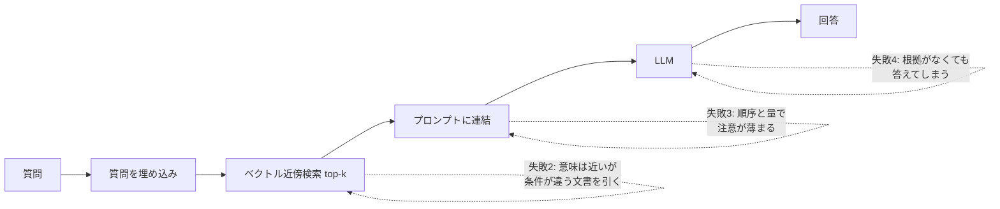
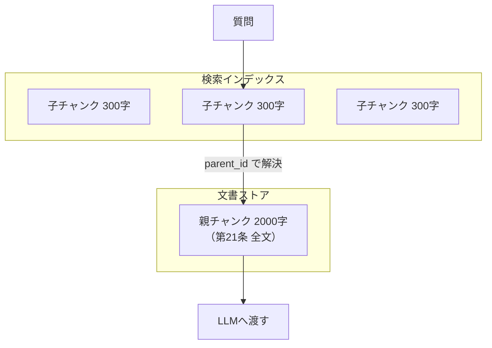
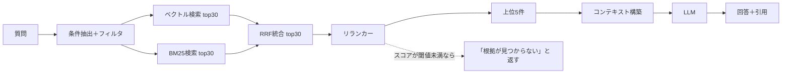

# 第6章 実用的なLLM/RAGアーキテクチャの全貌

RAG（Retrieval-Augmented Generation）のデモは、半日あれば作れる。PDFを読み込み、分割し、埋め込み、ベクトルDBに入れ、質問時に近いものを引いてプロンプトに詰める。動く。それらしく答える。

そして現場に出すと、次のような報告が返ってくる。

- 「規程の第3条について聞いたのに、第3条ではない条文を根拠に答えた」
- 「昨年度の数字を聞いたのに、今年度の資料から答えた」
- 「『該当なし』と答えてほしい場面で、それらしい嘘をつく」
- 「社内用語で聞くと何も出てこない」

これらはモデルの能力不足ではなく、**検索の設計不足**である。本章では、RAGを検索システムとして設計し直す。

## 6.1 ナイーブRAGが失敗する構造 {#naive-rag}

まず、素朴な構成がどこで壊れるかを分解する。



四つの失敗は、それぞれ別の対処を必要とする。

| 失敗 | 原因 | 対処 | 扱う節 |
| --- | --- | --- | --- |
| 語彙が違うと引けない | 埋め込みは表記の違いに強いが、社内固有の略語には弱い | キーワード検索との併用、用語辞書での拡張 | 6.4 |
| 条件が違う文書を引く | 「令和6年度」「A事業部」といった条件が埋め込みでは区別されにくい | メタデータフィルタ | 6.3 |
| 注意が薄まる | 大量のチャンクを詰め込む | リランキングと件数の削減 | 6.4 |
| 根拠がなくても答える | 指示と出力形式の設計不足 | 引用の強制、棄権の許可 | 6.5 |

順に見ていく。

## 6.2 チャンキング戦略 {#chunking}

チャンキングは、RAGの品質に最も大きく効く工程でありながら、最も雑に扱われる。「1000文字で分割、200文字オーバーラップ」という既定値が、そのまま本番に出ていることは珍しくない。

### 6.2.1 三つの方式と適性

| 方式 | 概要 | 向く文書 | 弱点 |
| --- | --- | --- | --- |
| 固定長 | 文字数やトークン数で機械的に分割 | 均質な散文 | 表や条文が途中で切れる |
| 構造ベース | 見出し・条・項などの構造で分割 | 規程、マニュアル、仕様書 | 構造が取れない文書には使えない |
| セマンティック | 文の意味的な切れ目で分割 | 議事録、報告書 | 計算コストが高く、再現性が低い |
| 階層（親子） | 小さい単位で検索し、大きい単位で提示 | 長文全般 | 実装と保存が複雑になる |

エンタープライズ文書の大半は、**構造ベースが第一選択**になる。社内規程、業務マニュアル、製品仕様書はいずれも見出し構造を持ち、その構造自体が意味の単位になっているからだ。

### 6.2.2 構造を保存したチャンク設計

重要なのは、チャンクに**文脈を持たせる**ことである。「第3項 ただし、前項の規定にかかわらず（以下略）」というテキストだけを切り出しても、何の規程の何条の話か分からない。検索でヒットしても、LLMは正しく解釈できない。

```python
from pydantic import BaseModel, Field
from datetime import date

class Chunk(BaseModel):
    """検索単位。本文だけでなく、位置と所属を必ず持つ。"""
    chunk_id: str
    doc_id: str
    # 検索対象になる本文（見出しパスを先頭に埋め込む）
    text: str
    # 表示・引用に使う原文（本文のみ）
    raw_text: str
    # 構造上の位置
    heading_path: list[str] = Field(description="例: ['就業規則', '第4章 労働時間', '第21条 時間外労働']")
    page_from: int | None = None
    page_to: int | None = None
    # 絞り込みに使うメタデータ（第4章で述べた業務キーをここに入れる）
    doc_type: str          # 規程 / マニュアル / 議事録 / 契約書
    org_unit: str | None   # 適用部門
    valid_from: date | None
    valid_to: date | None
    version: str
    source_uri: str
    # 検索補助
    keywords: list[str] = []   # 用語辞書で展開した同義語

def build_embedding_text(chunk: Chunk) -> str:
    """埋め込み対象のテキストを組み立てる。見出しパスを前置するだけで精度が変わる。"""
    path = " > ".join(chunk.heading_path)
    meta = f"[{chunk.doc_type}] [{chunk.version}]"
    return f"{meta} {path}\n{chunk.raw_text}"
```

`build_embedding_text` が行っている**見出しパスの前置**は、コストがほぼゼロで効果が大きい定番の工夫である。「第21条 時間外労働」という見出しが本文と一緒に埋め込まれることで、「残業について」という質問との類似度が上がる。

さらに効く工夫として、**チャンク単位の要約や想定質問を生成して、埋め込み対象に加える**方法がある。文書の記述と利用者の問いは語彙が違う。規程は「時間外労働を命ずることがある」と書くが、社員は「残業を断れるのか」と聞く。この溝を埋めるために、取り込み時にLLMで想定質問を三つ生成し、埋め込みテキストに含める。

```python
HYPOTHETICAL_Q_PROMPT = """次の社内文書の一節を読み、この一節が答えになるような\
社員からの質問を3つ、日本語で簡潔に書け。質問のみを箇条書きで出力する。

# 文書の位置
{heading_path}

# 本文
{raw_text}
"""
```

この処理は取り込み時に一度だけ走るため、検索時のレイテンシには影響しない。**オフラインの計算を増やしてオンラインの精度を上げる**という交換は、RAGの設計で繰り返し使える原則である。

### 6.2.3 親子チャンクと表の扱い

検索の精度は小さいチャンクのほうが高く、回答の品質は大きいチャンクのほうが高い。この矛盾を解くのが親子構造である。



子で検索し、ヒットした子の親を取り出してLLMに渡す。実装上の注意は、**同じ親に属する子が複数ヒットしたときの重複排除**である。親のIDで畳んでから件数を数えないと、実質1文書しか見ていないのに「5件の根拠がある」と誤認する。

表は別扱いにする。表をテキストとして分割すると、ヘッダ行と値が離れて意味を失う。実務的な対処は次のとおり。

- 表は1表を1チャンクとして扱い、分割しない（大きすぎる場合は行グループで分ける）
- 表の直前の見出しと、表のキャプションを必ず添える
- Markdown形式に変換して保持する。LLMは行と列の対応を読み取りやすい
- 数値の集計を伴う質問は、RAGではなく第4章のセマンティックレイヤーに回す

最後の一点が設計判断として重要である。**表から数字を読んで計算する仕事を、LLMに任せない。** 読み取りは可能だが、検算できない誤りが混ざる。第2章の境界線の議論がここで効いてくる。

## 6.3 埋め込みモデルとメタデータ {#embedding}

### 6.3.1 埋め込みモデルの選定

選定の軸は四つある。

| 軸 | 確認すること |
| --- | --- |
| 日本語性能 | 日本語のベンチマークだけでなく、**顧客の実データ**で評価する |
| 次元数とコスト | 次元が大きいほど保存容量と検索時間が増える。1024次元前後が実用的な折衷点 |
| 入力長 | 長いチャンクを扱うなら、入力トークン上限を確認する |
| 配置可能性 | 閉域網ならローカル実行可能なモデルに限られる（第3章参照） |

公開ベンチマークの順位は参考程度にとどめる。**評価は必ず顧客のデータで行う。** 手順は単純で、業務担当者に「よくある質問」を30件挙げてもらい、それぞれに対する正解文書を指定してもらう。この30件でRecall@10を測れば、モデル間の差は十分に見える。この作業は第12章の評価データセット構築の第一歩にもなる。

::: warning 埋め込みモデルの変更はインデックスの作り直しを意味する
モデルを変えると、既存のベクトルはすべて無効になる。数百万チャンクの再埋め込みには時間と費用がかかる。したがって、モデルの選定はPoCの段階で済ませ、本番投入後は簡単に変えられないものとして扱う。この制約を前提に、インデックスの再構築を自動化しておく（再構築ジョブを一度も流していないシステムは、実質的に再構築できない）。
:::

### 6.3.2 ベクトルDBの比較

| 製品 | 形態 | 向く場面 | 留意点 |
| --- | --- | --- | --- |
| pgvector | PostgreSQL拡張 | 既存のPostgreSQLがある、データ量が中規模まで | 大規模では検索性能のチューニングが必要 |
| Qdrant | 専用（OSS/マネージド） | メタデータフィルタを多用する、自前運用したい | 運用対象が一つ増える |
| Chroma | 軽量（組み込み可） | プロトタイプ、ローカル検証 | 本番の規模には向かない |
| Pinecone | マネージド専用 | 運用負荷を下げたい、スケールが読めない | 閉域網要件と相性が悪い場合がある |

FDEの実務では、**pgvectorから始める**のが妥当なことが多い。顧客がすでにPostgreSQLを運用しており、バックアップも監視も既存の仕組みに乗る。運用対象を増やさないという第3章の原則が効く。数千万チャンクを超える規模や、フィルタ条件が複雑になってきた段階で専用DBを検討すればよい。

pgvectorでのスキーマは、第4章の議論を反映してこうなる。

```sql
create extension if not exists vector;

create table rag_chunk (
    chunk_id      text primary key,
    doc_id        text not null,
    raw_text      text not null,
    heading_path  text[] not null,
    -- メタデータ（絞り込み条件）
    doc_type      text not null,
    org_unit      text,
    customer_id   text,                         -- 構造化データ側の業務キー
    valid_from    date,
    valid_to      date,
    version       text not null,
    source_uri    text not null,
    -- 検索用
    embedding     vector(1024) not null,
    text_search   tsvector generated always as (to_tsvector('simple', raw_text)) stored,
    indexed_at    timestamptz not null default now()
);

-- 近似最近傍のインデックス（HNSW）
create index on rag_chunk using hnsw (embedding vector_cosine_ops);
-- キーワード検索のインデックス
create index on rag_chunk using gin (text_search);
-- フィルタ用
create index on rag_chunk (doc_type, org_unit, valid_to);
```

### 6.3.3 メタデータフィルタが効く理由

冒頭に挙げた「昨年度の数字を聞いたのに今年度の資料から答えた」という失敗は、埋め込みの類似度では解けない。「令和6年度」と「令和7年度」のベクトルは非常に近いからである。

解法は、**質問から条件を抽出して、検索前にフィルタする**ことだ。

```python
from pydantic import BaseModel
from typing import Literal

class SearchFilter(BaseModel):
    """質問から抽出する検索条件。LLMにこの型で出力させる（第7章参照）。"""
    doc_type: Literal["規程", "マニュアル", "議事録", "契約書"] | None = None
    org_unit: str | None = None
    fiscal_year: int | None = None
    as_of: str | None = None   # 「現在有効な版」を指す場合の基準日

FILTER_PROMPT = """利用者の質問から、文書検索の絞り込み条件を抽出する。
明示されていない項目は null にする。推測して埋めてはならない。

質問: {question}
"""
```

抽出した条件をSQLのWHERE句に変換して、ベクトル検索の前に適用する。ここで重要なのは、**条件が抽出できなかったときの既定動作**である。年度が特定できない質問に対して、全年度を対象にすると古い版が混ざる。既定は「現在有効な版のみ」とし、利用者が明示的に過去を指定したときだけ範囲を広げる。

```sql
-- 現在有効な版に限定したうえでのベクトル検索
select chunk_id, doc_id, raw_text, heading_path, source_uri,
       1 - (embedding <=> $1::vector) as similarity
from rag_chunk
where (valid_to is null or valid_to >= current_date)
  and ($2::text is null or doc_type = $2)
  and ($3::text is null or org_unit = $3 or org_unit is null)
order by embedding <=> $1::vector
limit 30;
```

## 6.4 ハイブリッド検索とリランキング {#hybrid}

### 6.4.1 二つの検索を混ぜる

ベクトル検索は意味の近さに強く、キーワード検索（BM25）は語の一致に強い。社内文書では、型番、条番号、部門コード、固有の略語といった**一致してほしい語**が頻出する。この領域はBM25の独壇場である。

両者の結果を統合する実務的な手法が、RRF（Reciprocal Rank Fusion）である。スコアのスケールが違う二つのランキングを、順位だけで統合する。

```python
def reciprocal_rank_fusion(
    rankings: list[list[str]],   # 各検索手法の結果（chunk_id を順位順に並べたもの）
    k: int = 60,
) -> list[tuple[str, float]]:
    """順位の逆数で統合する。スコアの正規化が要らないのが利点。"""
    scores: dict[str, float] = {}
    for ranking in rankings:
        for rank, chunk_id in enumerate(ranking, start=1):
            scores[chunk_id] = scores.get(chunk_id, 0.0) + 1.0 / (k + rank)
    return sorted(scores.items(), key=lambda x: x[1], reverse=True)
```

`k=60` は経験的な既定値で、上位の順位差を緩やかに扱う効果がある。スコアの正規化が不要なため、検索手法を三つ四つに増やしても同じ枠組みで統合できる。

### 6.4.2 リランキングで絞る

統合した上位30件を、そのままLLMに渡してはならない。関連の薄い文書が混ざると、回答の品質が下がる。クロスエンコーダ型のリランカー（Cohere Rerankなど）で、質問とチャンクのペアを直接評価し、上位5件程度に絞る。



図の右下、**閾値未満なら答えない**という分岐が、業務システムとしてのRAGで最も重要な一本である。関連文書がないときに黙って一般論を答えるシステムは、使われるほど信頼を失う。

### 6.4.3 クエリ側の工夫

検索前に質問を加工する手法も効く。三つ挙げる。

**クエリ拡張。** 社内用語の辞書を持ち、略語を正式名称に展開する。「勤怠システム」を「勤怠管理システム（KANTAI）」に展開するだけで、ヒット率が変わる。辞書は第3章の名寄せ対応表と同じく、運用で育てる資産である。

**マルチクエリ。** 一つの質問をLLMに複数の言い換えに展開し、それぞれで検索してRRFで統合する。語彙のずれに強くなるが、レイテンシとコストは増える。

**HyDE（仮想文書生成）。** 質問に対する仮の回答をLLMに書かせ、その回答文を埋め込んで検索する。質問文より回答文のほうが、文書の語彙に近いという性質を利用する。専門文書で効果が出やすい一方、LLMが誤った仮説を書くと検索が逸れる。

どれも常に効くわけではない。**評価データセットで測り、効いた手法だけを残す**という手順を守る。手法を足すほど遅く高くなるため、効果が測れないものは入れない。

## 6.5 コンテキスト構築と回答生成 {#generation}

検索結果をプロンプトに入れる段階にも設計がある。

**順序。** 最も関連の高いものを先頭と末尾に置く。中間に置かれた情報は相対的に参照されにくいという性質が知られている。件数が少なければ影響は小さいので、まず件数を絞ることが先である。

**引用の強制。** 各チャンクに番号を振り、回答で使った番号を示させる。これにより、利用者は根拠を確認でき、第12章の評価で自動検証も可能になる。

```python
SYSTEM_PROMPT = """あなたは社内規程に関する質問に答えるアシスタントである。

厳守すること:
1. 回答は、与えられた参考文書だけを根拠にする。文書にない内容は答えない。
2. 根拠として使った文書の番号を、文末に [1] のように必ず示す。
3. 参考文書から判断できない場合は、推測せず「提供された文書からは判断できない」と述べ、
   確認先として文書の管掌部門を案内する。
4. 規程の条文を示すときは、条番号と見出しを明記する。
5. 金額や期間などの数値は、文書に書かれた表記のまま引用する。換算や計算はしない。
"""

def build_context(chunks: list[Chunk]) -> str:
    parts = []
    for i, c in enumerate(chunks, start=1):
        path = " > ".join(c.heading_path)
        parts.append(
            f"[{i}] 出典: {path}（{c.version}, {c.source_uri}）\n{c.raw_text}"
        )
    return "\n\n".join(parts)
```

システムプロンプトの3番と5番が、業務利用での事故を減らす二大条項である。3番は棄権を明示的に許可している。棄権を許可しないと、モデルは何かを答えようとする。5番は第2章で議論した境界線の再掲であり、計算をさせないことで検算不能な誤りを防ぐ。

## 6.6 GraphRAGを検討すべき場面 {#graphrag}

GraphRAGは、文書から実体と関係を抽出してグラフを構築し、そのグラフをたどって回答を組み立てる手法である。導入の判断は、**問いの形**で決まる。

| 問いの形 | 適した方式 |
| --- | --- |
| 「育児休業の申請期限は」 | 通常のRAG（局所的な事実の参照） |
| 「この不具合と同じ原因の過去事例は」 | 通常のRAG＋メタデータフィルタ |
| 「A社に関係する全ての契約上の制約を洗い出して」 | GraphRAG、または構造化データとの結合 |
| 「この規程改定が影響する業務プロセスを網羅して」 | GraphRAG |

下二つに共通するのは、**網羅性が求められること**と、**複数の文書をまたいだ関係の追跡が必要なこと**である。通常のRAGは上位の数件しか見ないため、網羅性を原理的に保証できない。

ただしGraphRAGは、構築コストが高い。全文書に対して実体抽出のLLM呼び出しが必要で、抽出の品質がそのまま回答の品質になる。FDEとしての現実的な判断は、**まず第4章の構造化データとの結合で解けないかを確かめる**ことである。取引先の関係が基幹システムのマスタに存在するなら、文書からグラフを再構築する必要はない。

## この章のまとめ

RAGは「LLMに文書を渡す仕組み」ではなく検索システムである。失敗は語彙のずれ、条件の混同、注意の希薄化、根拠なき生成という四つに分解でき、それぞれ対処が違う。

チャンキングは構造ベースを基本とし、見出しパスの前置と想定質問の生成でオフラインの計算を増やす。メタデータには構造化側の業務キーと有効期間を持たせ、検索前にフィルタする。検索はベクトルとキーワードをRRFで統合し、リランカーで絞り、閾値未満なら答えない。

生成では、引用の強制、棄権の許可、計算の禁止を明示する。GraphRAGは網羅性が要る問いに限定し、まず構造化データとの結合を検討する。

次章では、この「答えさせ方」をさらに厳密にする——スキーマ駆動の構造化出力を扱う。

::: tip この章のポイント
- RAGの失敗は四つに分解できる。語彙のずれ、条件の混同、注意の希薄化、根拠なき生成
- チャンクには見出しパスと有効期間、構造化側の業務キーを必ず持たせる
- 想定質問の生成など、オフラインの計算を増やしてオンラインの精度を上げる交換は効率がよい
- ハイブリッド検索はRRFで統合し、リランカーで上位5件程度に絞る。スコアが閾値未満なら答えない
- システムプロンプトでは、引用の強制、棄権の許可、計算の禁止という三条項が事故を減らす
- 埋め込みモデルの変更はインデックス再構築を意味する。再構築を自動化し、実際に一度流しておく
:::
