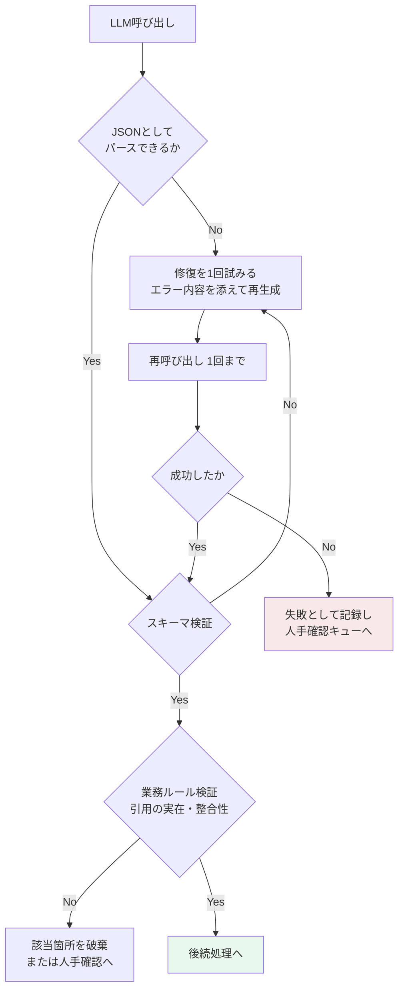
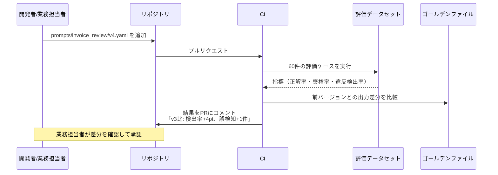

# 第7章 コンテキスト設計とプロンプトエンジニアリングの厳密化

LLMを業務システムに組み込むうえで最大の問題は、出力が自然言語であることだ。自然言語は人間には読めるが、後続の処理には渡せない。「承認してよさそうです」という文字列から、システムは何も判断できない。

したがって実務のLLMアプリケーションでは、**モデルの出力をスキーマに閉じ込める**のが基本形になる。本章では、その設計と、プロンプトをコードとして管理する方法を扱う。

## 7.1 スキーマ駆動のAI出力制御 {#structured-output}

### 7.1.1 スキーマは制約であると同時に仕様である

構造化出力を導入する目的は二つある。一つは、後続処理が扱える形にすること。もう一つ、そしてこちらのほうが見落とされやすいが、**何を出力すべきかをモデルに正確に伝えること**である。

型定義に書いた説明文（description）は、そのままモデルへの指示として機能する。プロンプトに散文で書くより、フィールドの隣に書いたほうが対応関係が明確になり、指示の抜けも見つけやすい。

請求書の内容をチェックするタスクを例に取る。

```python
from typing import Literal, Annotated
from datetime import date
from pydantic import BaseModel, Field, model_validator

class Finding(BaseModel):
    """1件の指摘。根拠のない指摘を防ぐため、必ず出典位置を要求する。"""
    severity: Literal["blocker", "warning", "info"] = Field(
        description="blocker=支払を止める必要がある / warning=担当者の確認が要る / info=参考情報"
    )
    rule_id: str = Field(description="適用した社内規程の識別子。例: AP-014")
    message: str = Field(max_length=200, description="担当者が読んで対応できる具体的な文言")
    evidence_page: int = Field(ge=1, description="根拠が記載されている請求書のページ番号")
    evidence_quote: str = Field(
        max_length=120,
        description="請求書からの引用。要約や言い換えをせず、原文をそのまま写す",
    )

class InvoiceReview(BaseModel):
    invoice_no: str
    vendor_name: str
    total_amount: int = Field(ge=0, description="税込総額。円単位の整数")
    issue_date: date
    findings: list[Finding] = Field(
        default_factory=list,
        max_length=20,
        description="規程違反や不整合の指摘。問題がなければ空配列",
    )
    decision: Literal["auto_approve", "needs_review", "reject"]
    confidence: Annotated[float, Field(ge=0, le=1)] = Field(
        description="判定の確信度。0.8未満のものは人間の確認に回される"
    )

    @model_validator(mode="after")
    def decision_must_match_findings(self) -> "InvoiceReview":
        # モデルの自己矛盾を機械的に検出する
        if any(f.severity == "blocker" for f in self.findings) and self.decision == "auto_approve":
            raise ValueError("blocker があるのに auto_approve は許容されない")
        if self.decision == "auto_approve" and self.confidence < 0.8:
            raise ValueError("確信度が不足しているため自動承認できない")
        return self
```

この定義で効いている設計を三つ挙げる。

**`evidence_quote` を必須にする。** 根拠の原文引用を必須項目にすると、文書に存在しない指摘が出にくくなる。さらに、出力された引用文が原文に実在するかを**機械的に照合できる**。照合に失敗した指摘は破棄する、という後処理を書ける。

**`model_validator` で自己矛盾を潰す。** 「重大な指摘があるのに自動承認」という出力は、形式的には正しいJSONだが業務的には誤りである。この種の整合性は、プロンプトでの指示だけに頼らず、コード側の検証で担保する。**プロンプトは努力目標、バリデーションは保証である。**

**`confidence` を出力させ、閾値で経路を分ける。** 自己申告の確信度は較正されていない（過信しがちである）が、相対的な順序としては使える。閾値は評価データで調整する前提で置く。

### 7.1.2 JSON Schemaとして渡すときの実務

多くのLLM APIは、JSON Schemaを渡して出力を強制する機能を持つ。Pydanticのモデルからスキーマを生成できるため、型定義を単一の情報源にできる。

```python
schema = InvoiceReview.model_json_schema()
# API に response_format / tool の input_schema として渡す
```

ただし、実際に渡す際の注意が三つある。

**深いネストと再帰は避ける。** ネストが深いスキーマは、モデルの出力精度が落ち、API側の制約に触れることもある。三階層を超えたら、設計を見直す合図と考える。

**列挙（Literal）を積極的に使う。** 自由文字列は誤りの温床になる。`status: str` ではなく `status: Literal["ok", "ng", "unknown"]` と書く。自由文字列が必要なのは、人間が読むためのメッセージだけである。

**「該当なし」を表現できる形にする。** 空配列、`None`、`"unknown"` のいずれかを必ず用意する。表現手段がないと、モデルは無理やり何かを埋める。第6章の棄権の許可と同じ原則が、スキーマ設計にも及ぶ。

### 7.1.3 検証・修復・失敗の三段構え

構造化出力を強制しても、検証に失敗することはある。そのときの扱いを設計する。



この図で伝えたい判断は二つある。

**再試行は1回まで。** 同じプロンプトで何度も呼び直すと、レイテンシとコストが膨らむ割に成功率は上がらない。1回失敗したら、エラー内容を添えて1回だけ再生成し、それでも駄目なら人手に回す。

**失敗を握りつぶさない。** `try/except` で例外を捕まえて既定値を返す実装は、障害を見えなくする。失敗は記録し、件数を監視する（第13章）。失敗率の上昇は、モデルの変更や入力データの変化を知らせる最も早い信号である。

```python
from pydantic import ValidationError

def review_invoice(doc_text: str, client) -> InvoiceReview:
    messages = [{"role": "user", "content": build_prompt(doc_text)}]
    for attempt in range(2):
        raw = client.generate(messages=messages, schema=InvoiceReview.model_json_schema())
        try:
            result = InvoiceReview.model_validate_json(raw)
        except ValidationError as e:
            if attempt == 1:
                raise OutputValidationFailed(raw=raw, errors=e.errors())
            # エラーを添えて1回だけ修復を試みる
            messages += [
                {"role": "assistant", "content": raw},
                {"role": "user", "content": f"次の検証エラーを修正して再出力する:\n{e}"},
            ]
            continue
        # 業務ルール検証: 引用が原文に存在するか
        result.findings = [f for f in result.findings if f.evidence_quote in doc_text]
        return result
    raise AssertionError("unreachable")
```

`f.evidence_quote in doc_text` という一行が、事実性の担保として実際によく効く。存在しない引用を持つ指摘を機械的に除去できる。

## 7.2 Function Calling / Tool Use の設計 {#tool-use}

### 7.2.1 ツール定義は権限設計である

ツール（関数）をLLMに渡すとき、設計の中心は「何ができるか」ではなく「**何ができてしまうか**」である。ツールの集合は、そのままモデルに与える権限の集合になる。

```python
TOOLS = [
    {
        "name": "search_orders",
        "description": (
            "受注を検索する。利用者が閲覧権限を持つ範囲に限られる。"
            "金額の集計が必要な場合は aggregate_sales を使う（このツールでは合計しない）。"
        ),
        "input_schema": {
            "type": "object",
            "properties": {
                "customer_id": {"type": "string", "description": "取引先コード。8桁"},
                "date_from": {"type": "string", "format": "date"},
                "date_to": {"type": "string", "format": "date"},
                "status": {"type": "string", "enum": ["open", "shipped", "cancelled"]},
                "limit": {"type": "integer", "maximum": 100, "default": 20},
            },
            "required": ["date_from", "date_to"],
        },
    },
]
```

`description` に書いた「このツールでは合計しない」という一文が、設計上の分業をモデルに伝えている。集計は決定論的な経路（第4章のセマンティックレイヤー）に寄せ、LLMには呼び分けだけをさせる。

権限の観点では、次の三原則を守る。

- **実行権限はツールの実装側で検証する。** モデルが `customer_id` を指定してきても、その利用者が見てよい取引先かはサーバー側で必ず確認する。モデルの出力を信用した認可は、認可ではない
- **副作用のあるツールを、参照ツールと同列に置かない。** 発注、送信、更新といった副作用は、第8章で扱う承認フローを挟む
- **上限を型で表現する。** `limit` の最大値をスキーマに書けば、暴走的な全件取得を防げる

### 7.2.2 エラーをモデルに返す設計

ツール実行が失敗したとき、例外をそのまま投げると会話が終わる。代わりに、**モデルが次の行動を選べる形**でエラーを返す。

```python
def tool_error(code: str, message: str, retryable: bool, hint: str | None = None) -> dict:
    """モデルが読むためのエラー。次に何をすべきかを含める。"""
    return {
        "error": {"code": code, "message": message, "retryable": retryable, "hint": hint}
    }

# 例: 取引先コードの形式が違う
tool_error(
    code="INVALID_ARGUMENT",
    message="customer_id は8桁の数字である必要がある。受け取った値: 'C412'",
    retryable=True,
    hint="利用者に取引先名を確認し、search_customer で正しいコードを取得する",
)

# 例: 権限がない
tool_error(
    code="PERMISSION_DENIED",
    message="この取引先の受注を参照する権限がない",
    retryable=False,
    hint="利用者に権限がない旨を伝え、申請窓口を案内する",
)
```

`retryable` と `hint` の二つが、エージェントの挙動を安定させる。`retryable: false` を明示しないと、モデルは同じ呼び出しを繰り返す。第8章で扱うループ制御の前提として、この設計が効いてくる。

::: warning ツールの数が増えると精度が落ちる
ツールが二十個を超えたあたりから、モデルは適切なツールを選べなくなる。対策は、ツールを階層化することである。まず領域を選ばせ（受注系・在庫系・文書系）、選ばれた領域のツールだけを次のターンで提示する。あるいは、意味の近いツールを一つに統合し、引数で分岐させる。
:::

## 7.3 プロンプトをコードとして管理する {#prompt-as-code}

### 7.3.1 プロンプトがコードに埋まっている状態の問題

プロンプトをPythonの文字列リテラルとしてアプリケーションコードに直書きすると、次の問題が起きる。

- どのバージョンのプロンプトでどの出力が出たのかを、後から追えない
- 変更の影響を評価せずにデプロイしてしまう
- 業務担当者がレビューできない（コードを読めないため）

したがって、プロンプトは**独立したファイルとして、バージョンとともに管理する**。

```yaml
# prompts/invoice_review/v3.yaml
id: invoice_review
version: 3
model: { provider: anthropic, name: claude-sonnet-5, temperature: 0 }
schema: InvoiceReview          # コード側の型と対応づける
owner: 経理部 業務改善チーム
changelog: |
  v3: 外貨建て請求書の扱いを追加。source_quote の必須化。
  v2: 軽微な端数差異を warning に降格。
variables: [vendor_name, doc_text, policy_excerpt]
system: |
  あなたは経理部の請求書チェック担当者である。
  与えられた請求書と社内規程の抜粋だけを根拠に、支払可否を判定する。

  判定の原則:
  - 規程に明示されていない事項は、needs_review とする。推測で auto_approve にしない
  - 金額の計算はしない。請求書に記載された数値をそのまま扱う
  - 指摘には必ず請求書からの原文引用を添える
user: |
  # 社内規程（抜粋）
  {policy_excerpt}

  # 請求書
  取引先: {vendor_name}
  {doc_text}
```

このファイルには、モデル名と温度まで含めている。**プロンプトとモデル設定は一体で評価すべきもの**だからだ。同じプロンプトでもモデルが変われば挙動は変わる。

### 7.3.2 プロンプト変更のCI

プロンプトの変更は、コードの変更と同じ扱いにする。プルリクエストで差分が見え、CIで回帰テストが走る。



CIで測る指標は、第12章で詳しく扱う。ここで強調したいのは、**前バージョンとの差分を人が読める形で出す**という点である。「正解率91%」という数字だけでは、何が良くなって何が悪くなったのか判断できない。どのケースの出力が変わったかを一覧にすると、業務担当者がレビューできる。

実装上のポイントは、評価を軽く保つことだ。全件を毎回流すと時間と費用がかかるため、次のように分ける。

| 実行タイミング | 対象 | 目的 |
| --- | --- | --- |
| プルリクエスト | 代表的な20件（各カテゴリから抽出） | 明らかな劣化の検出 |
| マージ時 | 全件（100〜300件） | 指標の記録 |
| 週次 | 全件＋新規追加ケース | 傾向の監視 |

### 7.3.3 コンテキストの組み立てを一か所に集める

プロンプトの品質は、テンプレートの文面より、**そこに入れる情報の選び方**で決まることが多い。コンテキストの組み立てを散らかさず、一つの関数に集約する。

```python
from dataclasses import dataclass

@dataclass(frozen=True)
class PromptContext:
    """LLMに渡す情報の全体。ここに現れないものはプロンプトに入らない。"""
    user_question: str
    retrieved: list[Chunk]        # 第6章の検索結果
    user_profile: dict            # 所属・権限・言語
    conversation: list[dict]      # 直近の会話（件数制限つき）
    business_date: date           # 「今日」をモデルに推測させない
    policy_version: str

def assemble(ctx: PromptContext, budget_tokens: int) -> list[dict]:
    """トークン予算内に収める。削る順序を明示的に決めておく。"""
    # 削る優先順位: 古い会話 → 検索結果の下位 → 補足情報
    ...
```

`business_date` を明示的に渡す設計は、地味だが重要である。モデルに「今日」を推測させると、学習時点の日付を前提にした回答が混ざる。同様に、利用者の所属や権限もプロンプトに明示し、**権限に応じた言い回しをモデルに任せない**（実際の絞り込みは第6章のフィルタとツール側の認可で行う）。

そしてトークン予算を超えたときに何から削るかを、あらかじめ決めておく。削る順序を実装時に決めていないと、本番で長い会話が来たときに、最も重要な検索結果が切り捨てられる事故が起きる。

> プロンプトエンジニアリングの実務の大半は、文面を磨く作業ではなく、何を入れて何を入れないかを決める作業である。

## この章のまとめ

構造化出力は、後続処理のためだけでなく、モデルへの指示を精密にするためにある。フィールドの説明文が指示になり、列挙型が誤りを防ぎ、バリデータが自己矛盾を潰す。プロンプトは努力目標、バリデーションは保証という役割分担を守る。

検証・修復・失敗の三段構えを設計し、再試行は1回まで、失敗は記録して人手に回す。ツール定義は権限設計であり、認可はサーバー側で行う。エラーは `retryable` と `hint` を添えてモデルに返す。

プロンプトはモデル設定とともにファイルで管理し、変更はCIで前バージョンとの差分として評価する。コンテキストの組み立ては一か所に集約し、削る順序を決めておく。

次章では、これらを組み合わせて自律的に動くエージェントと、その暴走を止める人間介入の設計を扱う。

::: tip この章のポイント
- スキーマは制約であると同時に仕様である。フィールドの説明文がそのままモデルへの指示になる
- 根拠の原文引用を必須項目にすると、機械的な照合で事実性を担保できる
- プロンプトは努力目標、バリデーションは保証。自己矛盾はコード側の検証で潰す
- 再試行は1回まで。失敗は握りつぶさず記録し、失敗率を監視する
- ツール定義は権限設計であり、認可はモデルの出力ではなくサーバー側で検証する
- プロンプトはモデル設定とともにバージョン管理し、変更はCIで前バージョンとの差分として見せる
:::
