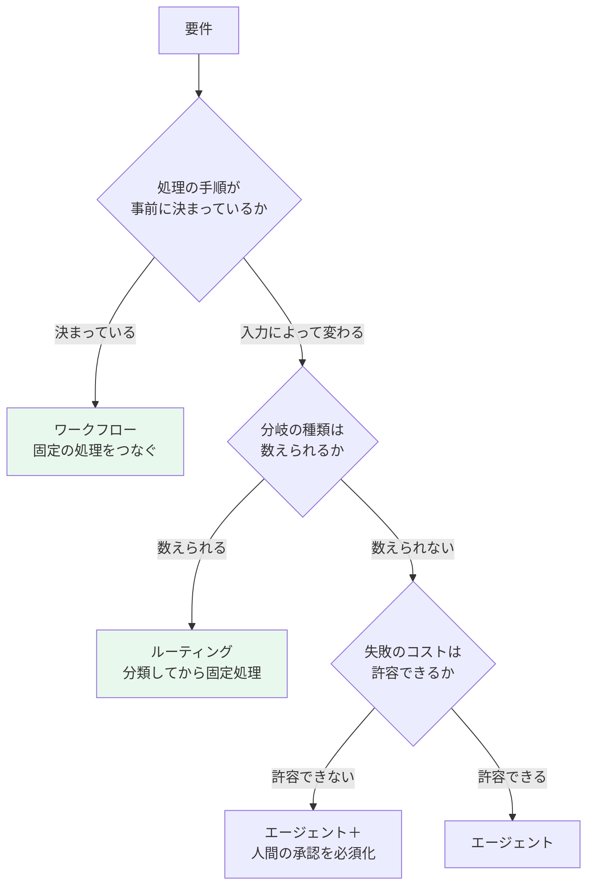
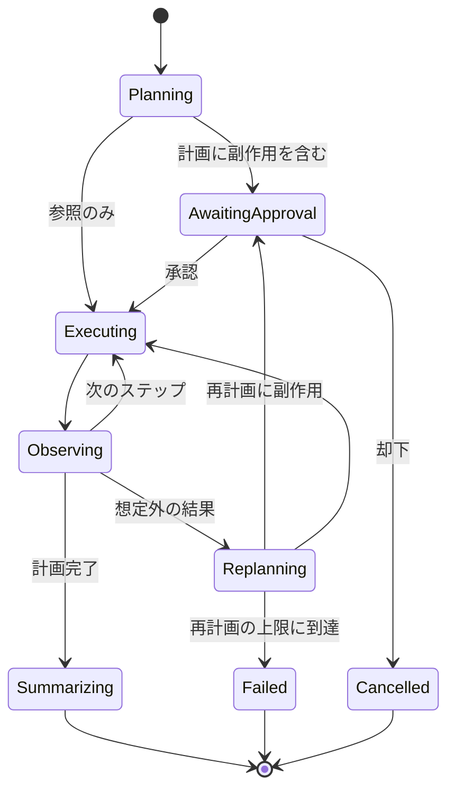
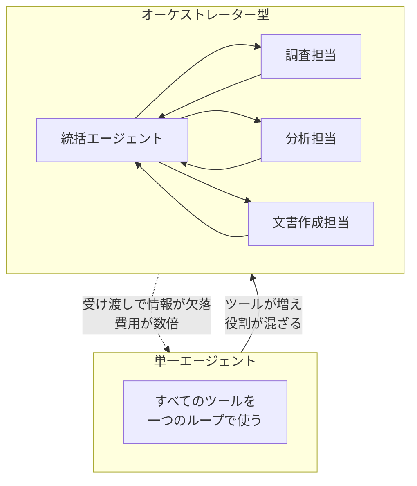
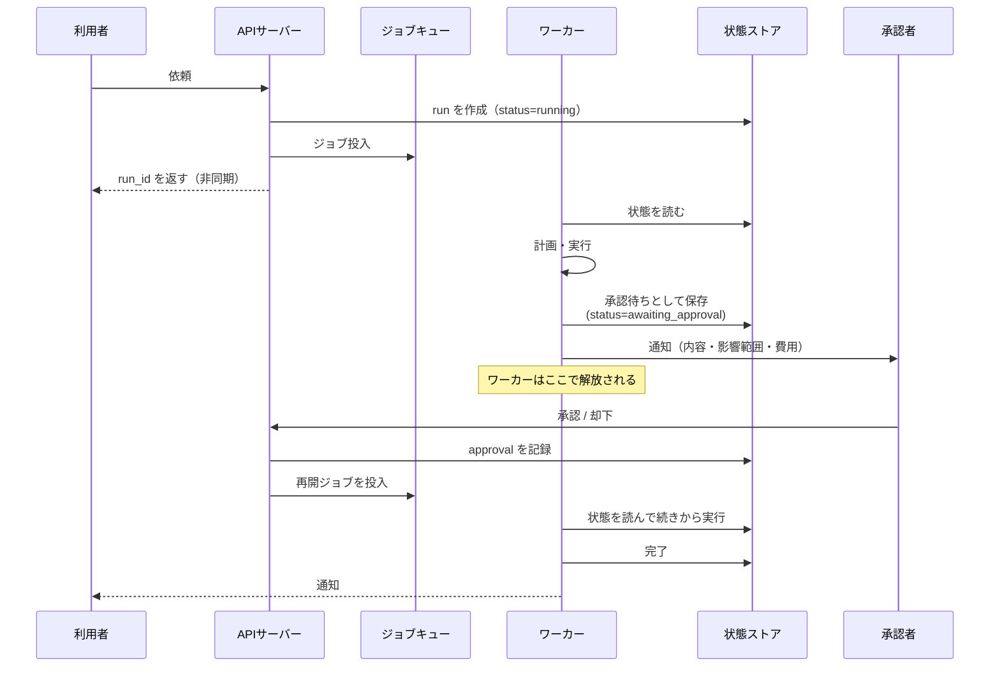

# 第8章 自律型AIエージェントの設計と実装パターン

エージェントという言葉は、現在ほとんど何も意味しない。プロンプトを二回つなげただけのものもエージェントと呼ばれ、数十のツールを自律的に使い分けるシステムもエージェントと呼ばれる。

本章では、実装上の定義を一つ置く。**ループを回して、自分で次の行動を決めるシステム**をエージェントと呼ぶ。ループがあることが本質であり、ループがあるからこそ、停止条件と観測と介入が設計課題になる。

## 8.1 エージェントを導入すべきかの判断 {#when-agent}

最初に確認すべきは、そもそもエージェントが必要かどうかである。



実務では、左側の二つで足りる場面が圧倒的に多い。「問い合わせを分類して、種類ごとに決まった処理をする」という要件に自律エージェントを持ち出すと、デバッグ困難で、レイテンシが読めず、コストが変動する仕組みを抱えることになる。

エージェントが正当化されるのは、次の条件が揃ったときである。

- 手順が入力に強く依存し、事前に列挙できない
- 途中の結果に応じて方針転換が必要になる
- 失敗しても取り返しがつく（読み取り中心、または承認を挟める）

> ワークフローで書けるものをエージェントで書くのは、for文で書けるものを強化学習で解くようなものである。

## 8.2 推論パターンと状態設計 {#patterns}

### 8.2.1 ReActとPlan-and-Solve

**ReAct**は、思考・行動・観察を繰り返す形式である。一歩ごとに状況を見て次を決めるため、予期しない結果に強い。反面、全体の見通しを持たないため、同じ場所を巡回したり、目的から逸れたりする。

**Plan-and-Solve**は、最初に計画を立て、その計画を順に実行する。見通しがよく、計画そのものを人間がレビューできるという大きな利点がある。反面、計画時に分からなかった事実が出てきたときの修正が弱い。

実務では、両者を組み合わせる。**計画を立て、実行し、失敗したら計画を作り直す**という二層構造にする。



この状態遷移図を最初に描くことが、エージェント設計の実務そのものである。図に現れていない状態には遷移できない。とくに `Failed` と `Cancelled` を明示的に置くことが重要で、これがないと「終わらないエージェント」が生まれる。

### 8.2.2 状態を明示的に持つ

LangGraphのようなグラフベースのフレームワークが解いている問題は、**状態の明示化**である。会話履歴という暗黙の状態にすべてを載せるのではなく、型のついた状態オブジェクトを持ち回る。

```python
from typing import Annotated, Literal, TypedDict
from operator import add

class AgentState(TypedDict):
    # 入力
    request: str
    user_id: str
    # 計画と進捗
    plan: list[str]
    step_index: int
    # 蓄積される情報（add で追記される）
    observations: Annotated[list[dict], add]
    # 制御変数（暴走を止めるための上限）
    iterations: int
    replans: int
    tokens_used: int
    cost_jpy: float
    # 承認
    pending_action: dict | None
    approval: Literal["pending", "approved", "rejected"] | None
    # 出力
    result: str | None
    status: Literal["running", "done", "failed", "cancelled"]
```

この型定義に含まれる `iterations`、`replans`、`tokens_used`、`cost_jpy` の四つが、**暴走を止めるための必須装備**である。エージェントの事故は、無限ループと費用の膨張という二つの形で現れる。どちらも、状態に上限を持たせて機械的に止める以外に確実な対処はない。

```python
LIMITS = {"iterations": 12, "replans": 2, "tokens": 200_000, "cost_jpy": 50.0}

def should_continue(state: AgentState) -> Literal["continue", "halt"]:
    if state["status"] != "running":
        return "halt"
    if state["iterations"] >= LIMITS["iterations"]:
        return "halt"
    if state["replans"] > LIMITS["replans"]:
        return "halt"
    if state["tokens_used"] >= LIMITS["tokens"] or state["cost_jpy"] >= LIMITS["cost_jpy"]:
        return "halt"
    return "continue"
```

上限に達したときの振る舞いも設計する。単に停止するのではなく、**そこまでに得た情報を要約して返す**。「12ステップ試したが完了しなかった。判明したのは次の三点」という出力は、何も返さないよりはるかに有用である。

### 8.2.3 ループが壊れる三つの形

実運用で観測されるループの壊れ方を挙げておく。いずれも上限だけでは体験が悪いため、個別の対処が要る。

| 壊れ方 | 症状 | 対処 |
| --- | --- | --- |
| 同一行動の反復 | 同じツールを同じ引数で呼び続ける | 直近の (ツール名, 引数ハッシュ) を記録し、重複を検出したら結果をキャッシュから返しつつ警告を添える |
| 二状態の振動 | AとBを交互に行き来する | 直近n回の行動列に周期があれば、再計画へ強制遷移 |
| 目的の漂流 | 元の依頼と無関係な探索を始める | 各ステップで元の依頼を再提示し、関連性が低い行動を選んだら停止 |

一つ目の対処は実装が容易で効果が高いため、最初から入れておく価値がある。

```python
import hashlib, json

def action_key(tool: str, args: dict) -> str:
    payload = json.dumps(args, sort_keys=True, ensure_ascii=False)
    return f"{tool}:{hashlib.sha256(payload.encode()).hexdigest()[:12]}"
```

## 8.3 マルチエージェントをいつ使うか {#multi-agent}

複数のエージェントに役割を分けて協働させる構成は、魅力的に見える。だが、**コンテキストの受け渡しが新しい失敗点になる**という代償がある。



分割が有効になる条件は、次のいずれかである。

- **文脈が独立している。** 調査対象が複数あり、互いに参照しない（並列実行で時間を短縮できる）
- **必要な指示が衝突する。** 「網羅的に集める」役割と「厳しく絞る」役割を、一つのプロンプトに同居させると両方が中途半端になる
- **権限を分けたい。** 参照専用のエージェントと、副作用を持つエージェントを分離し、後者にだけ承認を挟む

逆に、**単に工程が多いだけなら分割しない**。工程の多さはワークフローで扱う問題であり、エージェントを増やす理由にはならない。

分割する場合、受け渡しの形式を型で固定する。自然言語で引き継ぐと、そこで情報が落ちる。

```python
class ResearchResult(BaseModel):
    """調査担当から統括へ渡す成果物。自然言語の要約だけを渡さない。"""
    question: str
    findings: list[Finding]          # 第7章の型を再利用
    sources: list[str]               # 参照したドキュメントのURI
    coverage: Literal["full", "partial", "insufficient"]
    unresolved: list[str] = []       # 調べきれなかった論点
```

`coverage` と `unresolved` を必須にすることで、統括エージェントは「調査が不十分である」という事実を受け取れる。これがないと、部分的な調査結果が完全なものとして扱われ、最終出力の根拠が静かに薄くなる。

## 8.4 Human-in-the-Loopの設計 {#hitl}

### 8.4.1 どこに人間を置くか

人間の介入点は、三か所のいずれか（または複数）に置く。

| 介入点 | 内容 | 向く場面 |
| --- | --- | --- |
| 計画の承認 | 実行前に、これから何をするかを確認する | 副作用が複数ある、費用が大きい |
| 個別行動の承認 | 副作用のあるツール呼び出しごとに確認する | 発注、送信、更新など不可逆な操作 |
| 結果の確認 | 出力を人が確認してから採用する | 文書生成、判断支援 |

FDEとしての判断基準は、**取り消せるかどうか**である。取り消せる操作（下書き作成、一時テーブルへの書き込み）は事後確認でよい。取り消せない操作（メール送信、発注確定、外部システムへの登録）は事前承認にする。

### 8.4.2 中断と再開を前提にした実装

人間の承認は、数分後かもしれないし、翌朝かもしれない。したがってエージェントの実行は、**プロセスの生存を前提にできない**。状態を永続化し、承認イベントで再開する構成にする。



この構成にしておくと、承認待ちの間にプロセスが再起動しても実行が失われない。また、同じ仕組みで**中断と再開**を扱えるため、上限到達時の一時停止や、利用者による取り消しにも対応できる。

承認画面に出す情報は、次の四つを揃える。これが揃っていない承認は、承認とは呼べない。

- **何をするか**（具体的な操作と対象）
- **なぜそうするか**（エージェントの根拠と参照元）
- **影響範囲**（何件、いくら、どのシステム）
- **却下した場合の代替**（次に何が起きるか）

### 8.4.3 承認疲れを避ける

すべての行動に承認を求めると、承認者は内容を読まずに押すようになる。これは形式的な統制であり、実質的には無統制と変わらない。

実務的な緩和策を三つ挙げる。

**閾値による自動承認。** 金額や件数が一定以下なら自動で進める。閾値は業務側と合意し、設定として持つ（第1章の「差分を設定に追い出す」）。

**まとめ承認。** 同種の操作を一括で提示する。ただし、一括承認された個々の内容が後から追跡できるよう、記録は個別に残す。

**段階的な権限拡大。** 導入初期はすべて承認、一定期間の実績（承認率・訂正率）を見て自動化の範囲を広げる。第12章の評価指標がそのまま判断材料になる。

```python
class ApprovalPolicy(BaseModel):
    """承認要否の判定。設定として顧客ごとに持つ。"""
    tool: str
    auto_approve_below: dict[str, float] = {}   # 例: {"amount_jpy": 100000}
    always_require: bool = False
    approvers: list[str]
    escalate_after_minutes: int = 120           # 放置されたときのエスカレーション先
```

`escalate_after_minutes` を設計に含めておく点が実務的である。承認待ちで止まったまま誰も気づかない、という状態が最も業務を止める。

::: warning 監査ログはエージェントの必須要素
誰が何を依頼し、エージェントがどのツールをどの引数で呼び、誰が承認し、結果どうなったか。この記録がないシステムは、事故が起きたときに原因を説明できない。規制のある業界では、記録がないこと自体が指摘事項になる。第13章のトレースと合わせて設計する。
:::

## 8.5 評価と運用への接続 {#ops}

エージェントの評価は、最終出力の正しさだけでは足りない。**途中経過を評価対象にする**必要がある。

| 評価の観点 | 指標の例 |
| --- | --- |
| 目的の達成 | タスク成功率（人間の判定） |
| 効率 | 平均ステップ数、平均トークン数、平均費用 |
| 経路の妥当性 | 必要なツールを呼べたか、不要なツールを呼ばなかったか |
| 停止の健全性 | 上限到達率、無限ループ検出率 |
| 介入 | 承認率、却下理由の分類、訂正の内容 |

とくに**却下理由の分類**は、改善の最良の入力になる。承認者が却下した理由を自由記述ではなく選択式で集めると、どこを直すべきかが定量的に見える。第12章で扱う評価データセットに、却下されたケースを追加していく運用を組む。

## この章のまとめ

エージェントとは、ループを回して次の行動を自分で決めるシステムである。まずワークフローやルーティングで足りないかを確認し、それでも必要な場合に採用する。

推論パターンは、計画と実行の二層構造にし、状態遷移図を先に描く。状態には反復回数・再計画回数・トークン・費用の上限を持たせ、機械的に停止させる。ループの壊れ方は三種類あり、それぞれに個別の対処を入れる。

マルチエージェントは、文脈の独立性、指示の衝突、権限分離のいずれかが理由になるときだけ採用し、受け渡しは型で固定する。人間の介入は「取り消せるか」で配置を決め、中断と再開を前提に状態を永続化する。承認疲れを避ける緩和策と、監査ログを設計に含める。

ここまでで、AIアプリケーションの中核は形になった。次の部では、これを実際のシステムとして動かすための、API・フロントエンド・レガシー結合を扱う。

::: tip この章のポイント
- エージェントの本質はループである。ワークフローやルーティングで足りるなら、そちらを選ぶ
- 状態遷移図を先に描き、Failed と Cancelled を明示する。図にない状態には遷移できない
- 反復回数・再計画回数・トークン・費用の上限を状態に持ち、機械的に停止させる
- 同一行動の反復、二状態の振動、目的の漂流という三つの壊れ方に、個別の対処を入れる
- マルチエージェント間の受け渡しは型で固定し、coverage と unresolved で不足を伝える
- 人間の介入は「取り消せるか」で配置を決め、状態を永続化して中断と再開を可能にする
:::
