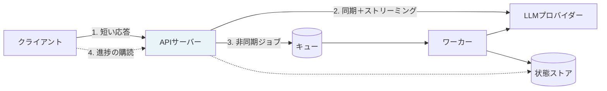
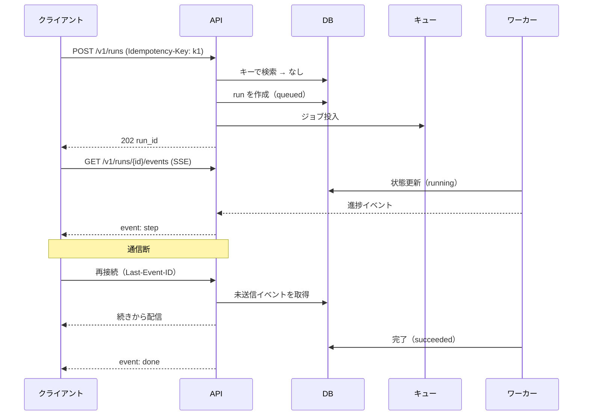

# 第9章 モダンバックエンド開発とAPI設計

前章までで作ったAI機能は、何らかの形で利用者に届かなければ価値にならない。その経路がAPIである。

LLMを組み込んだAPIは、従来の業務APIとは性質が違う。応答に数秒から数十秒かかり、応答の途中経過に意味があり、処理の途中でコストが発生し、外部サービスの障害に直撃される。本章では、この性質を前提にしたバックエンド設計を扱う。

## 9.1 LLM APIの性質が設計を変える {#characteristics}

まず、従来の業務APIとの違いを整理する。

| 観点 | 従来の業務API | LLMを含むAPI |
| --- | --- | --- |
| 応答時間 | 100ミリ秒前後 | 2秒〜60秒、分布の裾が長い |
| 処理中の状態 | 意味を持たない | 途中経過を見せる価値がある |
| 失敗の種類 | 入力誤り、DB障害 | レート制限、タイムアウト、出力検証の失敗 |
| コスト | ほぼ一定 | リクエストごとに変動する |
| 冪等性 | 設計で確保できる | 同じ入力でも出力が揺れる |
| 並行性の制約 | DBの接続数 | 外部APIのレート上限 |

この表の右列が、設計判断をほぼすべて決める。長い応答時間はストリーミングを要求し、変動するコストは計測を要求し、レート上限は待ち行列を要求する。



処理は三つの形に分かれる。数秒で終わる対話はストリーミング（経路2）、数十秒以上かかる処理や承認を挟む処理は非同期ジョブ（経路3）、そして即座に返せるものは通常のAPI（経路1）である。**どの処理がどの形になるかを最初に決める**ことが、後の作り直しを防ぐ。

判断の基準は次のとおり。

- 想定応答時間が30秒を超える、または上限が読めない → 非同期
- 第8章の人間承認を挟む → 非同期（必ず）
- 利用者が結果を待って次の操作をする → ストリーミング
- 結果を後で見ればよい → 非同期

## 9.2 非同期処理とイベントループの実務 {#async}

### 9.2.1 async/awaitで守るべき一線

FastAPIのようなASGIフレームワークでは、`async def` で定義したエンドポイントは単一のイベントループ上で動く。ここで最も多い事故が、**イベントループを同期処理でブロックすること**である。

```python
import asyncio
import httpx
from fastapi import FastAPI

app = FastAPI()

# 悪い例: 同期のHTTPクライアントをasync関数の中で呼ぶ
@app.post("/bad")
async def bad(q: str):
    import requests
    r = requests.post(LLM_URL, json={"prompt": q})   # ここでループ全体が止まる
    return r.json()

# 良い例: 非同期クライアントを使い、クライアントは使い回す
@app.post("/good")
async def good(q: str, client: httpx.AsyncClient = Depends(get_client)):
    r = await client.post(LLM_URL, json={"prompt": q})
    return r.json()
```

一つのリクエストが3秒ブロックすると、その間に届いた**すべての**リクエストが待たされる。負荷試験では見えにくく、本番の同時アクセスで初めて表面化する種類の不具合である。

CPUを使う処理（PDFの解析、埋め込みの計算、大きなデータフレームの操作）も同じ問題を起こす。これらはスレッドプールかワーカープロセスに逃がす。

```python
from fastapi.concurrency import run_in_threadpool

@app.post("/parse")
async def parse(file: UploadFile):
    content = await file.read()
    # 同期で重い処理はスレッドプールへ
    pages = await run_in_threadpool(parse_pdf_sync, content)
    return {"pages": len(pages)}
```

判断の目安は単純である。**待つ処理（I/O）は async、計算する処理はスレッドプールかワーカー**。

### 9.2.2 外部APIのレート制限と並行数の制御

LLMプロバイダーには、1分あたりのリクエスト数とトークン数に上限がある。制御しないと、負荷が高まったときに大量の429が返り、リトライがさらに負荷を生む悪循環に入る。

制御は、**アプリケーション側で同時実行数を絞る**ことから始める。

```python
import asyncio
from contextlib import asynccontextmanager

class LLMGate:
    """同時実行数と、簡易のトークン予算を管理する。"""
    def __init__(self, max_concurrency: int, tokens_per_minute: int):
        self._sem = asyncio.Semaphore(max_concurrency)
        self._tpm = tokens_per_minute
        self._window_start = 0.0
        self._window_tokens = 0
        self._lock = asyncio.Lock()

    @asynccontextmanager
    async def acquire(self, estimated_tokens: int):
        async with self._sem:
            await self._reserve(estimated_tokens)
            yield

    async def _reserve(self, tokens: int) -> None:
        loop = asyncio.get_running_loop()
        while True:
            async with self._lock:
                now = loop.time()
                if now - self._window_start >= 60:
                    self._window_start, self._window_tokens = now, 0
                if self._window_tokens + tokens <= self._tpm:
                    self._window_tokens += tokens
                    return
                wait = 60 - (now - self._window_start)
            await asyncio.sleep(min(wait, 1.0))
```

さらに、リトライは**指数バックオフとジッター**を必ず組み合わせる。ジッターがないと、複数のリクエストが同じタイミングで再送され、波が揃って再び429を受ける。

```python
import random

async def call_with_retry(fn, max_attempts: int = 4):
    for attempt in range(max_attempts):
        try:
            return await fn()
        except RateLimitError as e:
            if attempt == max_attempts - 1:
                raise
            # サーバーが Retry-After を返すなら、それを優先する
            base = e.retry_after or (2 ** attempt)
            await asyncio.sleep(base + random.uniform(0, 1.0))
```

::: warning リトライは上流の負荷を増やす
タイムアウトしたリクエストを再送すると、上流では最初のリクエストがまだ動いていることがある。結果として、課金は二重に発生し、負荷は倍になる。タイムアウトを長めに取り、リトライ回数は控えめにするほうが、全体としては安定することが多い。
:::

### 9.2.3 データベース接続の扱い

非同期APIでは、DB接続もプールで管理する。プールサイズの設計を誤ると、同時実行数が上がった瞬間に接続待ちが発生する。

```python
from sqlalchemy.ext.asyncio import create_async_engine

engine = create_async_engine(
    DSN,
    pool_size=10,          # 常時保持する接続数
    max_overflow=10,       # 一時的に超過を許す数
    pool_timeout=5,        # 接続待ちの上限（長く待たせるより早く失敗させる）
    pool_recycle=1800,     # 中間装置が切る前に自前で張り直す
    pool_pre_ping=True,    # 死んだ接続を掴まない
)
```

`pool_recycle` と `pool_pre_ping` は、エンタープライズ環境で特に効く。ロードバランサーやファイアウォールが一定時間で接続を切るため、これらがないと「朝いちばんのアクセスだけ失敗する」という症状が出る。

そして、**LLM呼び出しの最中にDB接続を握らない**。これは非同期APIで最も見落とされる設計上の要点である。

```python
# 悪い例: LLMの応答を待つ間、DB接続を占有している
async def bad(session):
    data = await session.execute(query)          # 接続を取得
    result = await llm.generate(prompt(data))    # 30秒かかる。接続は握られたまま
    await session.execute(insert(result))

# 良い例: 必要な期間だけ接続を借りる
async def good(session_factory):
    async with session_factory() as s:
        data = (await s.execute(query)).all()
    result = await llm.generate(prompt(data))    # 接続を返した状態で待つ
    async with session_factory() as s:
        await s.execute(insert(result))
        await s.commit()
```

## 9.3 ストリーミングの実装 {#streaming}

### 9.3.1 SSEとWebSocketの選択

LLMの応答を逐次表示するための通信方式は二つある。

| 観点 | Server-Sent Events | WebSocket |
| --- | --- | --- |
| 方向 | サーバーからクライアントへの一方向 | 双方向 |
| プロトコル | 通常のHTTP | 独自プロトコルへのアップグレード |
| 企業プロキシとの相性 | 良い（HTTPのまま） | 遮断されることがある |
| 再接続 | ブラウザーが自動で行う（`Last-Event-ID`） | 自前で実装する |
| 実装の複雑さ | 低い | 中程度 |

**LLMの応答表示が主目的なら、SSEを選ぶ。** 情報の流れは一方向であり、企業ネットワークを通りやすく、再接続も標準で扱われる。WebSocketが必要になるのは、共同編集や、双方向の頻繁なやり取りがある場合に限られる。

### 9.3.2 SSEの実装で守ること

```python
import json
from fastapi import Request
from fastapi.responses import StreamingResponse

async def event_stream(request: Request, run_id: str):
    """SSEの本体。切断検知とハートビートを必ず入れる。"""
    try:
        async for delta in llm.stream(run_id):
            # クライアントが離脱したら、上流の生成も止める（課金を止めるため）
            if await request.is_disconnected():
                await llm.cancel(run_id)
                break
            yield sse(event="delta", data={"text": delta.text})
            # 途中経過も同じ経路で流す（第8章のエージェントのステップなど）
        yield sse(event="done", data={"run_id": run_id})
    except Exception as e:
        # エラーもイベントとして流す。接続を黙って切らない
        yield sse(event="error", data={"code": classify(e), "message": user_message(e)})

def sse(event: str, data: dict) -> str:
    return f"event: {event}\ndata: {json.dumps(data, ensure_ascii=False)}\n\n"

@app.get("/runs/{run_id}/stream")
async def stream(run_id: str, request: Request):
    return StreamingResponse(
        event_stream(request, run_id),
        media_type="text/event-stream",
        headers={
            "Cache-Control": "no-cache",
            "Connection": "keep-alive",
            "X-Accel-Buffering": "no",   # nginx のバッファリングを無効化する
        },
    )
```

実装で必ず入れるべきものが四つある。

**切断検知。** 利用者がタブを閉じても、上流のLLM生成は続き、課金も続く。`is_disconnected()` を見て中断する。

**`X-Accel-Buffering: no`。** リバースプロキシがレスポンスをバッファすると、逐次表示が効かず、全部まとめて最後に届く。nginxを挟む構成では、この指定がないとストリーミングは機能しない。

**ハートビート。** 数十秒沈黙すると、中間装置が接続を切ることがある。15秒ごとにコメント行（`: ping`）を送る。

**エラーもイベントで流す。** ストリーミング開始後はHTTPステータスを変えられない。エラーはイベントとして送り、クライアント側で表示する。

### 9.3.3 何を流すか

トークンだけを流すのは、対話UIとしては最低限である。第8章のエージェントのように内部で複数のステップが進む場合、**進行状況を流すこと**が体験を大きく変える。

```json
{"event": "step", "data": {"phase": "検索中", "detail": "社内規程 12件を確認"}}
{"event": "step", "data": {"phase": "参照", "detail": "就業規則 第21条"}}
{"event": "delta", "data": {"text": "時間外労働は"}}
{"event": "citation", "data": {"index": 1, "uri": "s3://docs/rules_v7.pdf#page=14"}}
{"event": "usage", "data": {"input_tokens": 8421, "output_tokens": 312, "cost_jpy": 3.8}}
{"event": "done", "data": {"run_id": "r_01J..."}}
```

`usage` イベントを流す設計は、FDEとして強く勧めたい。開発中に各リクエストの費用が目に見えると、コストの問題は本番前に発見される。第13章のコスト管理は、この計測が前提になる。

## 9.4 非同期ジョブとAPIの形 {#jobs}

長時間処理と承認フローには、ジョブAPIを用意する。設計は素直なリソース指向でよい。

```http
POST /v1/runs                      → 202 Accepted, {"run_id": "...", "status": "queued"}
GET  /v1/runs/{run_id}             → 現在の状態（status, progress, result）
GET  /v1/runs/{run_id}/events      → SSEで進捗を購読
POST /v1/runs/{run_id}/approve     → 第8章の承認
POST /v1/runs/{run_id}/cancel      → 中断
```

ここで重要なのが**冪等キー**である。ネットワークの再送や利用者の二度押しで、同じ処理が二重に走ることを防ぐ。

```python
@app.post("/v1/runs", status_code=202)
async def create_run(
    body: RunRequest,
    idempotency_key: str = Header(..., alias="Idempotency-Key"),
    session=Depends(get_session),
):
    existing = await find_run_by_key(session, idempotency_key)
    if existing:
        return {"run_id": existing.id, "status": existing.status}   # 同じ結果を返す
    run = await create(session, body, idempotency_key)
    await enqueue(run.id)
    return {"run_id": run.id, "status": "queued"}
```

LLMを呼ぶ処理は1回あたりの費用が無視できないため、冪等キーの有無がそのまま費用に響く。第7章で述べたように出力は揺れるので、**同じキーには同じ結果を返す**（再実行しない）という挙動にしておく。



再接続したときに続きから配信できるよう、**イベントをDBに保存する**。メモリ上のキューだけで配信していると、再接続時に途中経過が失われ、利用者には「止まったように見える」。

## 9.5 エラー設計と観測可能性の入口 {#errors}

LLMを含むAPIのエラーは、利用者に見せる粒度と、開発者が見る粒度を分ける。

```python
class ApiError(BaseModel):
    code: str            # 機械可読。UPSTREAM_TIMEOUT / RATE_LIMITED / VALIDATION_FAILED など
    message: str         # 利用者向け。次に何をすべきかを含める
    retryable: bool
    request_id: str      # 問い合わせ時に照合するID
```

| 内部の事象 | 利用者に見せる文言 | retryable |
| --- | --- | --- |
| プロバイダーの429 | 「混み合っている。少し待って再実行する」 | true |
| プロバイダーの5xx | 「一時的に応答できない」 | true |
| 出力検証の失敗（第7章） | 「うまく処理できなかった。入力を短くして再実行する」 | true |
| 検索結果ゼロ（第6章） | 「該当する資料が見つからない」 | false |
| 認可エラー | 「この情報を参照する権限がない」 | false |

`request_id` をレスポンスヘッダーとエラーの両方に入れ、ログとトレースにも同じIDを載せる。この一貫性があると、利用者からの「さっき変な回答が出た」という報告を、実際のトレースまで辿れる。第13章のオブザーバビリティは、ここから始まる。

> 利用者からの曖昧な報告を、五分で該当トレースまで辿れるかどうか。運用の難易度は、ほぼこれで決まる。

## この章のまとめ

LLMを含むAPIは、長い応答時間、変動する費用、外部のレート制限という三つの性質を前提に設計する。処理は同期・ストリーミング・非同期ジョブの三形態に分け、最初に割り当てを決める。

非同期実装では、イベントループをブロックしないこと、LLM呼び出し中にDB接続を握らないこと、同時実行数とトークン予算を自前で制御することが要点になる。ストリーミングはSSEを基本とし、切断検知・バッファリング無効化・ハートビート・エラーイベントの四点を必ず入れる。

ジョブAPIには冪等キーを必須にし、イベントを永続化して再接続に備える。エラーは利用者向けの文言と機械可読なコードに分け、`request_id` で観測につなぐ。

次章では、この API の上に載る利用者接点——プロトタイプと本番ダッシュボードの作り分けを扱う。

::: tip この章のポイント
- 処理を同期・ストリーミング・非同期ジョブの三形態に分け、承認を挟むものは必ず非同期にする
- 待つ処理は async、計算する処理はスレッドプールへ。イベントループのブロックは本番でだけ表面化する
- LLM呼び出しの最中にDB接続を握らない。接続は必要な期間だけ借りる
- SSEでは切断検知・X-Accel-Buffering・ハートビート・エラーイベントの四点を必ず実装する
- usage イベントで費用を可視化すると、コストの問題が本番前に発見される
- ジョブAPIには冪等キーを必須にし、同じキーには再実行せず同じ結果を返す
:::
