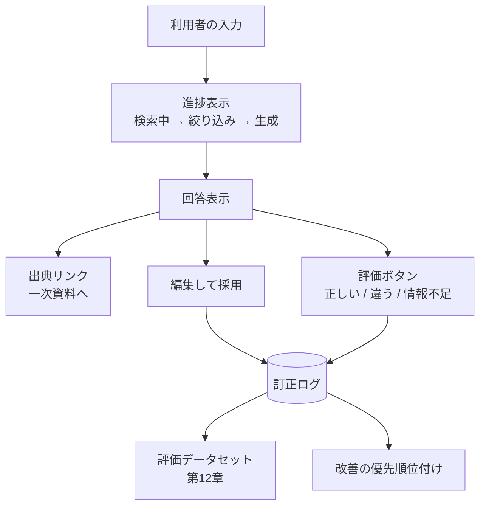

# 第10章 現場主導型フロントエンドと高速プロトタイピング

第1章で述べたとおり、FDEの試作は「スライドではなく、現場が触れるもの」でなければならない。触れるものを最短で出すことと、それを運用に耐える形へ育てることは、別の技術であり、別の判断を要する。

本章では、この二つの作り分けを扱う。焦点は「どのフレームワークが優れているか」ではなく、**いつ書き捨て、いつ作り込むか**である。

## 10.1 二種類のUIを区別する {#two-kinds}

現場に出すUIには、目的が異なる二種類がある。

| | 検証用UI | 運用UI |
| --- | --- | --- |
| 目的 | 仮説が正しいかを確かめる | 毎日の業務を回す |
| 寿命 | 数日〜数週間 | 数年 |
| 利用者 | 数名（協力的な担当者） | 数十〜数百名 |
| 品質要求 | 動けばよい。壊れても口頭で補える | 認証、権限、監査、可用性 |
| 作り手 | FDE一人 | チーム、または顧客側 |
| 適した道具 | Streamlit、Gradio、単一HTML | Next.js、React、既存の社内基盤 |

最も高くつく失敗は、**検証用UIをそのまま運用UIに昇格させてしまうこと**である。Streamlitで作った画面に認証を足し、権限を足し、複数ユーザーの同時利用に対応させていくと、フレームワークの前提に逆らう改造が積み上がる。

判断の分岐点を明確にしておく。次のいずれかに該当したら、検証用UIは役目を終えたと考え、作り直す前提で計画する。

- 利用者が10名を超える、または部門をまたぐ
- 権限によって見せる情報を変える必要がある
- 誰が何を操作したかの記録が要求される
- 一日に何度も使われる（操作速度が業務効率に直結する）

> 検証用UIの価値は、捨てやすさにある。捨てにくくなった瞬間、それは負債に変わる。

## 10.2 数時間でプロトタイプを出す {#prototype}

### 10.2.1 StreamlitとGradioの使い分け

| | Streamlit | Gradio |
| --- | --- | --- |
| 得意 | データ表示、フィルタ、ダッシュボード的な画面 | モデルへの入出力、チャット、ファイル投入 |
| 状態管理 | `st.session_state`。再実行モデルの理解が要る | コンポーネント間の明示的な結線 |
| 表・グラフ | 強い（データフレームをそのまま表示） | 標準的 |
| 共有 | 社内サーバーに置く | 一時的な共有リンクを出せる |

**業務データを見せながら議論するならStreamlit、AIの入出力を試してもらうならGradio**、という切り分けがおおむね実態に合う。

Streamlitで最初に押さえるべきは、**スクリプト全体が毎回再実行される**という実行モデルである。ここを理解していないと、重い処理が操作のたびに走り、「遅くて使えない」と評価されて終わる。

```python
import streamlit as st

# 接続やモデルは1回だけ作る
@st.cache_resource
def get_engine():
    return create_engine(DSN)

# クエリ結果は引数をキーにキャッシュする
@st.cache_data(ttl=600, show_spinner="集計中")
def load_orders(date_from: date, date_to: date, org: str) -> pd.DataFrame:
    return pd.read_sql(QUERY, get_engine(), params={"f": date_from, "t": date_to, "org": org})

st.title("受注遅延の予兆チェック（検証版）")
col1, col2 = st.columns(2)
date_from = col1.date_input("開始日")
date_to = col2.date_input("終了日")
org = st.selectbox("部門", options=ORGS)

df = load_orders(date_from, date_to, org)
st.caption(f"対象 {len(df):,} 件 / データ最終更新 {last_loaded_at():%Y-%m-%d %H:%M}")
st.dataframe(df, use_container_width=True)
```

`st.caption` でデータの鮮度を出しているのは、第5章で述べた原則をここでも守るためである。検証用UIであっても、**利用者が見ている数字がいつ時点のものか**は必ず示す。これがないと、古いデータで議論が進み、その混乱がプロジェクト全体の信頼を削る。

### 10.2.2 プロトタイプに入れるもの、入れないもの

数時間で作るという制約の中で、何を削るかの判断が質を決める。

**入れるもの。**

- **入力データの実物**。ダミーデータでは議論が進まない。顧客の実データを使う（持ち出し可否は必ず事前確認する）
- **根拠の表示**。AIの出力には、第6章で設計した引用を必ず添える。根拠が見えないと「なんとなく合っている気がする」以上の評価が得られない
- **フィードバックの受け口**。各出力の横に「正しい/違う」のボタンを置く。ここで集まった判断が、第12章の評価データセットの最初の種になる

```python
for i, row in enumerate(results):
    with st.container(border=True):
        st.markdown(row["answer"])
        st.caption("根拠: " + " / ".join(row["citations"]))
        c1, c2, _ = st.columns([1, 1, 6])
        if c1.button("正しい", key=f"ok_{i}"):
            record_feedback(row["run_id"], verdict="correct", user=current_user())
        if c2.button("違う", key=f"ng_{i}"):
            record_feedback(row["run_id"], verdict="incorrect", user=current_user())
```

このフィードバック記録が、検証用UIの隠れた本命である。UIそのものは捨てるが、**集まった判断は資産として残る**。

**入れないもの。**

- 凝ったレイアウトとデザイン調整
- 例外系の網羅（エラーは画面に生の内容を出して構わない。開発者がその場にいる）
- ログイン機能（社内ネットワークの制限とURLの共有範囲で代替する）
- 性能最適化（キャッシュ以上のことはしない）

::: warning 実データを扱うときの最低限
顧客の実データを検証用UIに載せる場合、持ち出しの可否、保管場所、削除時期を必ず書面で合意する。個人情報が含まれるなら、第13章で扱うマスキングを試作の段階から入れる。「検証だから」という理由で例外を作ると、その例外が本番の慣行になる。
:::

## 10.3 運用UIの構築 {#production-ui}

### 10.3.1 Next.jsで作るときの設計の軸

運用UIに移行する判断をしたら、設計の軸は三つになる。

**第一に、データ取得の境界。** 認証情報を持つAPIアクセスはサーバー側に置き、ブラウザーからは直接叩かせない。APIキーがクライアントのバンドルに混入する事故は、今でも定期的に起きる。

```ts
// app/api/chat/route.ts — サーバー側でのみ資格情報を扱う
export const runtime = 'nodejs'

export async function POST(req: Request) {
  const session = await getSession()            // 認証確認はサーバーで
  if (!session) return new Response('Unauthorized', { status: 401 })

  const upstream = await fetch(`${process.env.API_BASE}/v1/runs`, {
    method: 'POST',
    headers: {
      'Content-Type': 'application/json',
      'Authorization': `Bearer ${await getServiceToken()}`,   // 環境変数はサーバーのみ
      'Idempotency-Key': crypto.randomUUID(),
    },
    body: JSON.stringify({ ...(await req.json()), actor: session.userId }),
  })

  // ストリーミングはそのまま中継する（バッファしない）
  return new Response(upstream.body, {
    headers: { 'Content-Type': 'text/event-stream', 'Cache-Control': 'no-cache' },
  })
}
```

**第二に、ストリーミングの扱い。** 第9章で設計したSSEを受け取り、途中経過を描画する。実装で注意するのは、**描画の頻度**である。トークンごとに再描画すると、長い応答で目に見えて重くなる。一定間隔でまとめて反映する。

```ts
// 受信は逐次、描画は間引く
let buffer = ''
let scheduled = false

function onDelta(text: string) {
  buffer += text
  if (scheduled) return
  scheduled = true
  requestAnimationFrame(() => {
    setAnswer((prev) => prev + buffer)
    buffer = ''
    scheduled = false
  })
}
```

**第三に、状態の置き場所。** サーバーのデータ（実行履歴、承認待ち一覧）と、クライアントのUI状態（開いているタブ、入力中の文字列）を混ぜない。前者はキャッシュ付きのデータ取得ライブラリに任せ、後者だけをローカルの状態として持つ。この分離を怠ると、承認済みなのに画面では未承認のまま、といった不整合が起きる。

### 10.3.2 デザインシステムに時間をかけない

FDEが単独で運用UIを立ち上げる場合、デザインを自作している時間はない。ユーティリティCSS（Tailwind CSS）と、コピーして使えるコンポーネント集（shadcn/uiのような、コードを自分のリポジトリに取り込む方式）を組み合わせるのが現実的である。

この方式の利点は、**依存ではなくコードとして手元に入る**ことにある。顧客のデザイン要件に合わせて改変でき、ライブラリのバージョン更新に振り回されない。第14章で扱う引き継ぎの観点でも、手元にコードがあるほうが説明しやすい。

一方で、注意すべき点もある。コンポーネントを取り込んだ後に自分で改変すると、上流の修正（アクセシビリティの改善など）が自動では入ってこない。取り込んだ日付とバージョンを記録しておく。

### 10.3.3 AIの出力を扱うUIの原則

LLMを含む画面には、通常の業務画面にはない配慮が要る。実務で効くものを五つ挙げる。

**1. 不確実であることを画面が語る。** 断定的なレイアウトは過信を生む。根拠へのリンク、確信度の表示、「確認してください」の文言を、装飾ではなく機能として配置する。

**2. 待ち時間を情報で埋める。** スピナーだけを数十秒見せない。第9章で流した `step` イベントを使い、「社内規程を検索中」「12件から3件に絞り込み中」と表示する。体感時間が変わるだけでなく、失敗したときにどこで失敗したかが利用者にも分かる。

**3. 訂正の経路を必ず置く。** AIの出力をそのまま提出する運用にはしない。編集できる形で出し、人が直したという事実を記録する。訂正の内容は第12章の評価に直結する最良のデータである。

**4. 出典を一次資料に飛べる形で出す。** 「就業規則 第21条」という文字列ではなく、当該ページを開くリンクにする。確認のコストが下がるほど、実際に確認されるようになる。

**5. 失敗を隠さない。** 検索がゼロ件なら「見つからなかった」と表示する。第6章で設計した棄権が、画面上で意味を持つのはここである。



この図の下半分——訂正と評価が評価データセットに還る流れ——が、運用UIを作る最大の理由である。使われる画面を作ることは、**改善の材料が継続的に集まる仕組みを作ること**でもある。

## 10.4 移行を計画に入れる {#migration}

検証用UIから運用UIへの移行は、必ず計画に含める。移行を「余裕があればやる」扱いにすると、検証用UIが数年動き続ける。

移行時に持ち越すもの、捨てるものを、あらかじめ整理しておく。

| 資産 | 扱い |
| --- | --- |
| プロンプトとスキーマ（第7章） | 持ち越す。ファイルで管理していれば、そのまま動く |
| 検索の設定（チャンク戦略、フィルタ） | 持ち越す |
| フィードバックと訂正のログ | 持ち越す。最も価値が高い |
| UIのコード | 捨てる |
| 画面の構成と操作の流れ | 設計として持ち越す（検証で確かめた結果そのもの） |

この表が示すとおり、**UIのコード以外はすべて持ち越せる**。検証用UIをフレームワークの流儀に沿って素直に書き、ビジネスロジックを画面のコードに埋め込まないようにしておけば、移行のコストは大幅に下がる。具体的には、Streamlitのスクリプトから呼ぶ処理を、UIに依存しないモジュールとして切り出しておく。

```
src/
  core/              # UIに依存しない。両方から使う
    retrieval.py     # 第6章の検索
    review.py        # 第7章の構造化出力
    prompts/         # YAMLで管理
  app_streamlit.py   # 検証用UI（捨てる）
  api/               # 第9章のAPI（運用UIから使う）
```

この構成にしておくだけで、移行は「UIを書き直す」作業に限定される。第1章で述べた「初日からプロダクションを見据える」の、フロントエンドにおける具体形がこれである。

## この章のまとめ

現場に出すUIには検証用と運用の二種類があり、目的も寿命も違う。検証用UIの価値は捨てやすさにあり、捨てにくくなったら負債になる。利用者数、権限、監査、使用頻度のいずれかが閾値を超えたら、作り直す前提で計画する。

検証用UIには実データ、根拠の表示、フィードバックの受け口を入れ、デザインと例外処理は削る。運用UIでは資格情報をサーバー側に閉じ、描画を間引き、サーバーの状態とUIの状態を分ける。

AIを扱う画面では、不確実性の表示、進捗の可視化、訂正の経路、一次資料へのリンク、失敗の明示という五点が効く。そして、UIに依存しないモジュール構成にしておけば、移行のコストはUIの書き直しだけに収まる。

次章では、これらのシステムを既存の基幹システムと安全につなぐ方法を扱う。

::: tip この章のポイント
- 検証用UIと運用UIは別物である。利用者数・権限・監査・使用頻度のいずれかが閾値を超えたら作り直す
- 検証用UIには実データ、根拠表示、フィードバックボタンを入れる。集まった判断は評価データの種になる
- 資格情報はサーバー側に閉じ込め、ストリーミングは中継する。描画は間引いて負荷を抑える
- AIを扱う画面では、不確実性・進捗・訂正経路・一次資料リンク・失敗の明示という五点が効く
- ビジネスロジックをUIコードから切り離しておけば、移行はUIの書き直しだけで済む
:::
