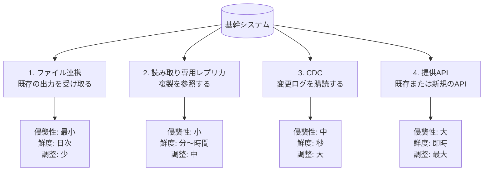
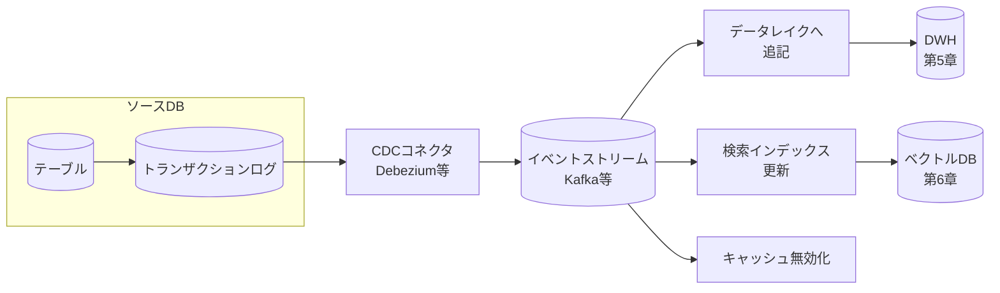
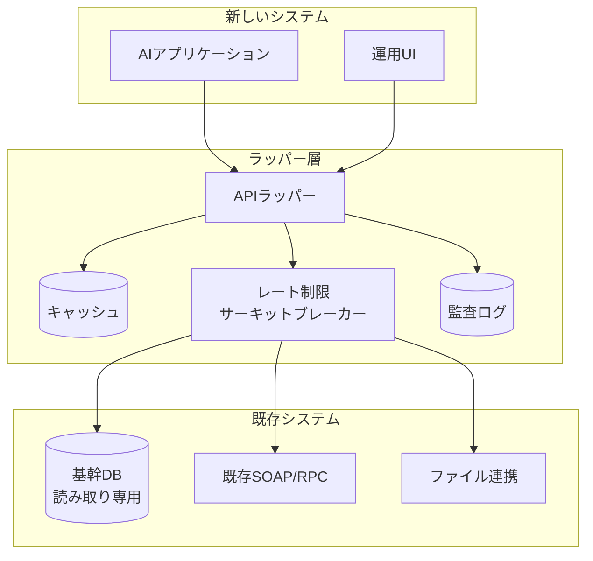
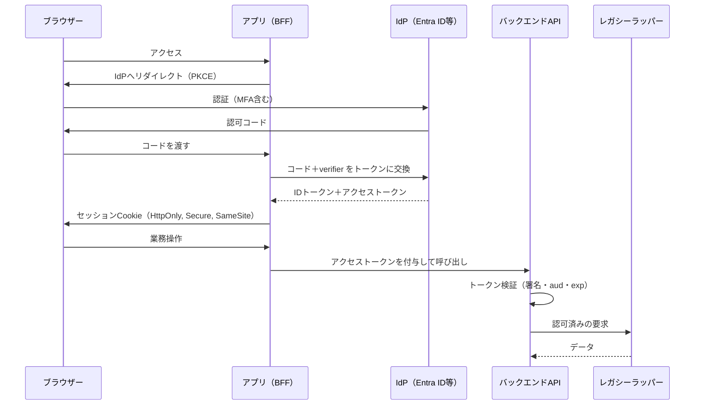

# 第11章 既存基幹システム（レガシー）とのセキュアな結合

FDEのプロジェクトが技術的に難航する原因は、AIの精度ではない。**既存システムからデータを取り出す経路**と、**そこに書き戻す経路**である。

顧客の基幹システムは、たいてい十年以上動いている。ドキュメントは実装とずれ、当時の担当者は退職し、変更には稟議が要る。そして止められない。本章では、この環境と安全に接続するためのパターンを扱う。

## 11.1 接続方式の選択 {#access-patterns}

既存システムからデータを取得する方法は、侵襲性の低い順に四つある。



| 方式 | 向く場面 | 注意点 |
| --- | --- | --- |
| ファイル連携 | 既に夜間バッチで出力がある、初期の検証 | 鮮度が日次に固定される。文字コードと締めの扱いに注意（第3章） |
| 読み取り専用レプリカ | 参照が中心、負荷を本番に与えたくない | レプリケーション遅延をどこまで許容するか合意する |
| CDC | 準リアルタイムが業務要件、更新履歴が欲しい | 本番DBの設定変更が要る。運用負荷が増える |
| 提供API | 書き戻しが必要、他システムからも使う | 既存システム側の改修が要る。最も時間がかかる |

FDEとしての初動は、**1から順に試す**ことである。いきなりCDCを提案すると、DBAとの調整に数か月かかり、その間プロジェクトが進まない。ファイル連携で価値を示してから、鮮度が足りないという具体的な根拠とともに次の方式を提案するほうが、はるかに早く通る。

::: warning 本番DBへの直接接続を安易に選ばない
参照だけだから安全、という判断で本番DBに直接つなぐと、重いクエリが基幹の処理を止める事故につながる。どうしても直接参照するなら、実行時間の上限、同時接続数、実行可能な時間帯を明示的に制限する。制限はアプリケーション側ではなく、DBのロール設定（`statement_timeout`、接続数上限）で強制する。
:::

## 11.2 変更データキャプチャ（CDC） {#cdc}

### 11.2.1 CDCが解く問題

バッチによる差分抽出は、「更新日時の列」に依存する。この列は、次の理由で信用できないことが多い。

- 一括更新の際にアプリケーションが更新日時を書き換えない
- 物理削除された行が検出できない
- トリガーやストアドプロシージャ経由の更新が反映されない

CDCはデータベースのトランザクションログを読むため、これらの問題が原理的に起きない。削除も捕捉でき、変更の順序も保たれる。



この図で示したいのは、CDCの価値が**一つの変更を複数の用途に配れること**にある点だ。DWHの更新と、ベクトルインデックスの更新と、キャッシュの無効化を、同じイベントから駆動できる。第6章で作ったRAGのインデックスを最新に保つ仕組みとして、これは有効な選択肢になる。

### 11.2.2 実務上の落とし穴

CDCの導入で実際に詰まる点を挙げる。

**初期ロード（スナップショット）との整合。** 既存の全データを取り込みつつ、その間の変更も取りこぼさない必要がある。多くのCDCツールは初期スナップショット機能を持つが、大きなテーブルではロックや負荷が問題になる。夜間の実施と、段階的なスナップショットの選択肢を確認しておく。

**スキーマ変更への追随。** ソース側で列が追加されたとき、下流がどう振る舞うか。第3章で述べたとおり、黙って無視するのが最も危険である。スキーマレジストリを使うか、少なくとも変更を検知して通知する。

**「少なくとも1回」の配信。** ほとんどのCDC構成は、同じイベントが二度届きうる。下流は冪等に処理する必要がある。第5章で増分モデルを `merge` で書いた理由と同じである。

**論理削除と物理削除。** 業務上は論理削除（`del_flg = '1'`）でも、CDCから見れば更新イベントである。一方、物理削除は削除イベントになる。どちらも下流で正しく扱えているかを、実データで確認する。

**トランザクション境界。** 複数テーブルにまたがる業務トランザクションが、下流では別々のイベントとして届く。受注ヘッダだけが先に届き、明細がまだ届いていない瞬間が存在する。**中間状態を参照する可能性を、下流の設計に織り込む。**

```python
# 下流の処理は、関連データが未着である可能性を前提にする
def handle_order_header(event: dict) -> None:
    lines = fetch_lines(event["order_no"])
    if not lines:
        # 明細が未着。少し待って再処理する（捨てない）
        requeue(event, delay_seconds=30, max_attempts=5)
        return
    upsert_order(event, lines)
```

## 11.3 Web APIラッパーという現実解 {#wrapper}

既存システムに手を入れられない場合、その前段に**ラッパーAPI**を置く構成が現実的な解になる。



ラッパー層が引き受ける責務は五つある。

**1. 語彙の翻訳。** 基幹の `TOK_CD`、`SIRE_NO` といった列名を、業務の語彙に直す。第4章のstaging層と同じ役割を、オンライン参照に対して果たす。

**2. 保護。** 上流の負荷を制御する。同時接続数の制限、タイムアウト、サーキットブレーカー。基幹システムを落とさないことが最優先である。

**3. キャッシュ。** マスタ系（取引先、商品、組織）は変化が遅い。キャッシュすれば上流の負荷は劇的に下がる。ただし**在庫や残高のような動く数字はキャッシュしない**。古い在庫数で引当を判断すると業務事故になる。

**4. 監査。** 誰が、いつ、どの情報を参照したかを記録する。第8章で述べたとおり、AIエージェントが基幹データを読む構成では、この記録が必須になる。

**5. 認可。** 利用者の権限に応じた絞り込みを、ここで一元的にかける。第7章で述べた「認可はサーバー側で検証する」の実装場所がここである。

```python
from fastapi import Depends, HTTPException
from circuitbreaker import circuit

@circuit(failure_threshold=5, recovery_timeout=30)
async def _call_legacy(path: str, params: dict) -> dict:
    async with legacy_gate.acquire():          # 同時接続数の制御
        return await legacy_client.get(path, params=params, timeout=8.0)

@app.get("/v1/customers/{customer_id}")
async def get_customer(customer_id: str, actor: Actor = Depends(current_actor)):
    # 認可はここで必ず行う。呼び出し元の主張を信用しない
    if not actor.can_read_customer(customer_id):
        raise HTTPException(403, "この取引先を参照する権限がない")

    cached = await cache.get(f"cust:{customer_id}")
    if cached:
        await audit.record(actor, "read_customer", customer_id, source="cache")
        return cached

    raw = await _call_legacy("/SIRE/INFO", {"SIRE_NO": customer_id})
    result = translate_customer(raw)           # 語彙の翻訳
    await cache.set(f"cust:{customer_id}", result, ttl=3600)
    await audit.record(actor, "read_customer", customer_id, source="legacy")
    return result
```

サーキットブレーカーの導入は、AIエージェントを使う構成では特に重要である。第8章で述べたループが暴走した場合、基幹システムへ大量の問い合わせが飛ぶ。エージェント側の上限と、ラッパー側のブレーカーで、二重に守る。

### 書き戻しをどう扱うか

参照より難しいのが書き戻しである。原則は二つ。

**原則1: 直接書かない。** 基幹システムのテーブルに直接INSERT/UPDATEするのは、業務ロジック（在庫引当、与信チェック、履歴記録）を迂回することを意味する。必ず既存の登録処理を経由する。経由する手段がない場合は、取り込み用のインターフェーステーブルやファイルを使う。

**原則2: 提案までに留める選択肢を持つ。** AIが生成した内容を直接登録せず、「下書き」として作成し、人が確認して確定する。第8章の人間介入を、基幹システム側の仕組み（承認待ちステータス）で実現する形である。これは技術的にも安全で、業務的にも受け入れられやすい。

## 11.4 認証・認可のエンタープライズ統合 {#auth}

### 11.4.1 標準への合流

新しいアプリケーションに独自のログイン機能を作るのは、ほぼ常に誤りである。顧客はすでにIDプロバイダー（Entra ID、Okta、社内のSAML基盤）を運用しており、そこに合流するのが正しい。

| 要素 | 役割 | 実務での注意 |
| --- | --- | --- |
| OIDC | 認証（誰であるか） | 認可コードフロー＋PKCEを使う。暗黙フローは使わない |
| OAuth 2.0 | 認可（何をしてよいか） | アクセストークンの寿命を短く、リフレッシュで更新する |
| SAML | 既存のSSO基盤 | 古い基盤ではSAMLしか選べないことがある。OIDCへの橋渡しを検討 |
| SCIM | ユーザーの同期 | 退職者の無効化を自動化する。手作業だと必ず漏れる |



この構成の要点は、**ブラウザーにアクセストークンを保存しない**ことである。トークンはサーバー側（BFF）で保持し、ブラウザーにはHttpOnlyのセッションCookieだけを渡す。これによりXSSによるトークン奪取のリスクが下がる。

### 11.4.2 AIエージェントの権限をどう扱うか

第8章のエージェントが基幹データにアクセスするとき、**誰の権限で動くのか**という問題が発生する。三つの方式がある。

| 方式 | 内容 | 適する場面 | リスク |
| --- | --- | --- | --- |
| 利用者の権限を委譲 | 利用者のトークンでツールを実行 | 対話型アシスタント | トークンの寿命管理が煩雑 |
| サービスアカウント | 固定の権限で動く | バッチ処理、全社共通の参照 | 権限が広くなりがち |
| 利用者の権限で絞り込み | サービスアカウントで実行し、結果を利用者の権限でフィルタ | RAGの検索（第6章） | フィルタ漏れが情報漏洩になる |

**対話型のアシスタントでは、原則として利用者の権限を委譲する。** 「自分には見えない情報が、AIに聞くと見える」という状態は、情報統制の観点で明確な問題になる。とくに人事情報や取引条件を扱う場合、ここは妥協できない。

第6章のベクトル検索では、検索時にメタデータでフィルタする方式（三行目）を取ることが多い。この場合、**フィルタ条件の生成をLLMに任せない**。利用者の所属と権限から、アプリケーションが決定論的に条件を組み立てる。

```python
def build_acl_filter(actor: Actor) -> dict:
    """権限フィルタはコードで組み立てる。LLMの出力を条件に使わない。"""
    return {
        "org_unit": {"$in": actor.visible_org_units},   # 所属と、閲覧を許可された組織
        "confidentiality": {"$lte": actor.clearance_level},
    }
```

そして、インデックス作成時にも権限情報を正しく付与する必要がある。文書の機密区分がメタデータに入っていなければ、検索時にフィルタしようがない。第6章のチャンク設計で `org_unit` を持たせたのは、この要求に対応するためである。

::: warning 権限変更の反映遅延
利用者の所属が変わったとき、キャッシュされた権限情報が古いままだと、旧所属の情報が見え続ける。権限情報のキャッシュは寿命を短く（5分程度）し、重要な操作の前には再取得する。異動の多い組織では、この設計が監査の指摘対象になる。
:::

## この章のまとめ

既存システムとの接続は、侵襲性の低い順に試す。ファイル連携で価値を示してから、鮮度の不足という具体的な根拠とともに次の方式へ進むほうが、結果的に速い。

CDCは削除と更新順序を正しく捕捉でき、一つの変更を複数の用途に配れる。ただし初期ロード、スキーマ変更、重複配信、トランザクション境界という四つの落とし穴がある。

既存システムに手を入れられない場合は、ラッパーAPIを置き、語彙の翻訳・保護・キャッシュ・監査・認可という五つの責務を担わせる。書き戻しは既存の登録処理を経由し、AIの出力は下書きとして人の確認を挟む。

認証は顧客のIDプロバイダーに合流し、トークンはサーバー側で保持する。エージェントは原則として利用者の権限を委譲して動かし、検索の権限フィルタはLLMではなくコードで組み立てる。

ここまでで、システムは動く形になった。次の部では、動き続けさせるための評価と運用に入る。

::: tip この章のポイント
- 接続方式は侵襲性の低い順に試す。ファイル連携で価値を示してから次の方式を提案する
- CDCの落とし穴は初期ロード、スキーマ変更、重複配信、トランザクション境界の四つである
- ラッパーAPIは語彙の翻訳・保護・キャッシュ・監査・認可を担う。動く数字はキャッシュしない
- 書き戻しは既存の登録処理を経由し、AIの出力は下書きとして人の確認を挟む
- エージェントは原則として利用者の権限で動かす。検索の権限フィルタはコードで決定論的に組み立てる
:::
