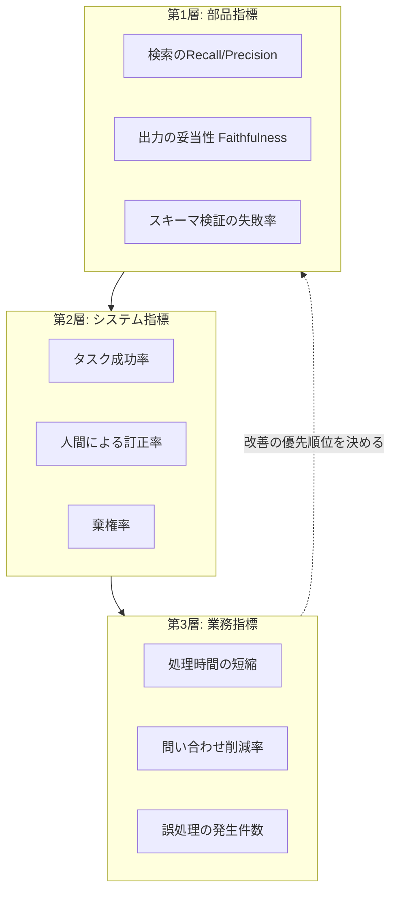
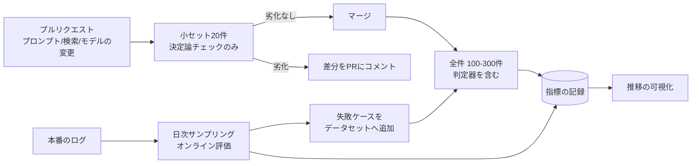

# 第12章 LLMアプリケーションの精度の客観的評価

「精度はどのくらいですか」と聞かれたときに、数字で答えられるかどうか。この一点が、LLMアプリケーションを本番に出せるかどうかを分ける。

答えられない場合、モデルを変えるべきかどうか判断できず、プロンプトを直した結果が良くなったのか悪くなったのか分からず、そして本番で劣化しても気づけない。第7章でプロンプトをコードとして管理し、第10章でフィードバックを集める設計にしたのは、すべてこの章のためである。

## 12.1 何を測るのかを決める {#what-to-measure}

### 12.1.1 三つの層

評価は、層に分けて考えると設計しやすい。



三つの層は、それぞれ測る目的が違う。

| 層 | 何のために測るか | 頻度 | 見る人 |
| --- | --- | --- | --- |
| 部品指標 | どこを直すかを決める | 変更のたび（CI） | 開発者 |
| システム指標 | 出してよいかを判断する | 週次 | FDEと業務責任者 |
| 業務指標 | 投資が回収できたかを示す | 月次・四半期 | 経営層 |

FDEが陥りがちな失敗は、第1層だけを測って満足することである。Faithfulnessが0.92でも、業務の処理時間が変わっていなければ、プロジェクトは失敗している。逆に、第3層だけを見ていると、悪化したときに何を直せばよいか分からない。**三層を接続して持つ**ことが要点になる。

### 12.1.2 評価データセットの作り方

評価の土台は、質問と期待される答えの組である。これを最初にどう作るかが、すべてを決める。

**出発点は、業務担当者に挙げてもらう30件である。** 第6章で埋め込みモデルの選定に使ったものと同じでよい。ここで重要なのは、**やさしい質問ばかりを集めないこと**。次の比率を意識して構成する。

| 種別 | 比率の目安 | 内容 |
| --- | --- | --- |
| 典型的な質問 | 40% | 日常的に来る問い合わせ |
| 境界的な質問 | 25% | 条件が複雑、複数の規程にまたがる |
| 答えられない質問 | 20% | 資料に情報がない。棄権が正解 |
| 紛らわしい質問 | 10% | 似た文書が複数ある（年度違い、部門違い） |
| 不適切な質問 | 5% | 業務範囲外、個人情報の要求、攻撃的な入力 |

「答えられない質問」を20%入れることが、実務上とくに重要である。この種別がないデータセットで評価すると、何にでも答えるシステムが高得点を取る。第6章で設計した棄権が機能しているかを測れるのは、このケースだけである。

```python
from pydantic import BaseModel
from typing import Literal

class EvalCase(BaseModel):
    case_id: str
    category: Literal["typical", "boundary", "unanswerable", "confusable", "inappropriate"]
    question: str
    # 検索の評価用: 正解となる文書（複数可）
    expected_doc_ids: list[str] = []
    # 生成の評価用
    expected_answer: str | None = None            # 完全一致は求めない。採点の基準として使う
    must_include: list[str] = []                  # 必ず含むべき事実（条番号、金額など）
    must_not_include: list[str] = []              # 含んではいけない内容
    expect_abstention: bool = False               # 棄権が正解か
    # 文脈
    actor_role: str = "一般社員"                    # 権限による差を評価する（第11章）
    as_of: str | None = None                      # 基準日
    note: str | None = None                       # 作成者のメモ（なぜこのケースが重要か）
```

`must_include` と `must_not_include` を持つ設計が、実務では効く。完全一致の採点は日本語の自由記述では機能しないが、「第21条という条番号を含むこと」「他部門の金額を含まないこと」は機械的に判定できる。

そして、データセットは**運用しながら育てる**。第10章で設置したフィードバックボタン、第8章で記録した却下理由、利用者からの苦情——これらを定期的にケースとして取り込む。実際に失敗したケースこそ、最も価値の高い評価データである。

::: warning 評価データセットを本番データから作るときの注意
個人情報や取引条件が含まれる場合、評価データセットも同じ管理水準で扱う必要がある。リポジトリに平文で置く、外部の評価サービスに送るといった扱いは、事前の合意なしにやってはならない。マスキングした版を評価用に用意するか、社内の管理された場所に置く。
:::

## 12.2 RAGの評価 {#rag-eval}

### 12.2.1 検索と生成を分けて測る

RAGの失敗は、検索の失敗と生成の失敗のどちらかである。合算した指標だけを見ていると、どちらを直すべきか分からない。

**検索の評価**は、情報検索の古典的な指標で測れる。

| 指標 | 定義 | 実務での意味 |
| --- | --- | --- |
| Recall@k | 正解文書が上位 `k` 件に含まれる割合 | これが低いと、生成をどれだけ改善しても上限が決まる |
| Precision@k | 上位 `k` 件のうち正解である割合 | 低いと、文脈が薄まり生成が乱れる |
| MRR | 最初の正解文書の順位の逆数の平均 | リランキング（第6章）の効果測定に向く |

FDEが最初に見るべきは**Recall@k**である。Recall@10が0.6なら、4割の質問には正解の根拠が渡っていない。この状態でプロンプトを調整しても、改善の余地は限られる。検索を直すのが先である。

**生成の評価**では、次の三つが実務の中核になる。

| 指標 | 問い | 失敗の意味 |
| --- | --- | --- |
| Faithfulness（忠実性） | 回答は、渡した文脈だけから導けるか | 文脈にない内容を生成している。ハルシネーション |
| Answer Relevance（回答の関連性） | 回答は、質問に答えているか | 関係のあることを書いているが、質問に答えていない |
| Context Precision（文脈の適合度） | 渡した文脈に無関係なものが混ざっていないか | 検索の絞り込み不足 |

RagasやDeepEvalといったライブラリは、これらの指標をLLMを使って算出する。導入は容易だが、**算出にもLLMを使う以上、その判定自体が誤りうる**という点を忘れてはならない。指標の絶対値を信じるのではなく、**変更前後の差**を見る道具として使う。

### 12.2.2 機械的に測れるものは機械的に測る

LLMによる採点に頼る前に、決定論的に判定できるものを潰しておく。こちらのほうが速く、安く、安定している。

```python
class CaseResult(BaseModel):
    case_id: str
    passed: bool
    checks: dict[str, bool]
    notes: list[str] = []

def evaluate_case(case: EvalCase, output: RagOutput) -> CaseResult:
    checks: dict[str, bool] = {}

    # 1. 棄権すべきケースで棄権したか
    if case.expect_abstention:
        checks["abstained"] = output.is_abstention

    # 2. 必須の事実を含むか
    for token in case.must_include:
        checks[f"include:{token}"] = token in output.answer

    # 3. 含んではいけない内容を含まないか
    for token in case.must_not_include:
        checks[f"exclude:{token}"] = token not in output.answer

    # 4. 引用が実在するか（第7章と同じ照合）
    checks["citations_exist"] = all(
        c.quote in c.source_text for c in output.citations
    )

    # 5. 引用された文書が、検索結果に含まれていたか（捏造された出典の検出）
    retrieved_ids = {d.doc_id for d in output.retrieved}
    checks["citations_from_context"] = all(
        c.doc_id in retrieved_ids for c in output.citations
    )

    # 6. 検索の正解が含まれていたか
    if case.expected_doc_ids:
        checks["recall"] = bool(set(case.expected_doc_ids) & retrieved_ids)

    return CaseResult(case_id=case.case_id, passed=all(checks.values()), checks=checks)
```

このうち4番と5番は、ハルシネーションの検出として非常に効率がよい。**存在しない出典を挙げる**という典型的な失敗を、LLMによる採点なしで捕まえられる。

## 12.3 LLM-as-a-Judge {#judge}

自由記述の回答を採点するには、最終的にLLMによる判定が必要になる。ただし、素朴に使うと信用できない結果が出る。

### 12.3.1 既知のバイアス

| バイアス | 内容 | 緩和策 |
| --- | --- | --- |
| 位置バイアス | 比較時に、先に提示された方を好む | 順序を入れ替えて2回評価し、一致しなければ引き分け扱い |
| 冗長性バイアス | 長い回答を高く評価する | 評価基準に「簡潔さ」を明示し、文字数を判定材料から外す |
| 自己選好 | 同じモデルが生成した回答を好む | 生成と判定で別系統のモデルを使う |
| 寛大さ | 全体的に高い点をつける | 二値または三値の判定にし、5段階評価を避ける |

とくに**5段階評価を避ける**という緩和策は、実務での効果が大きい。「1から5で評価せよ」と指示すると、モデルの出力は4に集中し、変更前後の差が見えなくなる。「基準を満たすか、満たさないか」の二値にすると、差が検出しやすくなる。

### 12.3.2 判定プロンプトの設計

判定は、生成と同じく構造化出力で受け取る（第7章）。

```python
class JudgeVerdict(BaseModel):
    """採点結果。理由を先に書かせ、判定を後に置く。"""
    reasoning: str = Field(max_length=500, description="基準ごとの判断を簡潔に")
    grounded: bool = Field(description="回答の全ての主張が、提示された文脈から確認できるか")
    answers_question: bool = Field(description="利用者の質問に直接答えているか")
    no_overreach: bool = Field(description="文脈にない推測や一般論を加えていないか")
    verdict: Literal["pass", "fail"]

JUDGE_PROMPT = """あなたは社内文書QAシステムの出力を検査する。
以下の三つの基準それぞれについて判断し、すべて満たす場合のみ pass とする。

1. grounded: 回答に含まれる全ての主張が、提示された文脈から確認できる
2. answers_question: 質問に直接答えている（関連するだけでは不十分）
3. no_overreach: 文脈にない推測、一般論、補足を加えていない

判断の注意:
- 回答の長さや文体は評価しない
- 情報が不足しているため答えられない、という回答は、実際に文脈が不足していれば pass とする
- 正しい情報であっても、提示された文脈から確認できなければ grounded は false

# 質問
{question}

# 提示された文脈
{context}

# 評価対象の回答
{answer}
"""
```

`reasoning` を `verdict` より先に定義している点が重要である。構造化出力は定義順に生成されるため、理由を先に書かせることで判定が思考の結果になる。逆順にすると、判定を先に決めてから理由を後付けする形になり、精度が落ちる。

### 12.3.3 判定器そのものを検証する

最も見落とされる工程である。**LLM-as-a-Judgeの判定が、人間の判断と一致しているかを測る。**

手順は単純で、50件程度を人間が採点し、同じケースを判定器にかけて一致率を見る。一致率が8割を下回るなら、その判定器は使えない。プロンプトを直すか、基準を細かく分けるか、そのケース種別だけ人手に残すかを決める。

```python
def judge_agreement(human: list[bool], judge: list[bool]) -> dict:
    n = len(human)
    agree = sum(h == j for h, j in zip(human, judge))
    # 人間がfail、判定器がpassとしたケース（見逃し）が最も危険
    false_pass = sum(1 for h, j in zip(human, judge) if not h and j)
    return {
        "agreement": agree / n,
        "false_pass": false_pass,          # 見逃し件数
        "false_fail": sum(1 for h, j in zip(human, judge) if h and not j),
    }
```

`false_pass`（人間が不合格としたものを判定器が合格とした件数）を分けて見る。全体の一致率が高くても、見逃しが多い判定器は本番の品質保証には使えない。

## 12.4 評価を開発サイクルに組み込む {#ci}

測るだけでは何も変わらない。評価を、変更のたびに自動で走る仕組みにする。



この図で強調したいのは、右下の**本番ログからの還流**である。オフラインの評価データセットは、作った時点の想定でしかない。実際の利用者は、想定していない聞き方をする。日次で本番のログをサンプリングし、判定器にかけ、失敗したものをデータセットに追加する。この循環が回り始めると、評価データセットは現場の実態を反映した資産になる。

指標の推移は、必ず可視化して関係者が見られる場所に置く。

| 表示 | 目的 |
| --- | --- |
| 指標のバージョン別推移 | 変更が改善だったかを確認する |
| ケース種別ごとの内訳 | どの種別が弱いかを特定する |
| 失敗ケースの一覧 | 具体的に何が失敗したかを読む |
| 本番の棄権率・訂正率の推移 | 劣化の早期検出 |

とくに**棄権率の急変**は、劣化を知らせる最も早い信号の一つである。棄権率が上がったら検索が壊れた可能性があり、下がったら根拠なく答え始めた可能性がある。どちらも調査の対象になる。

> 評価は品質保証の作業ではなく、改善の方向を決めるための計測器である。計測器がなければ、改善は勘になる。

## この章のまとめ

評価は部品・システム・業務の三層に分け、接続して持つ。評価データセットは業務担当者の30件から始め、答えられない質問を2割含める。運用しながら、実際に失敗したケースを取り込んで育てる。

RAGでは検索と生成を分けて測る。Recall@kが低いなら、生成の改善より検索の改善が先である。機械的に判定できるもの——棄権、必須事実、引用の実在、出典の捏造——は決定論的に測り、LLMによる採点は自由記述の部分に限定する。

LLM-as-a-Judgeには既知のバイアスがあり、二値判定と順序の入れ替えで緩和する。そして判定器自体を人間の採点と突き合わせ、見逃し件数を分けて確認する。

評価はCIに組み込み、本番ログから失敗ケースを還流させる。棄権率と訂正率の推移は、劣化の早期検出に効く。

次章では、この計測を支える基盤——トレース、コスト、セキュリティを扱う。

::: tip この章のポイント
- 評価は部品・システム・業務の三層に分け、接続して持つ。部品指標だけを見ても投資は説明できない
- 評価データセットには「答えられない質問」を2割入れる。棄権の機能はこのケースでしか測れない
- 検索と生成を分けて測る。Recall@kが低ければ、生成の改善には上限がある
- 引用の実在と出典の捏造は、LLMによる採点なしで機械的に検出できる
- LLM-as-a-Judgeは二値判定にし、判定器自体を人間の採点と突き合わせて見逃し件数を確認する
- 本番ログから失敗ケースを還流させる循環を作る。棄権率の急変は劣化の早期信号になる
:::
