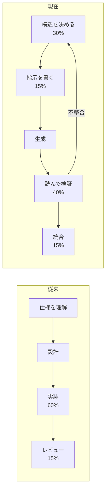
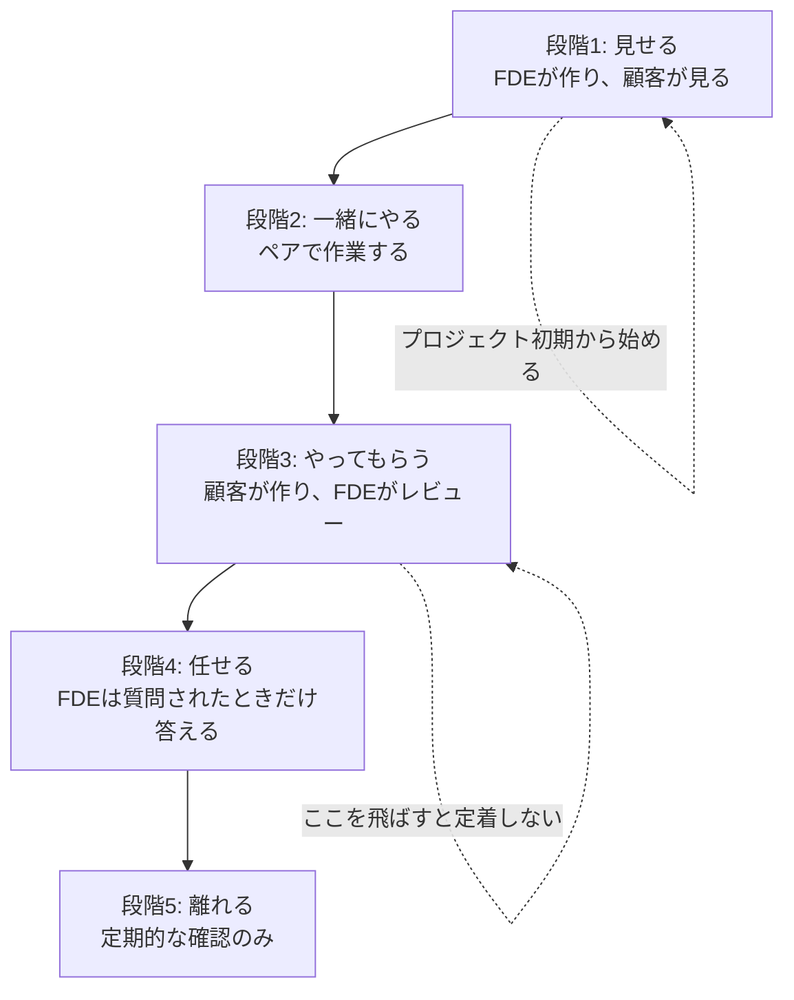

# 第14章 コンサルタントからFDEへの移行と顧客アセット化

最終章では、技術から一歩引いて、この職種を続けていくための二つの設計を扱う。一つは、AIが実装の大部分を担う時代に、自分の技術力をどこに置くか。もう一つは、FDEの最終成果物である「自分がいなくても回る状態」をどう作るかである。

第1章で、FDEの成果物はソフトウェアではなく、顧客の業務プロセスが変わったという事実だと書いた。プロセスが変わったまま定着するには、FDEが去った後も誰かが手を入れられなければならない。引き継ぎは、プロジェクトの最後の作業ではなく、初日から積み上げる設計である。

## 14.1 AIペアプログラミング時代の実装力 {#ai-pair-programming}

### 14.1.1 何が変わり、何が変わらないか

コード生成AIの登場で変わったのは、**実装の律速要因**である。以前はタイピングと文法の正確さが律速だった。現在は、何を作るべきかの決定と、生成されたものが正しいかの判断が律速になっている。



この変化に対して、FDEが伸ばすべき能力は三つある。

**第一に、仕様を構造として書く能力。** 曖昧な指示からは曖昧なコードが生まれる。第7章で扱ったスキーマ、第4章のグレイン宣言、第8章の状態遷移図——これらはすべて、AIに渡す仕様としても機能する。**型と図で書ける仕様は、散文で書いた仕様より格段に正確に伝わる。**

**第二に、大量のコードを短時間で読む能力。** 生成されたコードを読まずにマージすることは、レビューなしで他人のコードをマージすることと同じである。しかも量は増えている。読み方の技術は後述する。

**第三に、検証を先に置く能力。** テストや評価データセットを先に用意しておけば、生成されたコードの正しさを機械的に確かめられる。第12章で作った評価基盤は、AI生成コードの検証基盤でもある。

### 14.1.2 指示の書き方

コーディングAIへの指示で効果が大きいものを、実務の順で挙げる。

**1. 文脈を先に固定する。** プロジェクトの規約、使用するライブラリのバージョン、既存の設計方針を、リポジトリ内のファイル（`CLAUDE.md` や `.cursorrules` のような規約ファイル）に書いておく。毎回のプロンプトで説明するより、はるかに安定する。

```md
# このプロジェクトの規約（抜粋）

- Python 3.12。型注釈は必須。`Any` は使わない
- 外部入力は必ず Pydantic モデルで受ける（第7章の方針）
- DB アクセスは `repository/` 配下に閉じる。サービス層からSQLを直接書かない
- LLM 呼び出しは `llm/gateway.py` 経由。トレースとコスト計測が入っている
- 新しい依存を追加する場合は、理由をコミットメッセージに書く
```

**2. 入出力の型を先に書く。** 実装を依頼する前に、シグネチャと型を自分で定義する。これによって設計の主導権を保てる。

**3. 一度に一つの変更にする。** 「この機能を追加して、ついでにリファクタリングして」という指示は、差分が大きくなりレビューが困難になる。変更を分ける。

**4. 判断を要する箇所を明示的に尋ねる。** 「この設計で問題になりそうな点を三つ挙げてから実装する」という指示は、暗黙の前提を表面化させる効果がある。

### 14.1.3 生成されたコードの読み方

短時間で大量のコードを読むには、読む順序を決めておく。

| 順序 | 見るもの | 典型的な問題 |
| --- | --- | --- |
| 1 | 差分の全体像（変更ファイル数と行数） | 依頼より広い範囲を触っている |
| 2 | 新しく追加された依存 | 不要なライブラリの追加 |
| 3 | データ構造と型の定義 | 設計意図とのずれ。ここが違えば以降は読む必要がない |
| 4 | エラー処理と境界条件 | 例外の握りつぶし、`None` の扱い |
| 5 | 外部との境界（DB、API、ファイル） | トランザクション、リソース解放、認可の欠落 |
| 6 | ロジックの本体 | 最後でよい。上流が正しければ大きく外れない |

3番でデータ構造を先に見るという順序が要点である。**構造が間違っていれば、その下の実装は全部読む価値がない。** 逆に構造が正しければ、細部の誤りは見つけやすい。

とくに注意して見るべきものを挙げる。生成コードで頻出する問題である。

- **もっともらしい例外処理。** `except Exception: pass` や、失敗時に既定値を返す実装。第7章で述べたとおり、失敗は記録されなければならない
- **存在しないAPIの呼び出し。** ライブラリのバージョン差で存在しないメソッドを呼ぶ。実行して確かめるまで分からない
- **認可の欠落。** 動作はするが権限チェックがない。第11章で述べた「認可はサーバー側」が守られているか
- **N+1クエリ。** ループの中でDBを引く。テストデータでは速く、本番で遅い
- **設定のハードコード。** 第1章の「差分を設定に追い出す」に反する実装

::: warning AIに書かせたコードの責任は書かせた人にある
「AIが生成したので」は、レビューでもインシデントでも通用しない理由である。マージした時点で、そのコードは自分が書いたものとして扱われる。読めない量を生成させないという自制も、技術のうちである。
:::

### 14.1.4 リファクタリングを指示する技術

既存コードの改善をAIに任せる場合、**改善の基準を自分で定義する**ことが前提になる。「きれいにして」という指示は、意味のない変更を大量に生む。

効果的な指示の形は、次のように具体的である。

- 「この関数は責務が三つ混ざっている。取得・変換・保存に分割し、それぞれ単体でテストできる形にする」
- 「この分岐は顧客ごとの差分である。第1章の方針に従い、YAMLの設定として外に出す」
- 「この処理は同期でDB接続を握ったままLLMを呼んでいる。接続を解放してから呼ぶ形に直す」

いずれも、**どう直すかを自分が分かっている**。AIは手を動かす速度を提供するが、方向は人間が決める。方向を決められないなら、リファクタリングは依頼すべきではない。

## 14.2 顧客アセット化と引き継ぎ {#enablement}

### 14.2.1 「FDEが抜けても回る」の中身

引き継ぎが成功している状態を、具体的に定義する。次の五つが揃っていれば、引き継ぎは完了している。

| 条件 | 確認方法 |
| --- | --- |
| 誰かが仕組みを説明できる | 顧客側の担当者が、第三者にアーキテクチャを説明できる |
| 壊れたときに直せる | 障害訓練として、実際に一度復旧してもらう |
| 変更を加えられる | 小さな機能追加を、顧客側の手で実施してもらう |
| 品質を測れる | 第12章の評価を、顧客側が実行できる |
| 判断の根拠が残っている | なぜその設計にしたかが文書で追える |

多くのプロジェクトが失敗するのは、一番目だけを満たして終わるからである。説明資料を作り、説明会を開き、質疑応答をして完了とする。しかし説明を聞いただけでは、壊れたときに直せない。

**実際にやってもらうこと**が、引き継ぎの中核である。



図に書いたとおり、段階3を飛ばすと定着しない。そして段階3には時間がかかるため、**プロジェクトの終盤に始めると間に合わない**。第1章で「初日からプロダクションを見据える」と書いたのと同じ理由で、引き継ぎも初日から始める。

具体的には、プロジェクトの中盤で、意図的に自分がやらない作業を作る。「この新しい帳票の取り込み設定は、そちらでやってみてください。詰まったら見ます」という形で渡す。ここで顧客が詰まる箇所が、ドキュメントの不足点そのものである。

### 14.2.2 残すべきドキュメント

ドキュメントは、量ではなく種類で考える。次の五種類があれば足りる。

**1. アーキテクチャの決定記録（ADR）。** なぜその設計にしたかを、選択肢と却下理由とともに残す。これが最も価値が高く、最も書かれない。

```md
# ADR-007: ベクトルDBに pgvector を採用する

## 状況
社内規程QAの検索基盤が必要。文書数は約12万チャンク、年間の増加は2万程度の見込み。

## 選択肢
1. pgvector（既存のPostgreSQL 16に拡張を追加）
2. Qdrant（コンテナで自己ホスト）
3. マネージドのベクトルDB

## 決定
1を採用する。

## 理由
- 既存のPostgreSQLがあり、バックアップ・監視・障害対応の運用が確立している
- 想定規模ではHNSWインデックスで十分な性能が出ることを検証済み（p95で180ms）
- 3は閉域網の要件（外部へのデータ送信不可）を満たせない
- 2は性能面で有利だが、運用対象が増える。情報システム部門の体制を踏まえ見送る

## 結果として受け入れる制約
- チャンク数が50万を超えたら再検討する（検索性能の劣化を監視する）
- メタデータフィルタが複雑化した場合、クエリの調整が必要になる

## 見直しの条件
チャンク数50万到達、または検索p95が500msを超えたとき。
```

「結果として受け入れる制約」と「見直しの条件」を書くのが要点である。これがあれば、将来の担当者は「なぜこうなっているのか」と「いつ変えるべきか」の両方を判断できる。

**2. 運用手順書（Runbook）。** 障害時に何を見て、何をするか。深夜に呼ばれた人が読む前提で書く。第5章で述べた再実行手順がここに入る。

**3. データディクショナリ。** 第5章のdbtドキュメントで自動生成されるものがこれにあたる。手で書くと必ず古くなるため、**生成されるものにする**。

**4. 業務ロジックの根拠。** 「なぜ締め日の3営業日前なのか」「なぜこの条件を除外するのか」。実装だけ見ても分からないルールの出所を、担当部門と合意事項の日付とともに残す。これがないと、数年後に「この処理は不要では」と削除され、業務が壊れる。

**5. 引き継ぎのチェックリスト。** 上記の五つの条件（14.2.1）を確認する具体的な手順。

::: tip ドキュメントを腐らせない工夫
手で書いたドキュメントは必ず古くなる。腐りにくい順に、(1) コードから生成されるもの、(2) CIで検証されるもの（手順書のコマンドを実際に実行する）、(3) 変更時に必ず通る場所にあるもの（プルリクエストのテンプレート）、(4) それ以外。(4) は最小限にとどめる。
:::

### 14.2.3 内製化を支援するということ

顧客が自分たちで作れるようになることは、FDEの仕事を減らすように見える。実際には逆で、**内製化が進んだ顧客ほど、次の難しい課題を相談してくる**。簡単な課題を自分で解けるようになった組織は、より大きな課題に取り組むからである。

内製化支援で実際に効くのは、次の三つである。

**共通部品を残す。** 第1章で述べた「設定に追い出す」設計を徹底しておけば、新しい帳票や新しい顧客への対応は設定の追加で済む。顧客側のエンジニアがコードを書かずに対応できる範囲を広げることが、そのまま内製化の範囲になる。

**判断基準を渡す。** 「どういうときにAIを使い、どういうときに使わないか」（第2章）、「どこに人間の承認を置くか」（第8章）、「どの指標を見て改善するか」（第12章）。これらの判断基準は、個別の実装より長く残る。

**失敗の記録を共有する。** うまくいかなかった試みと、その理由。これは資料として残しにくいが、最も価値がある。「この方式を試したが、この理由で駄目だった」という記録がないと、後任者は同じ失敗を繰り返す。

### 14.2.4 撤退の設計

最後に、FDEが現場を離れるときの技術的な整理を挙げる。

- **アクセス権限の返却。** 自分のアカウントが本番にアクセスできる状態で去らない。同時に、自分だけが持っていた権限を誰かに移す
- **個人に紐づく資源の移管。** 自分の名前で作ったAPIキー、自分のアカウントで動いているジョブ、自分だけが知っているパスワード
- **依存の棚卸し。** 自分が書いたスクリプトのうち、本番に組み込まれているものを列挙する。「ローカルで動かしていた便利スクリプト」が業務に組み込まれていることは、実際によくある
- **連絡経路の明示。** 完全に断つのではなく、どういう場合に誰に連絡するかを決めておく

この整理を怠ると、半年後に「あの処理が止まったが誰も直せない」という連絡が来る。それは顧客にとって損失であり、FDEにとっても自分の仕事の価値を毀損する出来事である。

> 良い引き継ぎとは、自分が必要とされなくなることではない。自分が必要とされる場所が、より難しい課題に移ることである。

## この本のまとめ

本書は、FDEという職種を責任範囲の設計として定義することから始めた。課題発見から価値測定までを一本の線として引き受け、現場を観測し、初日から本番の経路を通す。

技術編では、汚れたデータを扱う防御（第3章）、分析とAIを支えるモデリング（第4章）、コード化されたパイプライン（第5章）、検索システムとしてのRAG（第6章）、スキーマに閉じ込めた出力（第7章）、止まるように作られたエージェント（第8章）、長い応答を前提としたAPI（第9章）、捨てやすい試作と運用UIの分離（第10章）、既存システムとの安全な結合（第11章）を扱った。

運用編では、三層に分けた評価（第12章）と、品質・費用・安全を一つの記録から追う基盤（第13章）を扱った。そして本章で、AI時代の実装力と引き継ぎの設計に触れた。

通して繰り返し現れた原則を三つ挙げて、本書を終える。

**一つ、不確実性の高い順に潰す。** 精度より経路、技術的な最適解より組織が保守できる解。

**二つ、失敗の扱いを先に設計する。** 停止か隔離か人手確認か。止まらないエージェント、握りつぶされた例外、届かないアラートは、いずれも設計の欠落である。

**三つ、判断を資産として残す。** 名寄せの対応表、評価データセット、ADR、失敗の記録。これらは実装より長く生き、次の誰かの仕事を速くする。

::: tip この章のポイント
- AI時代に伸ばすべきは、仕様を構造として書く力、大量のコードを短時間で読む力、検証を先に置く力
- 生成コードは、データ構造から読む。構造が間違っていればその下は読む価値がない
- 引き継ぎは「説明した」では終わらない。実際にやってもらう段階を、プロジェクト中盤から始める
- ADRには「受け入れる制約」と「見直しの条件」を書く。将来の担当者が判断できるようになる
- ドキュメントは、生成されるもの、CIで検証されるものを優先する。手書きは最小限にとどめる
- 撤退時は権限・個人資源・依存・連絡経路を整理する。これを怠ると成果そのものが失われる
:::
