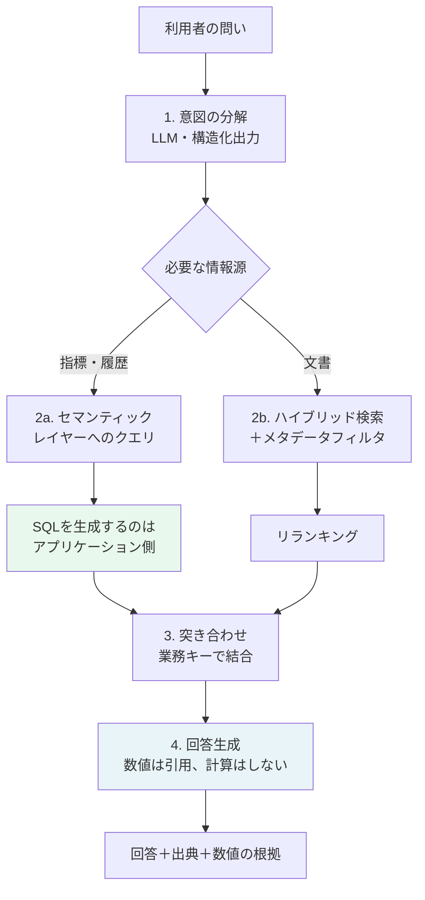
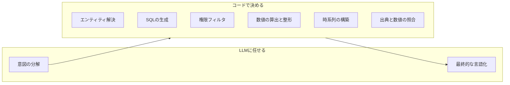

# 付録A 構造化データと文書をまたぐ検索の実装

第4章でセマンティックレイヤーを設計し、第6章でRAGを設計した。実務の問いは、この二つをまたぐ。

> 「A社向けの与信限度を引き下げた経緯を教えて。直近の取引実績も添えて」

この一文は、限度額の履歴（構造化）、審査メモ（非構造化）、取引実績の集計（構造化）の三つを必要とする。本付録では、この問いに答える経路を一つ通す。第2章で述べた「決定論と確率論の境界線」が、実装としてどこに現れるかを見てほしい。

## A.1 全体の流れ {#flow}



設計上の主張は一点に尽きる。**LLMに任せるのは意図の分解と最終的な言語化だけで、数値の算出と文書の絞り込みは決定論的な経路に寄せる。**

## A.2 意図を分解する {#intent}

まず、問いを機械が扱える形に落とす。第7章のスキーマ駆動をそのまま使う。

```python
from typing import Literal
from datetime import date
from pydantic import BaseModel, Field

class MetricRequest(BaseModel):
    """セマンティックレイヤーへの要求。指標名は列挙で縛る（第4章の定義と対応）。"""
    metric: Literal["net_sales", "order_count", "credit_limit_history", "overdue_days"]
    dimensions: list[Literal["month", "quarter", "item_category", "site"]] = []
    period_from: date | None = None
    period_to: date | None = None

class DocumentRequest(BaseModel):
    """文書検索への要求。doc_type とキーワードで絞る（第6章のメタデータと対応）。"""
    doc_type: Literal["審査メモ", "契約書", "議事録", "規程"] | None = None
    query: str = Field(description="検索に使う自然文。利用者の語彙のまま渡す")
    period_from: date | None = None
    period_to: date | None = None

class ResolvedIntent(BaseModel):
    """分解結果。entity は必ず業務キーに解決してから使う。"""
    entity_kind: Literal["customer", "item", "site", "none"]
    entity_name: str | None = Field(description="利用者が書いた名称。コードには変換しない")
    metrics: list[MetricRequest] = []
    documents: list[DocumentRequest] = []
    needs_clarification: str | None = Field(
        default=None,
        description="問いが曖昧で実行できない場合、利用者に確認すべき一文",
    )
```

`entity_name` をコードに変換させない、という制約が重要である。「A社」が `C00412` なのかどうかは、LLMに推測させる対象ではない。名寄せは第3章で作った対応表とアプリケーションの責務であり、候補が複数あるなら利用者に選ばせる。

```python
def resolve_entity(name: str, actor: Actor) -> EntityResolution:
    """名称から業務キーを引く。曖昧なら候補を返して利用者に選ばせる。"""
    candidates = search_customer_master(name, visible_to=actor)
    if len(candidates) == 1:
        return EntityResolution(status="resolved", customer_id=candidates[0].id)
    if not candidates:
        return EntityResolution(status="not_found")
    return EntityResolution(status="ambiguous", candidates=candidates[:5])
```

`needs_clarification` を型に含めておく点も実務的である。「直近の」が何か月を指すのか決まらない問いに、勝手な既定値で答えるより、一往復聞くほうが速い。

## A.3 二つの経路を並行して引く {#retrieve}

分解が済んだら、指標と文書を並行して取得する。第9章で述べたとおり、待つ処理は並行させる。

```python
import asyncio

async def gather_evidence(intent: ResolvedIntent, customer_id: str, actor: Actor) -> Evidence:
    metric_tasks = [
        run_semantic_query(m, customer_id=customer_id, actor=actor)   # SQLはここで組み立てる
        for m in intent.metrics
    ]
    doc_tasks = [
        hybrid_search(
            query=d.query,
            filters={
                "customer_id": customer_id,          # 第6章: 構造化側の業務キーで絞る
                "doc_type": d.doc_type,
                "valid_range": (d.period_from, d.period_to),
                **build_acl_filter(actor),           # 第11章: 権限フィルタはコードで組む
            },
        )
        for d in intent.documents
    ]
    metrics, docs = await asyncio.gather(
        asyncio.gather(*metric_tasks),
        asyncio.gather(*doc_tasks),
    )
    return Evidence(metrics=list(metrics), documents=[c for r in docs for c in r])
```

この関数に現れている三つの設計は、いずれも本文の章に対応している。

- `run_semantic_query` がSQLを組み立てる。LLMはSQLを書かない（第4章）
- 文書検索のフィルタに `customer_id` を渡す。チャンクのメタデータに業務キーを持たせてあるから成立する（第6章）
- 権限フィルタをコードで組み立てる（第11章）

## A.4 突き合わせて、時系列に並べる {#join}

集めた証拠を、そのままLLMに渡してはならない。**同じ出来事を指す構造化データと文書を、業務キーと日付で結びつける**工程を挟む。この一手間が、回答の質を大きく変える。

```python
from dataclasses import dataclass

@dataclass(frozen=True)
class TimelineEvent:
    occurred_on: date
    kind: Literal["metric_change", "document"]
    summary: str                 # 機械的に組み立てる。LLMに書かせない
    source_ref: str              # 出典（テーブル名＋キー、または文書URI＋ページ）
    numbers: dict[str, float] = None

def build_timeline(evidence: Evidence) -> list[TimelineEvent]:
    events: list[TimelineEvent] = []

    # 構造化: 限度額の変更履歴（第4章のSCD Type 2から差分を作る）
    for row in evidence.metric("credit_limit_history"):
        events.append(TimelineEvent(
            occurred_on=row["valid_from"].date(),
            kind="metric_change",
            summary=f"与信限度を {row['prev_limit']:,}円 から {row['limit']:,}円 に変更",
            source_ref=f"dim_customer_credit:{row['customer_id']}@{row['valid_from']:%Y-%m-%d}",
            numbers={"prev": row["prev_limit"], "current": row["limit"]},
        ))

    # 非構造化: 審査メモ（第6章のチャンク）
    for chunk in evidence.documents:
        events.append(TimelineEvent(
            occurred_on=chunk.document_date,
            kind="document",
            summary=" > ".join(chunk.heading_path),
            source_ref=f"{chunk.source_uri}#page={chunk.page_from}",
        ))

    return sorted(events, key=lambda e: e.occurred_on)
```

`summary` をコードで組み立てているのが要点である。「与信限度を800万円から500万円に変更」という文は、データから機械的に作れる。機械的に作れる文をLLMに書かせると、そこに桁の誤りが混入する余地が生まれる。

時系列に並べる効果も大きい。「限度額の変更（3月14日）」と「審査メモ（3月11日）」が並ぶことで、因果の順序がLLMにも利用者にも見える。並べずに渡すと、経緯を問う質問に対して順序が入れ替わった説明が返ることがある。

## A.5 生成する——数値は引用、計算はしない {#generate}

最後に言語化する。プロンプトの制約は、第6章と第7章で決めたものをそのまま適用する。

```python
SYSTEM = """あなたは与信管理の担当者を支援するアシスタントである。

厳守すること:
1. 提示された時系列と数値だけを根拠にする。時系列にない出来事は述べない
2. 数値は提示された表記のまま引用する。増減率や合計を自分で計算してはならない
   （必要な計算結果は、すでに numbers として提示されている）
3. 各記述の末尾に、対応する出典参照 [source_ref] を付ける
4. 経緯を問われた場合は、時系列の順に述べる。推測した因果関係は述べない
5. 時系列から判断できない点は「提示された記録からは判断できない」と明示する
"""

def build_prompt(question: str, timeline: list[TimelineEvent], actor: Actor) -> list[dict]:
    lines = []
    for i, e in enumerate(timeline, start=1):
        nums = f" 数値: {e.numbers}" if e.numbers else ""
        lines.append(f"[{i}] {e.occurred_on:%Y-%m-%d} ({e.kind}) {e.summary}{nums}\n    出典: {e.source_ref}")
    return [
        {"role": "system", "content": SYSTEM},
        {"role": "user", "content": f"# 時系列\n" + "\n".join(lines) + f"\n\n# 質問\n{question}"},
    ]
```

2番の指示に添えた括弧が、この設計の帰結である。**計算を禁じるだけでは足りず、必要な計算結果をあらかじめ渡しておく必要がある。** 禁じられた上に必要な数字がなければ、モデルは計算するか、答えないかのどちらかになる。

## A.6 この構成の評価 {#eval}

第12章の枠組みを、この横断検索に当てはめる。機械的に測れる項目が多い。

| 検証項目 | 方法 |
| --- | --- |
| エンティティ解決の正しさ | 名称と業務キーの対応を正解として一致を見る |
| 指標値の正しさ | セマンティックレイヤーの出力を直接検算する（LLMを通さない） |
| 文書の再現率 | 正解文書が検索結果に含まれるか（Recall） |
| 時系列の完全性 | 正解の出来事が時系列に含まれているか |
| 出典の実在 | 回答中の `[n]` が時系列の項目に存在するか |
| 数値の一致 | 回答中の数値が、渡した `numbers` の値と文字列として一致するか |

最後の行は特に有効である。**回答に現れた数字が、渡した数字のどれとも一致しなければ、それはモデルが作った数字である。** 正規表現で数値を抽出して照合するだけで検出できる。

```python
import re

def numbers_are_quoted(answer: str, timeline: list[TimelineEvent]) -> bool:
    allowed = {
        f"{int(v):,}" for e in timeline if e.numbers for v in e.numbers.values()
    } | {
        str(int(v)) for e in timeline if e.numbers for v in e.numbers.values()
    }
    found = set(re.findall(r"[\d,]{2,}", answer))
    # 年月日などの日付表記は除外してから比較する
    return all(n in allowed for n in found - extract_date_like(answer))
```

## A.7 この付録の要点 {#summary}



第2章で「境界を引く力」と書いたものの、具体的な姿がこの図である。LLMが担うのは両端だけで、中央はすべて決定論的に決まる。この配分にしておくと、精度の議論が「検索が引けているか」と「言語化が適切か」という二つに分離し、それぞれ別々に改善できる。

::: tip この付録のポイント
- 横断的な問いは、意図の分解と言語化だけをLLMに任せ、算出と絞り込みは決定論的な経路に寄せる
- エンティティ名から業務キーへの解決はコードで行い、曖昧なら候補を出して利用者に選ばせる
- 構造化データと文書を業務キーと日付で突き合わせ、時系列として渡すと因果の順序が保たれる
- 機械的に作れる文はコードで組み立てる。LLMに書かせると桁の誤りが混入する余地が生まれる
- 計算を禁じるだけでは足りない。必要な計算結果をあらかじめ渡しておく
- 回答中の数値が渡した数値と一致するかは、正規表現で機械的に検証できる
:::
